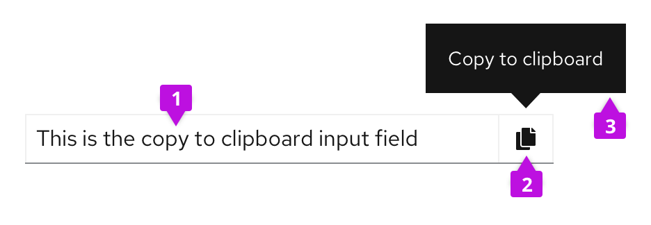
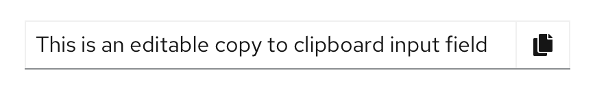
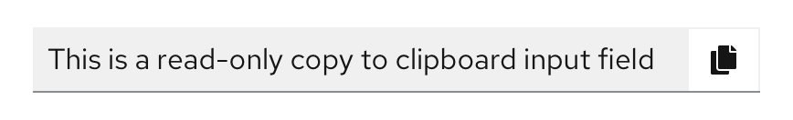
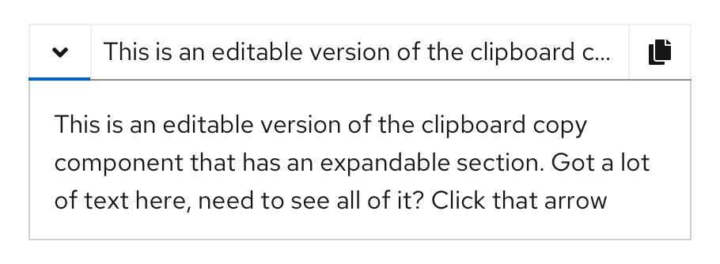
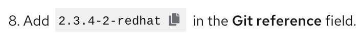
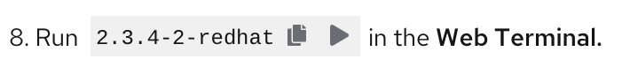
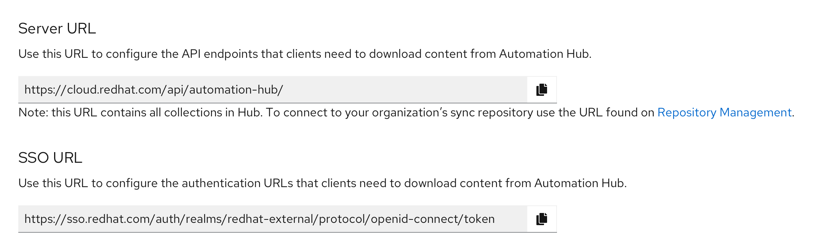
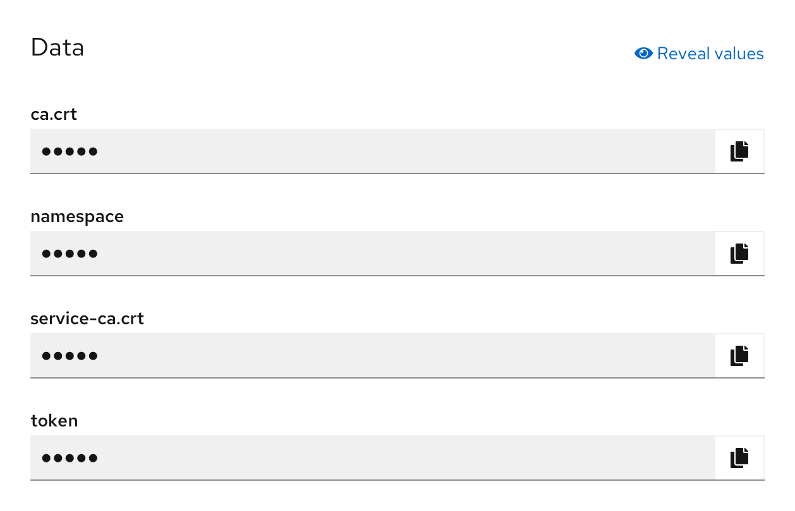
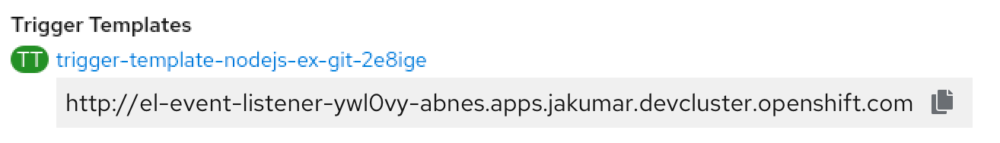
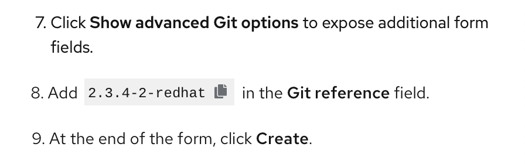

## Elements
Clipboard copy has 3 main components.

1. **Copy content:** the content that will be copied to the user’s clipboard.
2. **Clipboard button:** completes the copy action when clicked.
3. **Tooltip:** informs users that clicking the button will copy the content to their clipboard, or that the content has successfully been copied.

## Usage
Use clipboard copy to allow users to quickly and easily copy content to their clipboard to paste it in another location. Copy content can vary but is usually a line or block of text or code. This is useful for copying system generated key values, to both reduce user effort and the occurrence of entry errors, for example. The clipboard copy has a few features that can be used to customize the component to fit different use cases.

### Features
The clipboard copy component can be editable or read-only and both types can optionally be expandable.

**Editable**

An editable clipboard copy allows users to copy an editable text input box.

**Read-only**

A read-only clipboard copy only allows the user to copy a predefined line of text that is not editable by the user.

**Expandable**

An expandable clipboard copy allows for long lines of text to be stored in an expansion panel. Expanding the clipboard copy allows the user to view the full string that they can copy.

**Inline compact**

An inline compact clipboard copy is placed directly inline with other text or used on its own when you want a lighter weight clipboard copy treatment.

An inline compact clipboard copy can include one or two action buttons next to it. The second action is customizable and optional.

### Clipboard copy in context
Clipboard copy can be used almost anywhere in a UI. It is commonly used in forms and definition lists.

**Clipboard copy in a form**

**Clipboard copy in a description list**

**Inline compact clipboard copy for URLs**

**Inline compact clipboard copy in context**

