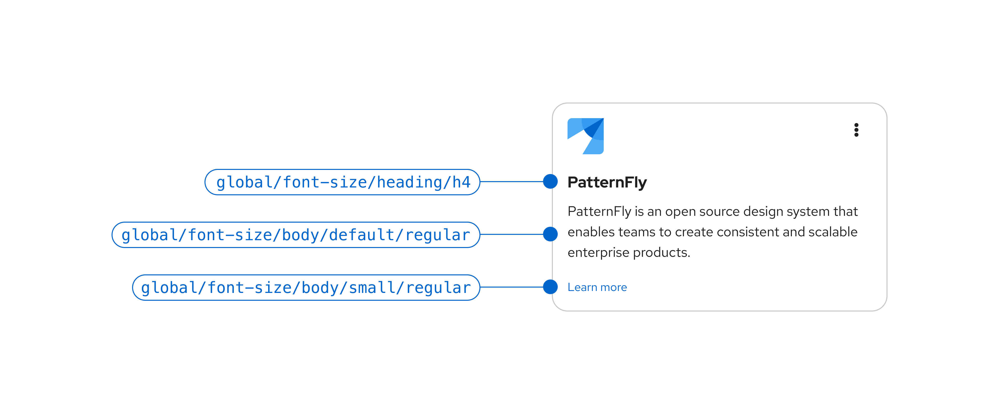
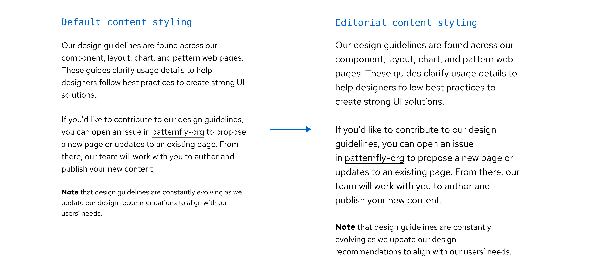

## Usage

Content can be used anywhere in your designs and can take on different formats. Read [PatternFly’s typography page](/design-foundations/typography) for more guidelines on how to use content in your UIs, and the different styles available.

When using the content component, the content type that you use will align with our specific design recommendation for that type. For example, heading content will align with our heading text styles, while body content will align with our body text styles. 

Margins will be automatically applied to the content component, based on its location in the overall page. If it's the first item on the page, there will be no top margin. If it's the final item on the page, there will be no bottom margin.

### When to use content vs. title

**Use content:** 
- In most cases for UI text. 
- When you want to ensure that text aligns with our design recommendations. 

**Use title:** 
- If the built-in styling of the content component doesn't work well for your use case. This may happen if content's heading level style appears too large or too small for your page.

## Variations 

### Body content

[Body content](/design-foundations/typography#body-text) makes up the majority of the content on a page and is used across PatternFly components.

### Headings 

[Headings](/design-foundations/typography#headings) utilize bold and prominent styling to help users quickly understand the subject of a page or section. 

### Editorial content 

[Editorial styling](/components/content#editorial-content) increases the default size of PatternFly's body text from 14px to 16px and small text from 12px to 14px. This style adjustment is intended to aid in readability and should be used for long-form content, like documentation. 

