## Usage
### Simple list
1. **Draggable area:** The drag and drop interaction can be triggered with click and hold over any part of the item. The `fa-grip` icon is used to show that the drag and drop interaction is available.

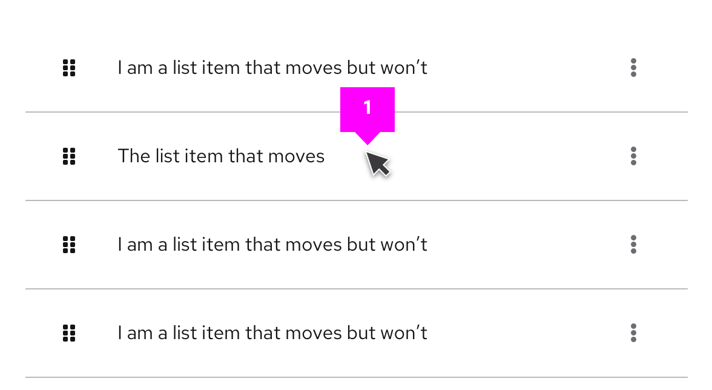

2. **Bounding box:** Upon click & hold a `--pf-v6-global--active-color--100` border will show the draggable area that is available. 

3. **onDrag event:** The list item being dragged will also use a `--pf-v6-global--active-color--100` border to highlight it as the item being dragged and all other list items will switch to a disabled state. The space where the item is being dragged from will remain empty to indicate its original position in the list.

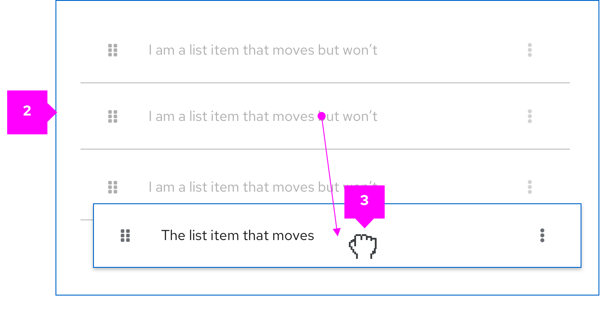

4. **postDrag event:** Once dropped, the items will be reordered based on the user’s action. The space left empty is then filled by the next item in the list.

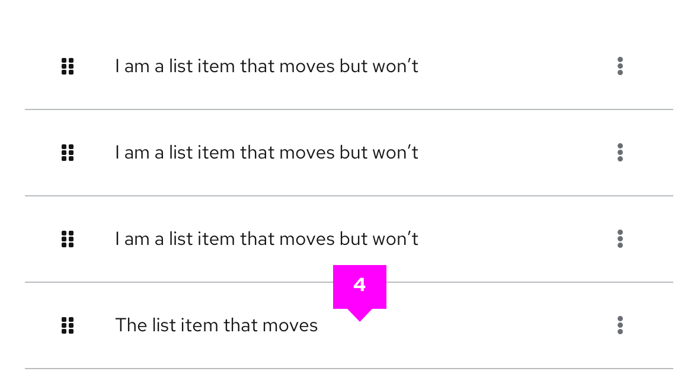

5. **Error state:** If the list item is dragged outside the bounding box the borders on the dragged item will switch to `--pf-v6-global--danger-color--100` and the cursor will change to `not-allowed` to indicate an invalid placement. If the user releases the cursor outside the bounding area the dragged item will return to its default position.

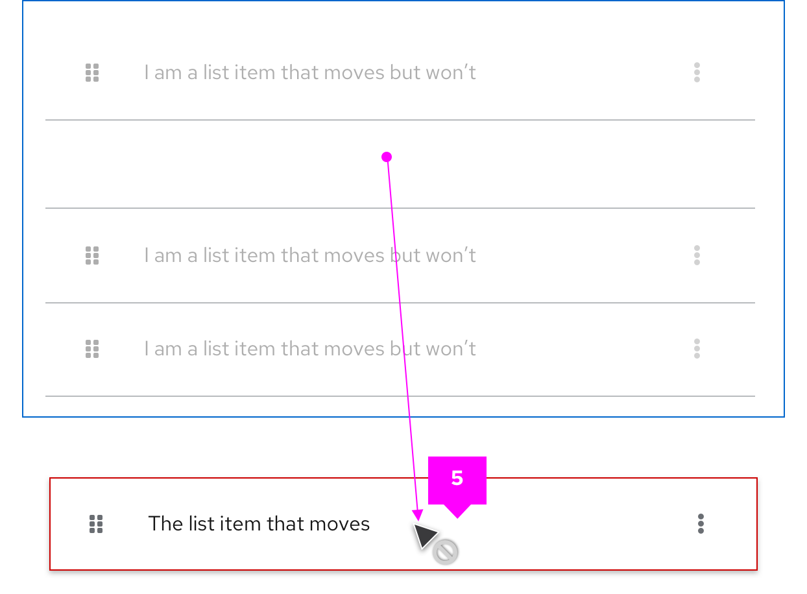

### Multiple lists
PatternFly drag and drop allows users to move items between different list groups. For example, in a To-Do list scenario users can quickly drag list items from the ”In progress” column to the “Done” column.

1. **Draggable item**

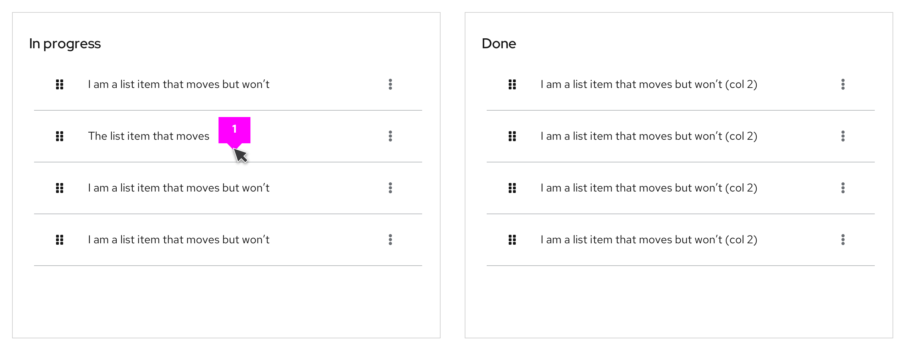

2. **onDrag event**

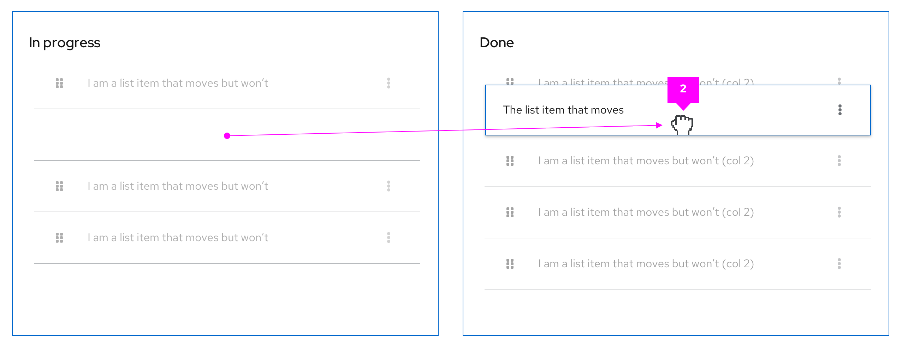 

3. **postDrag event**

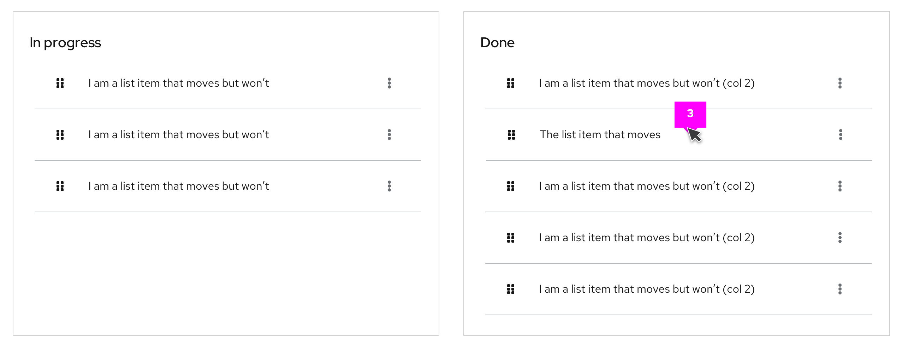 

4. **Error state**

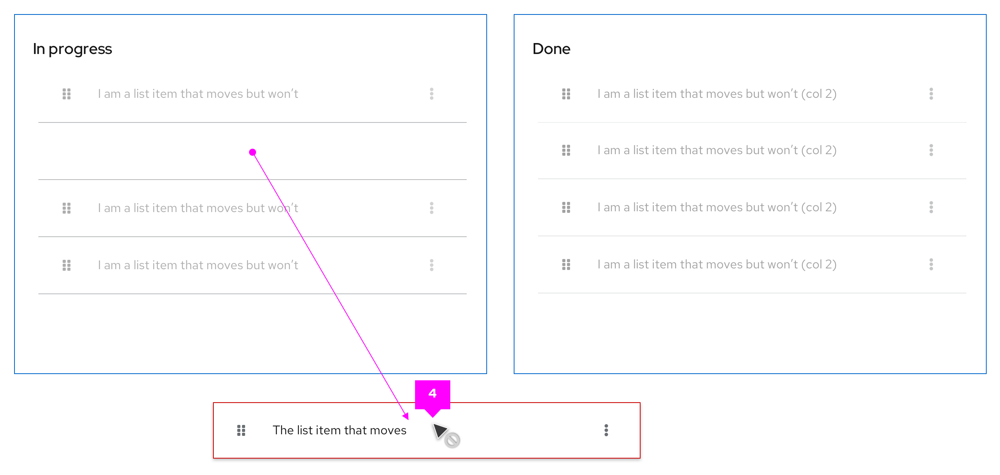 

### Draggable cards
In a card view, when the selected card has been dropped the others will reposition following a left-to-right flow by default.

1. **Draggable item**

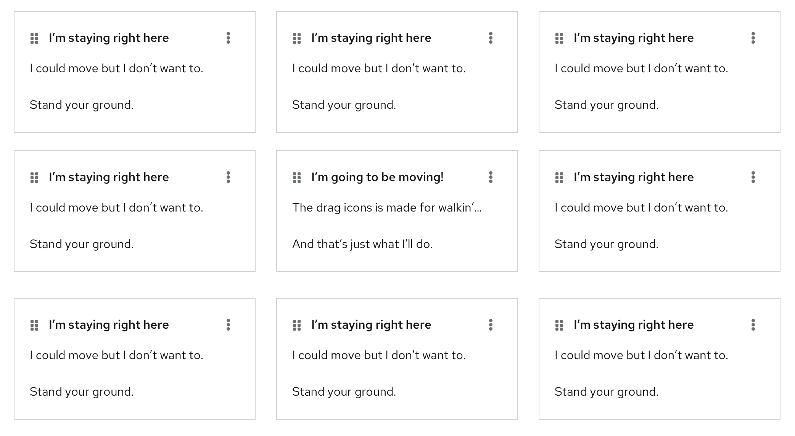

2. **onDrag event**

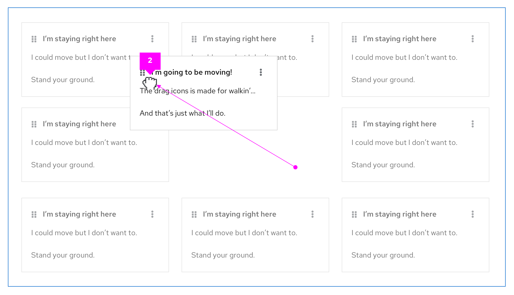 

3. **postDrag event**

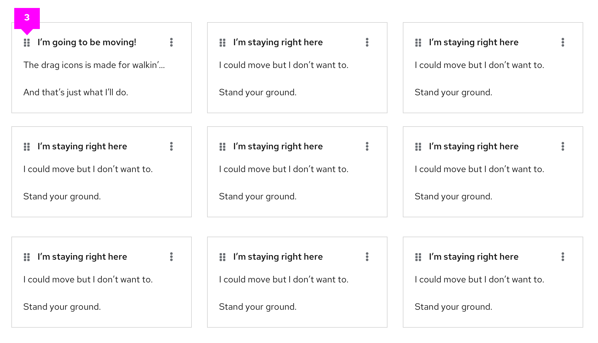 

4. **Error state**

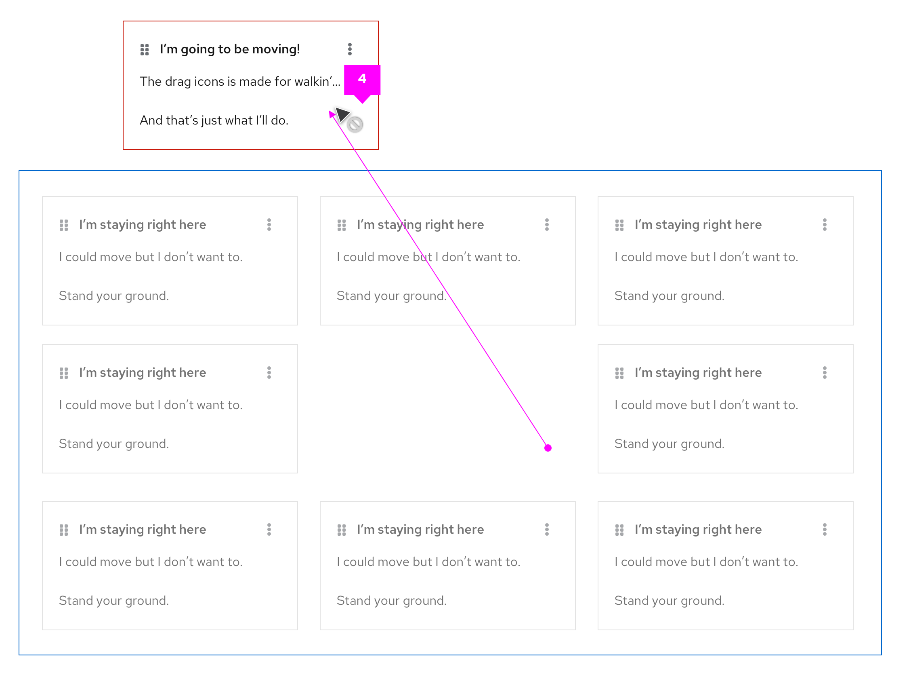 

