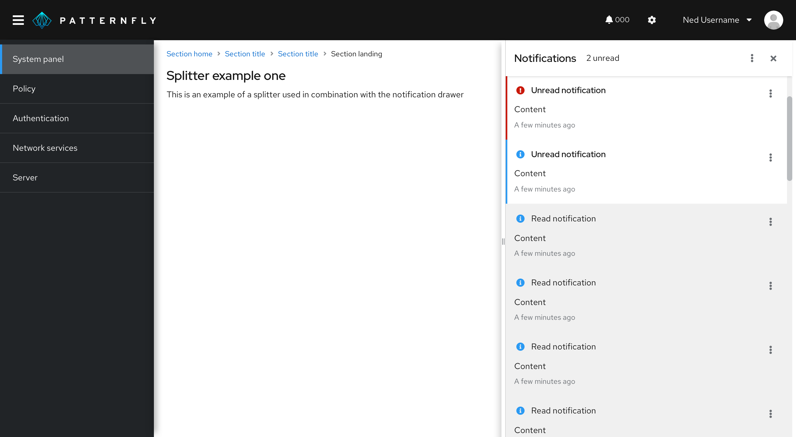

## Usage

Drawers can be used to store and show more information than immediately presented on a page. A drawer with more information is usually prompted by a user click. Upon the click, the drawer comes out and shows more information, which is usually relevant to a whole page.

Drawers appear as a sliding panel that can be attached to the bottom or right edge of a window. They’re commonly used in a [primary-detail](/patterns/primary-detail), which is a layout that uses a drawer for details and spans the height of the primary content. The primary content can be placed in any container, and the details drawer will span the height of that container. The drawer component is used for the details because it's common for the "detail" in primary-detail to be toggled open/close, while the primary content should always be present on the screen. For a primary-detail in a card, the details section is still built with a drawer component even when it's not collapsible.

In addition to primary-details, the drawer component is frequently used in [notification drawers](/components/notification-drawer) or terminal windows.

### Splitter in a drawer

A **splitter** allows you to create a layout with resizable panes. The orientation of a splitter can be set to **vertical** or **horizontal**.

### When to use a splitter
Add a splitter to a drawer if you need to resize the width or height of a panel to give content more space. If data shown in a drawer has enough space, then you don’t need to use a splitter.

