import CheckIcon from '@patternfly/react-icons/dist/esm/icons/check-icon';
import TimesIcon from '@patternfly/react-icons/dist/esm/icons/times-icon';

## Elements

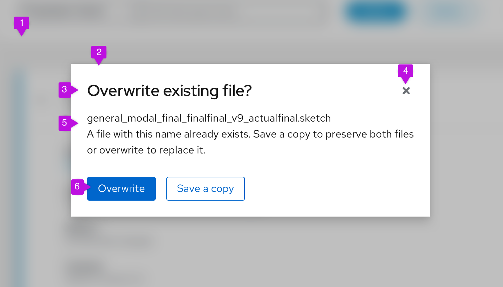

1. **Backdrop**
2. **Modal box**
3. **Headline**
4. **Close icon**
5. **Content area**
6. **Buttons**

See the [Content](#content) section for information about writing modal copy.

## Usage

Use a modal to communicate critical information that requires user input or action. 

Modals can:

* Validate user decisions.
* Confirm non-destructive or destructive actions.
* Report errors.
* Share task results and statuses.
* Prompt required user input.

Don’t use a modal unless its information is vital to user success and worth disrupting a user’s task flow.

## Variations
Modals serve several functions in a UI and appear in four main types:

* [Confirmation dialogs](#confirmation-dialogs)

* [Edit dialogs](#edit-dialogs)

* [Error dialogs](#error-dialogs)

* [Passive dialogs](#passive-dialogs)

* [Input dialogs](#input-dialogs)

### Confirmation dialogs

Use a confirmation dialog to validate user decisions and communicate their consequences. Confirmation dialogs can confirm non-destructive and destructive actions.

#### Confirm a non-destructive action

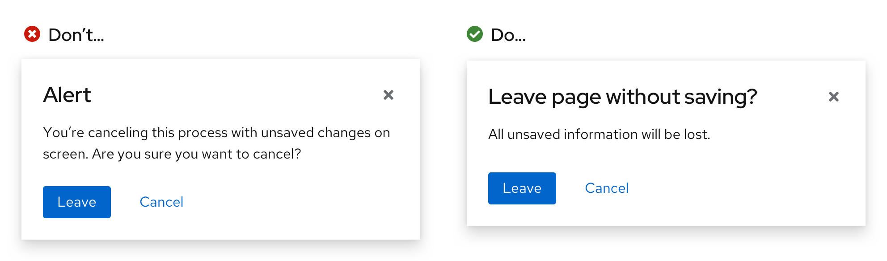

When confirming a non-destructive action, provide specific context about what will happen once a user confirms it.

#### Confirm a destructive action

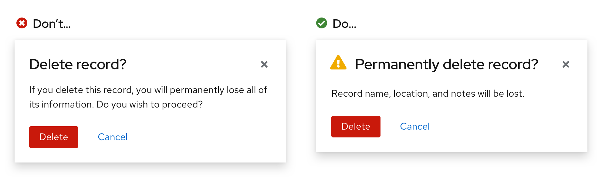

Use a [primary button](/components/button/design-guidelines#primary-button) to confirm a destructive action. If the action carries serious consequences, then use a [danger button](/components/button/design-guidelines#danger-button) instead.

If an action is difficult or impossible to undo, add a warning icon beside the headline. 

If a destructive action has serious consequences, consider adding an additional step before its destructive button becomes active. Additional confirmation measures like [text input](/components/forms/text-input/design-guidelines) fields safeguard a user from accidentally completing the action. 

When a text input field is added to a confirmation dialog, the danger button will only become enabled once a user enters the entire word or phrase.

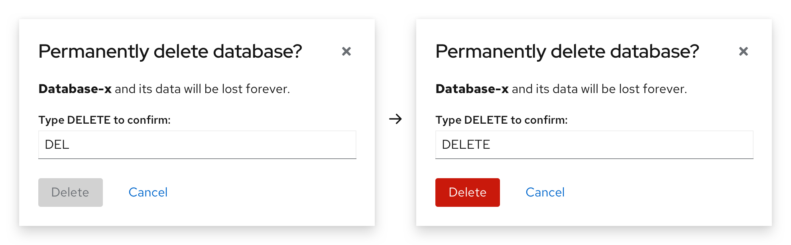

### Edit dialogs

Use an edit dialog for managing assets. Edit dialogs contain multiple actions which can include, but are not limited to, saving your changes or deleting the asset. The primary action in the dialog should use a primary button, the secondary should use a secondary button, and the cancel button should remain a link button.

For example, and edit dialogue might contain a "Save" button as the primary action, and a "Delete" button as a secondary action. If the secondary action is destructive, the button should be styled as a [secondary danger  button](/components/button/#variant-examples). Additionally, it should be aligned to the right-side of the modal, directly across from the primary action and cancel buttons. 

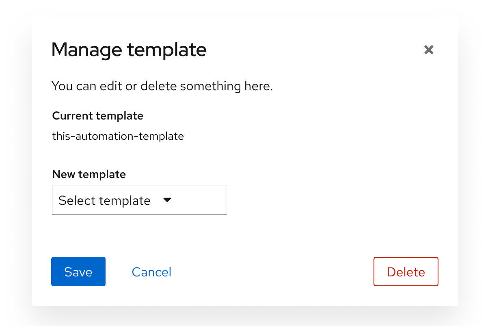

When using destructive actions, ensure that the user is informed about the consequences of taking this action. Review the general guidelines for [danger button](/components/button/design-guidelines#danger-button) and destructive actions for additional guidance. 

### Error dialogs

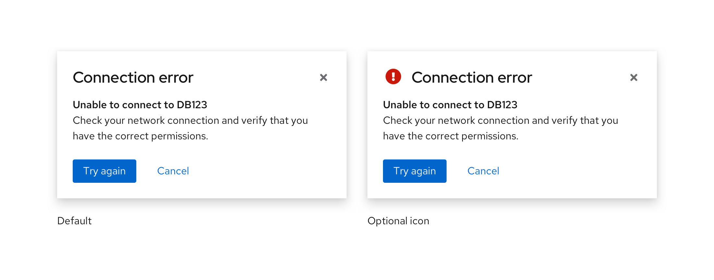

Use an error dialog to inform users of problems that interrupt normal or expected behavior. Briefly contextualize the problem and why it happened, then provide actionable steps toward a solution.

Learn more about writing error messages in our [error message guidelines](/ux-writing/error-messages).

Error dialogs may use an error icon for visual emphasis.

### Passive dialogs

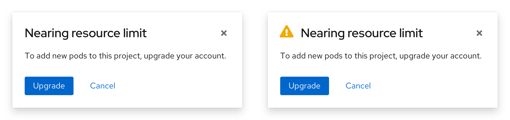

Use a passive dialog to communicate critical and immediately relevant information like the status of an application or an action’s result. Passive dialog content should require or lead to user action.

Passive dialogs can also notify the user about the status or duration of a critical process, especially if the process may take an unusual amount of time to complete.

Never use a passive dialog for non-critical information. Instead, use an [inline alert](/components/alert/design-guidelines/#inline-alerts) or a [toast alert](/components/alert/design-guidelines/#toast-alerts).

### Input dialogs

Users may need to provide additional input to complete an action. To accomplish this, use forms or other elements within the modal, like in a [modal wizard](/components/wizard#within-modal).

### Modals with help

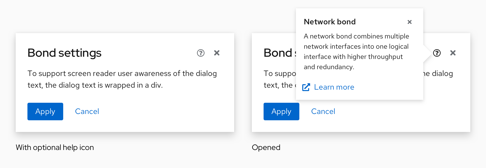

Use a [modal with help](/components/modal#with-help) to make complex tasks easier to understand within a modal. If needed, link to further documentation in the help popover.

Help popovers at the modal level explain and provide documentation for an entire task. Only place a help icon at the modal level if its information applies to all content in the modal. If the information you'd like to include in a help popover is specific to a particular input, place the help icon at that input level instead.

## Spacing

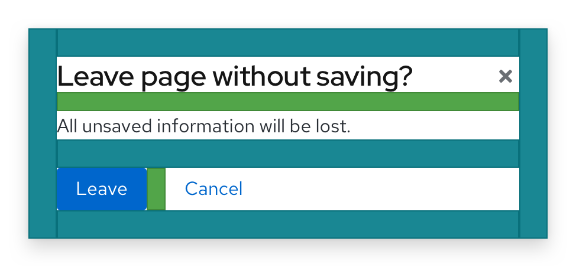

Basic modals use a primary spacing of 24px to separate:

- Each edge of the modal box from all modal content.
- The content area from both buttons.

A 16px spacing separates the modal's headline from the content area. 16px also separates each button.

## Placement

A modal can be aligned at the center or top of a page.

### Center-aligned modal (default)

A [center-aligned modal](/components/modal/html-demos/basic/) appears horizontally and vertically centered on a page, and should be used by default for most use cases.

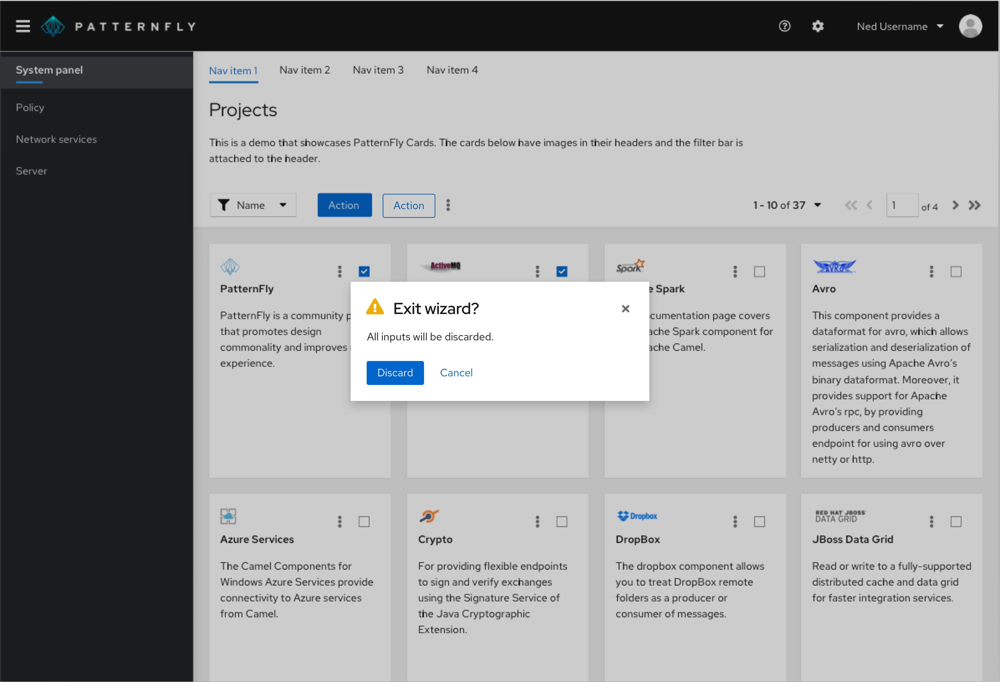

### Top-aligned modal

A [top-aligned modal](/components/modal/html-demos/top-aligned/) appears horizontally and vertically centered at the top of a page. 

Use a top-aligned modal when your modal contains expanding content or when you'd like to keep content behind the modal visible to the user.

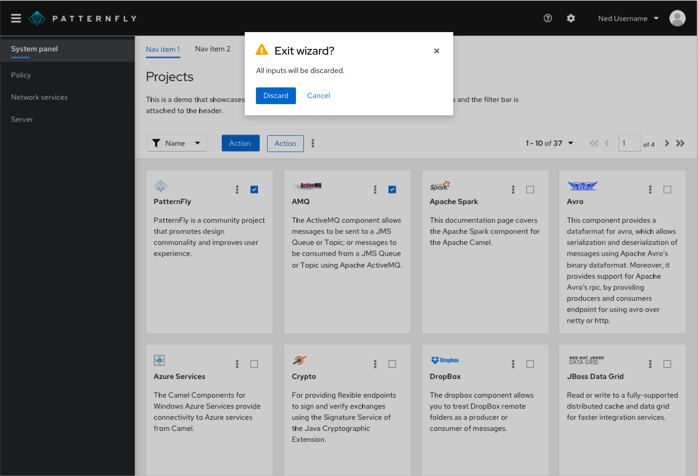

## Content considerations

All modal content should be descriptive and specific so that users can scan, understand an action's context, and make a quick decision.

A modal is comprised of 3 main content sections:

1. **Headline:** A headline introduces a modal’s purpose, usually as a question. Use important key words like “permanently” to contextualize an action and its impact.

2. **Body text:** Body text provides additional information about an action’s consequence in three lines or less, typically concerning changes to a user’s workflow or access to information. If a modal’s headline fully communicates an action’s context and consequences, body text isn’t needed.

3. **Buttons:** Buttons allow a user to answer the headline prompt or question. Write button labels as action-based verbs to clearly communicate their function and consequence, and keep them to 1–3 words. Often, verbs for buttons can be pulled directly from a modal’s headline to increase scannability.   
Example headline: *Permanently delete database?* 
Example buttons: *Delete* and *Cancel*  
For more button guidance, see our [button label guidelines](/components/button/design-guidelines#content).

For general content guidance to help write effective modal dialogs, see our [UX writing style guide](/ux-writing/about-ux-writing).

### Icon use in modal dialogs

Icons are optional in modal dialogs. Use or omit them as your use case requires.

| Icon | Use case(s) | Usage |
| ------------- |-------------|-------------|
|  <i class="fas fa-exclamation-triangle" />  | **Warning:** Cautions or warns the user of a permanent action, or that information will be deleted upon action completion | Add to confirmation dialogs or passive dialogs to indicate a higher level of urgency and importance.|
|  <i class="fas fa-exclamation-circle" />  | **Critical Warning:** Indicates that an error has occured  | Add to error dialogs. |
|  <i class="fas fa-info-circle" />  | **Acknowledgement:** Informs the user of an action or result  | Add to confirmation or passive dialogs to indicate a lower level of urgency. |
