A **progress stepper** displays progress through a sequence of linear steps and highlights what step the user is currently on.

## Elements
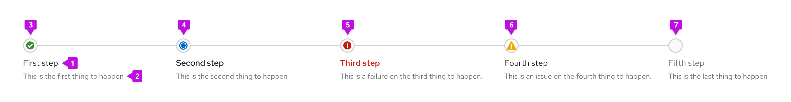

1. **Progress title:** Describes the task or process underway.
2. **Progress description (optional):** Provides additional information on the task or process
3. **Completed status:** Informs the user of a successfully completed step
4. **In progress status:** Informs the user what step they are on
5. **Failure status:** Informs the user of a failure or error in the step
6. **Warning status:** Informs the user of a non-critical error in step
7. **Pending step:** Upcoming steps needed to complete the task or process

## Usage
Use a progress stepper to convey to a user how many steps are required to complete a task or process. Similar to the [progress bar](/components/progress), the progress stepper can help to keep users informed about how much effort or time the task or process will take to complete. One advantage is it displays the total number of steps at all times. Additionally, it informs the user exactly where they are in the process and how much is left until their task or process is completed. 

### When to use
* A user is completing a multi-step process in a card

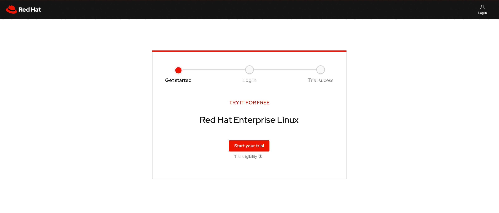

* A user is showing progression through a workflow in a table or card

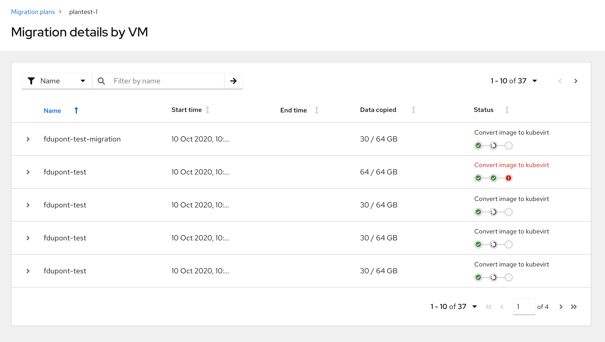

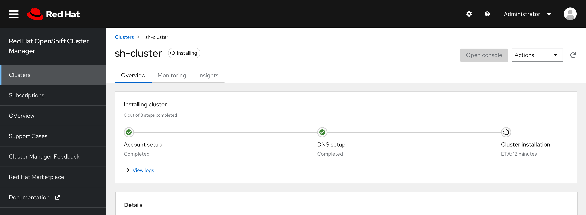

* A user is checking the status of the installation process in a popover

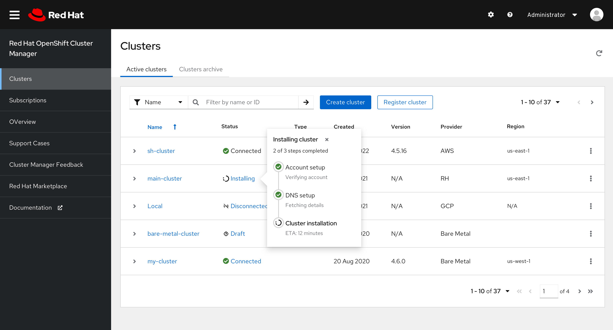

### When to use progress stepper vs. wizard

Use a progress stepper:
* To indicate to the user where they are in a step-by-step linear process on a single page. 
* When the steps in the process could be completed by the user or happening in the background without the user completing the task themselves. 

Use a [wizard](/components/wizard):
* To guide the user through a multi-step flow where they must complete specific tasks in order. 
* When the steps are complex enough they need to be broken up into smaller, more manageable steps and does not keep user on the same screen.

## Variations
There are a few variations of the progress stepper that can be used for different use cases. All variations can be displayed horizontally or vertically, and the text on each step can be left justified or centered.

### Basic progress stepper
The basic progress stepper can be used when just the title of the step is enough to inform the user.

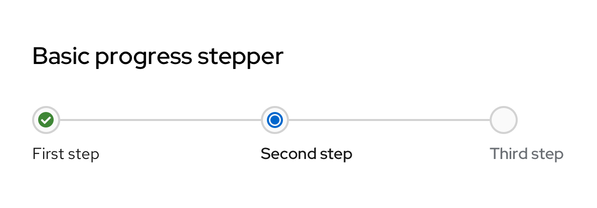

### Basic with descriptions
If more description is needed, a basic progress stepper with descriptions can be used which allows for more context for each step.

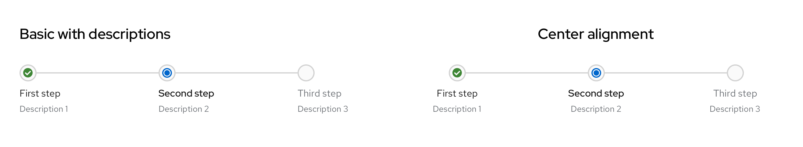

### Vertical progress stepper
The vertical alignment can be used in pages with a split view where one side houses the progress stepper and the other side houses each step’s content. These can also be used to display progress in a popover.

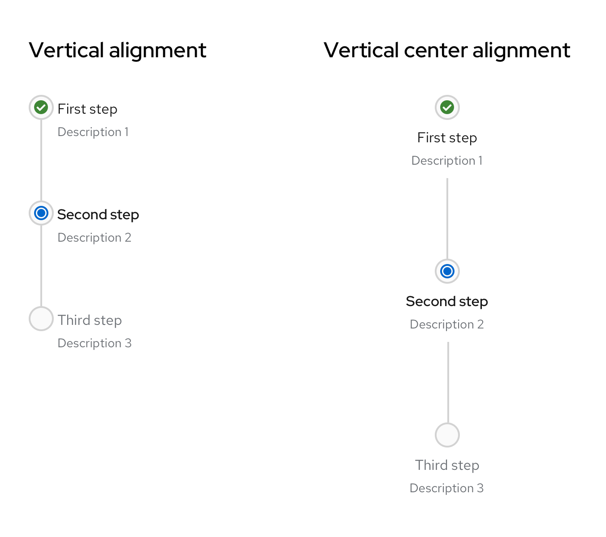

### Compact progress stepper
In areas with less real estate such as table rows, the compact progress stepper can be used. The component will not display as much information such as each step’s title and/or description and will be smaller in size. The compact progress stepper also accounts for the alignment variations.

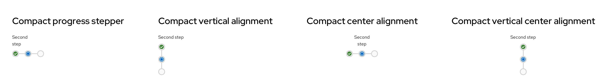

### Progress stepper with icons
Custom icons can also be used for each step of the progress stepper based on the use case and the product’s need.

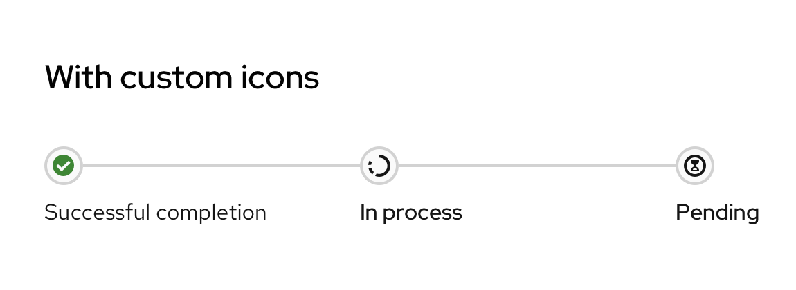

### Progress stepper with help popover
If additional help information or help text is needed and there is not enough real estate for a description, a popover on each step’s title can be used.

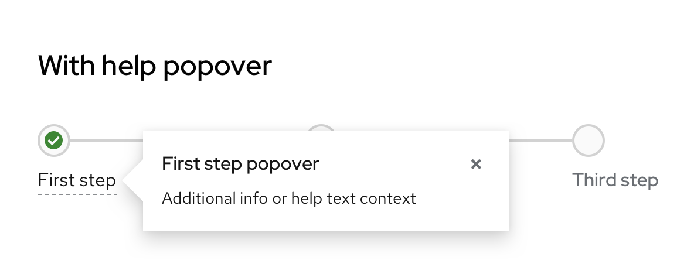

## Content considerations
Progress steppers should be self-explanatory and therefore include minimal written content: A title and an optional description.

Keep the title and description short and specific, between 1-3 words for the title and a few words for the description. Use verbs that clearly communicate each step of the process. There is no need to punctuate the title or description as they are fragments and not full sentences.

Use verb tenses to communicate the state of a process: In progress, failed, or complete.
 
For **in progress** steps, write your progress stepper title with present participles (—ing) to share that a process is underway. Avoid passive voice by starting each title with the present participle ("-ing") form of your task’s verb.

| **Do**                      | **Don't**                  |
|:-------------------------------:|:--------------------------:|
| Installing cluster | Cluster is installing | 
| Creating cache | Cluster creation in progress | 

For **failed** steps, write your progress stepper title in past tense. Avoid telling users a process “failed” in favor of providing a more specific description.

| **Do**                      | **Don't**                  |
|:-------------------------------:|:--------------------------:|
| Could not install cluster | Cluster installation failed | 
| Could not validate account credentials | Account validation unsuccessful | 

For **complete** steps, write your progress stepper title in past tense. Use this brief line to confirm that a process or task succeeded. Avoid using adverbs like “successfully” by simply stating the action happened.

| **Do**                      | **Don't**                  |
|:-------------------------------:|:--------------------------:|
| Cluster installed | Installation is complete | 
| Validated account credentials | Successfully validated account credentials | 

## Accessibility
For information regarding accessibility, visit the progress stepper [accessibility tab](/components/progress-stepper/accessibility).
