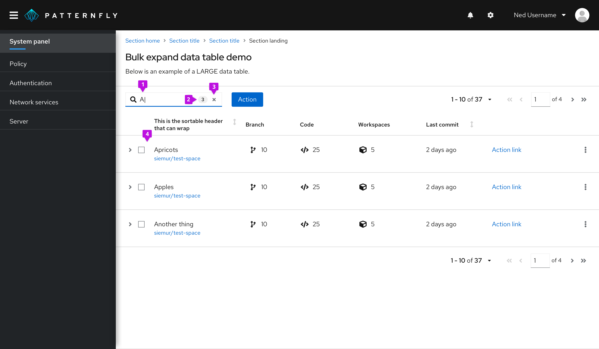
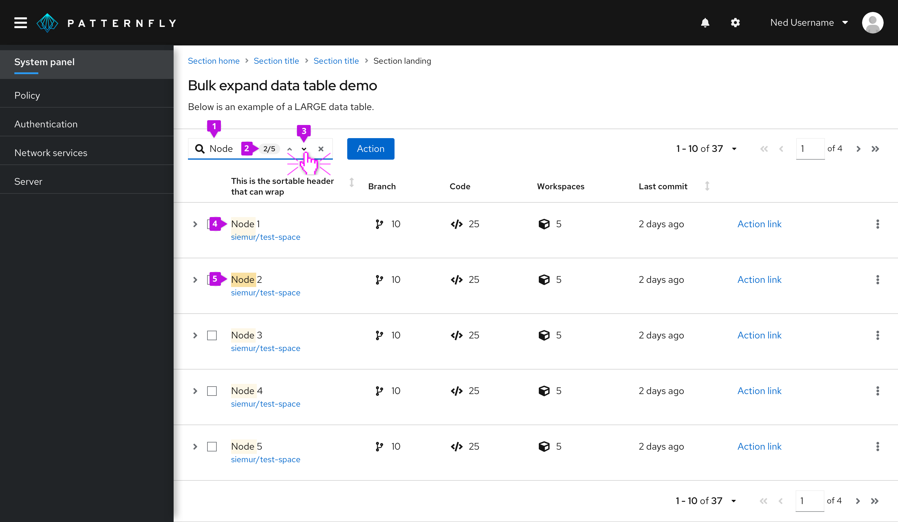
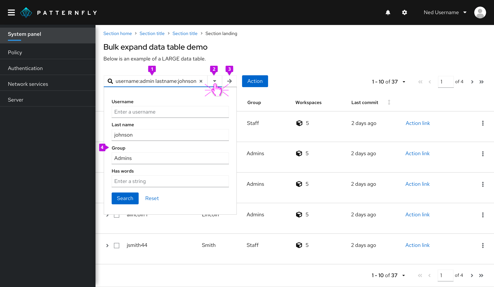

## Usage
Use a search input when you want to either filter down or locate values from a dataset that match an inputted value.

### Search input as a type-ahead filter

A search input can act as a basic filter for narrowing a list of values as the user types. If you want a search field with an explicit submit button (not type-ahead), we recommend that you use an [input group](/components/input-group) with a search button to act as a basic text filter.

1. **Input field:** The user’s input immediately starts filtering down the list as the user types. There is no need for them to press enter.

2. **Optional badge:** As matches are found, an optional badge may be added to the input field containing the count.

3. **Clear:** A clear button is easily accessible once the user begins typing to clear the field if necessary.

4. **Filtered list:** The list is filtered to match the value entered in the input field, in this case, “A”.

### Search input as a find function
Another way to use search input is as a find function. This would mean that the value entered within the field would then be compared to each result, and only matches would be highlighted.

1. **Input field:** The user’s input immediately starts matching to values as they begin typing.

2. **Optional badge:** A badge, by itself, can be used to capture the total count of matches. In this case, since navigation is also being used, it displays the match number that the user is highlighting compared to the total number of matches.

3. **Optional navigation:** The navigation feature allows the user to navigate 1-by-1 through the matched results. It will correspond to the count that is within the badge.

4. **Match highlight:** All matches will be highlighted using `gold-50`from the [PatternFly color palette](/design-foundations/colors#color-palette).

5. **Current highlight:** The active match will be highlighted with `gold-100` from the [PatternFly color palette](/design-foundations/colors#color-palette). In this case, since the user is on match 2 of 5, “Node” in “Node 2” is highlighted.

### Advanced search
The [advanced search variant](/components/search-input#advanced) is intended for more advanced search use cases across multiple attribute-value pairs. It allows users to enter complex search queries from the keyboard or to fill out a search form. Use this component for search or filter queries that involve many attributes and when you want to give the user the option to use a form to complete the search criteria.

1. **Input field:** Accepts one or more search queries in the form of an attribute-value pair. The delimiter character used to separate attribute and value strings can be passed to the component. Typical delimiter characters are “:” or “=”. If the user enters a string that is not in the form of an attribute-value pair, it will be treated as a standard text search where the software will search for the occurrence of that string anywhere in the data set.

2. **Form toggle:** Opens or closes the search form when clicked.

3. **Search button:** Triggers the query and returns filtered results.

4. **Search form:** Gives the user the option to visually specify their search by filling out a form inserted into the dropdown panel. The component will synchronize the information entered into the form with the field. If a search button is included on the form, it should have the same effect as clicking the search button adjacent to the field.

When building a search that contains multiple terms, an AND relationship between the search terms is assumed.
