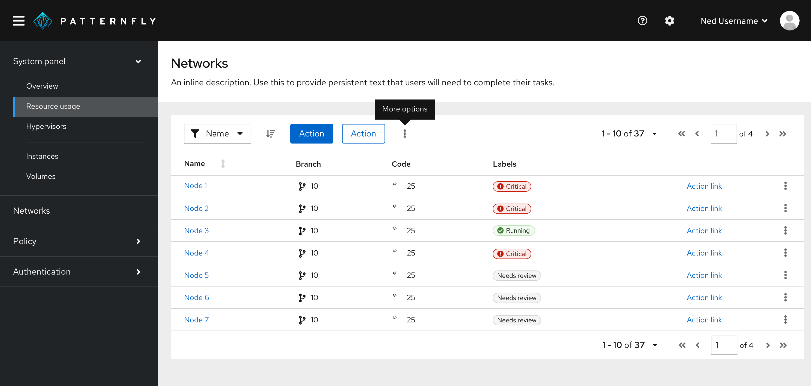
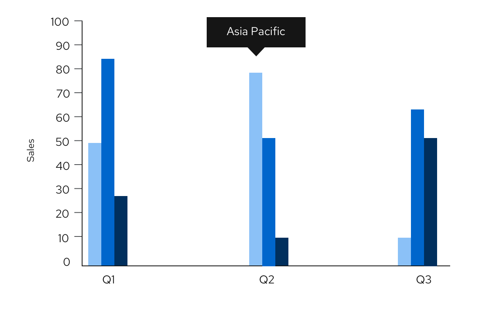
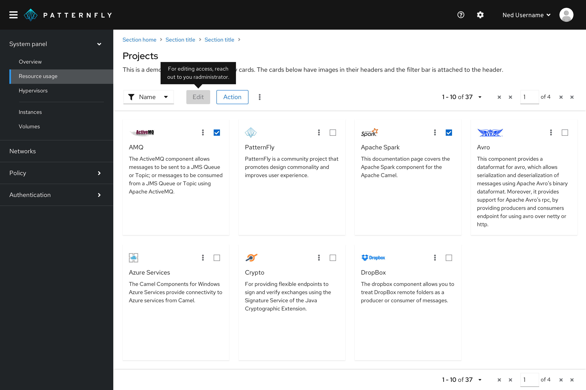
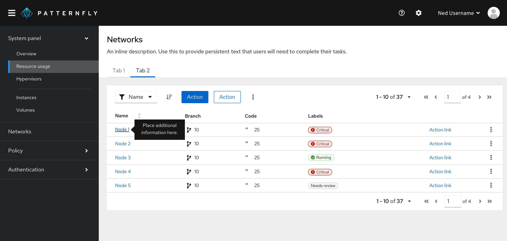

For information on other forms of on-screen help, see [popover](/components/popover/design-guidelines) and [hint](/components/hint/design-guidelines). 

## Usage 
Use tooltips to:
- Provide labels for unlabeled icons.   

    

- Provide additional information on a data point or element in a chart or table.   

   

- Define new or unfamiliar UI elements that aren’t described directly in the user interface. For example, you can use a tooltip on a disabled button.

  

- Provide additional information on text or labels on hover. A way for users to see more information before clicking the element and being directed to a new page or producing an action on the page.

  

### Tooltip delay on hover
By default, tooltips have a 300ms entry delay when hovering over an object. Although this is the recommended delay time, you may customize it via prop. For example, if you have a tooltip on an icon, and you would like for it to appear immediately on hover, you may set the delay to 0 ms.

### When to use tooltips vs. popovers
Both tooltips and [popovers](/components/popover/design-guidelines) provide more information in context for users. However, they’re different in a few ways:

- Tooltips are used for identification purposes, while popovers are used for added description or information in context. 
- Tooltips contain short descriptions or labels, while popovers contain longer descriptions, formatted text, and optional images or links.
- Tooltips appear on hover, while popovers appear on click.   

## Content considerations
For content guidance, refer to [our tooltip writing guide.](/ux-writing/tooltips)

## Accessibility

For information regarding accessibility, visit the [tooltip accessibility](/components/tooltip/accessibility) tab.

