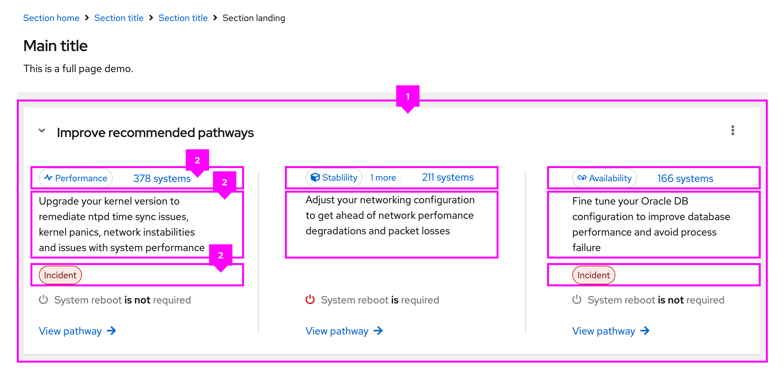

The **flex** layout supports a completely custom layout by utilizing the PatternFly spacer and breakpoint systems. Flex layouts are infinitely nestable and allow you to adjust spacing, direction, alignment, justification, wrapping, and width to fit your needs.

## Elements

1. **Flex:** The flex container, which contains all flex items.
1. **Flex item:** An individual section of content to be placed in the flex container. 

## Usage

Flex layouts can be combined with other layouts to create versatile UIs. 

For example, our [dashboard pattern](/patterns/dashboard) combines the grid layout with flex to improve the responsiveness of information. Similarly, our [primary-detail pattern](/patterns/primary-detail/react-demos/primary-detail-full-page/) combines the stack layout with flex to ensure that icons and buttons are responsive to changes in screen size. 

### When to use the flex layout

Use the flex layout with content heavy UIs and when it is necessary to wrap UI elements.

### When to use the flex layout vs the grid layout

Use the flex layout when a rigid grid is not necessary or wanted. If you need a more structured layout, consider using a the [grid layout](/layouts/grid).

## Variations

The flex layout is based on the [CSS "flex" properties](https://www.w3schools.com/cssref/css3_pr_flex.php), which help determine how a flex item will grow or shrink to fit a containers available space. These properties allow for variation in the implementation and appearance of flex layouts. 

Most of the flex layout variations are available at our standard breakpoints. In the future, we plan to apply these modifiers via [ResizeObserver](https://developer.mozilla.org/en-US/docs/Web/API/ResizeObserver). 

