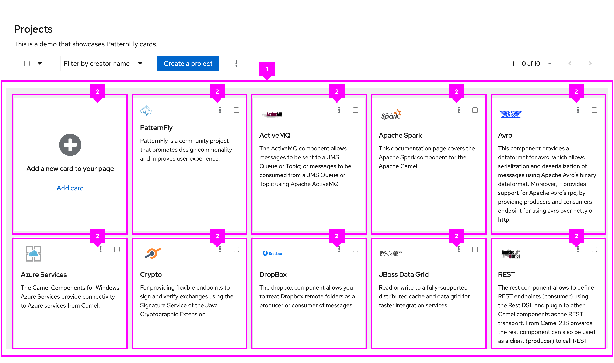

The **gallery** layout is used to arrange content in a responsive grid. Content will wrap responsively to create uniform rows and columns.

## Elements

The gallery layout is designed so that all of its elements wrap responsively, are of uniform size, and are displayed horizontally.

1. **Gallery:** The gallery container, which contains all gallery items.
1. **Gallery item:** An individual item to be placed in the gallery.

## Usage

While a gallery layout resembles a grid, it is not the same as the grid layout, which is structured more rigidly.

The gallery layout is commonly used for UIs that contain multiple card components.

## Variations

### Gutters around items

If you want to add spacing between items (a common practice for card views), you can apply gutters.

### Items with customized wrapping

Both a minimum and maximum width can be defined for gallery items. These values determine the width that a gallery item is allowed to be before wrapping.
