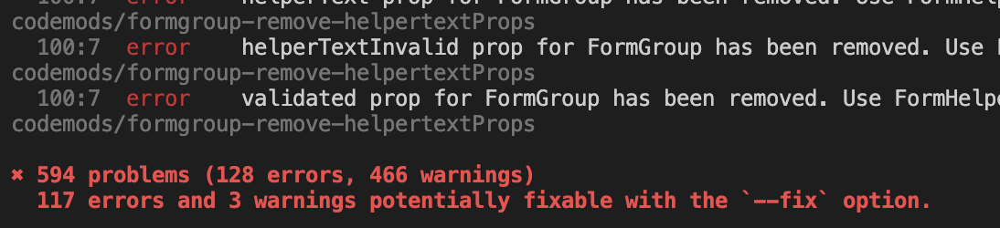

import { Alert } from '@patternfly/react-core';

<Alert variant="info" isInline title="Before you upgrade"> Make sure that you have already completed [the PatternFly 5 upgrade](https://v5-archive.patternfly.org/get-started/upgrade) before attempting to support PatternFly 6. This will ensure that your product has addressed any necessary changes from our previous release.
</Alert>

PatternFly 6 introduces exciting new features and functionality, as described in [our release highlights](/get-started/release-highlights). To support these new offerings, we've introduced a long list of changes, the details of which can be found in [our major release notes](/get-started/upgrade/release-notes). 

This guide outlines the steps required to upgrade your codebase to PatternFly 6 and provides additional resources to support your migration efforts.  

**Note:** If your product uses a custom solution to replicate PatternFly styling (without using PatternFly components), then it will need to be re-skinned. We recognize that this may be a large undertaking, so we encourage you to reach out to the PatternFly team so that we can help support this work. 

## Get help 

If you need support as you upgrade, the PatternFly team is here to help! 

Don't hesitate to reach out to us on [Slack](https://join.slack.com/t/patternfly/shared_invite/zt-1npmqswgk-bF2R1E2rglV8jz5DNTezMQ) or ask a question on [our GitHub discussion board](https://github.com/orgs/patternfly/discussions). Since this upgrade includes significant visual changes, please contact us if you have a question about styles or if you think something looks wrong in your UI. We'll always do our best to answer your questions, double-check your work, and connect you with the right people quickly. 

## How to upgrade

When you upgrade your product to PatternFly 6, several breaking changes will likely be introduced to your product’s codebase. These steps walk you through the migration process and connect you with resources that will help you address these breaking changes.

### 1. Run our codemods suite

Where we can, we offer [a suite of PatternFly codemods](https://github.com/patternfly/pf-codemods/) to simplify and streamline your upgrade process. Instead of requiring you to manually identify all errors and issues in your codebase, you can run our codemods to quickly identify and fix major issues. Keep in mind that some changes will still require manual intervention, but our codemods can automatically fix a large amount of issues and flag any issues that do require manual work.

**Note:** Running codemods after making manual changes will lead to even more manual intervention and cleanup. Because of this, we strongly recommend running codemods _before_ making any manual changes to your codebase.

To run our codemods, follow these steps: 

1. Run the following command, adding in the path to your product's source code: 

  `npx @patternfly/pf-codemods@latest <path to your source code> --v6`

    * You should see an output similar to running `lint`, with both a list of warnings and errors, as well as a total count of each, as shown in the following example:
    
    

    * If you see something different, please reach out before going further as there may be an issue.

2. Make note of any issues that get flagged.

3. Add the `--fix` flag to the end of your original command and run it again. 

4. Make note of the changes applied to your product's code base.

5. Note any errors that were not automatically fixed (some may simply be warnings) and manually repair issues that are critical.

6. Build your product.

7. Run codemods multiple times to ensure that all issues are flagged and addressed.

### 2. Remove all CSS overrides

PatternFly 6 supports our new design token system, which changes variable names across PatternFly. These changes mean that **all** existing CSS overrides must be updated (or removed), because they will be targeting outdated styles and will no longer work. 

At the start of your upgrade process, we strongly recommend temporarily removing all of your CSS overrides. Once you've run through all the codemods, remove your overrides and see how things look. Since there often isn't a 1:1 equivalent for every PatternFly 5 style in PatternFly 6, your previous overrides may no longer be relevant. 

We recommend *completely* removing CSS overrides as much as possible, so that your product upgrade experience will be smoother for future releases. 

If you do need to keep any CSS customizations, continue to step 3 and follow the instructions to [review and update variable and class names](#3.-review-and-update-variable-and-class-names) and make sure you are using what's most appropriate.

### 3. Review and update variable and class names
A number of variables were removed or added with PatternFly 6, primarily due to logical direction changes, refactoring, or deprecation. For more context, we've put together a list of [variables that have been removed](https://docs.google.com/spreadsheets/d/e/2PACX-1vQqeH7ThYi0jkhYEB8B2SXa7x8AaY5T9ajG6o-Ogz3p7YVp0OuTulb_L3DYLDrHlY4zUE3IBiup6tkN/pubhtml?gid=1160160856&single=true) and a list of [variables that have been added](https://docs.google.com/spreadsheets/d/e/2PACX-1vQqeH7ThYi0jkhYEB8B2SXa7x8AaY5T9ajG6o-Ogz3p7YVp0OuTulb_L3DYLDrHlY4zUE3IBiup6tkN/pubhtml?gid=268831450&single=true).

Wherever you have any custom CSS overrides that reference PatternFly class names or CSS variables, you should carefully review them and make updates to ensure that they align with our new design tokens, as described in [our tokens documentation](/tokens/all-patternfly-tokens). 

To assist with naming updates, we offer 2 codemods: 
- [class-name-updater](https://github.com/patternfly/pf-codemods/tree/main/packages/class-name-updater): Automatically identifies and renames classes that need to be updated as a result of changes in PatternFly 6.

- [tokens-update](https://github.com/patternfly/pf-codemods?tab=readme-ov-file#tokens-update): Helps update global CSS variables in your React code.

#### Run class-name-updater
This utility helps highlight places in your codebase that may require you to make adjustments. Specifically, it can replace `pf-v5` prefixes with `pf-v6`. 

Because this utility performs a simple "find and replace" (as shown in [the README example](https://github.com/patternfly/pf-codemods/tree/main/packages/class-name-updater#example)), it's possible that it will inadvertently identify code that is formatted similarly to a PatternFly class name, but is not one. You should check to ensure that this doesn't cause any unintentional changes.

When using this codemod, make sure to add: 
- The `--v6` option, since you are upgrading to PatternFly 6. This codemod targets v5 of PatternFly by default.
- The `--fix` flag to allow the codemod to fix issues where possible.

After running the class-name-updater codemod, continue to the next step to run the tokens-update codemod using the instructions in the next section.

#### Run tokens-update
Note that this will *only* fix JavaScript or TypeScript files: not CSS. 

This codemod updates global color variables to a temporary hot pink color (`--pf-t--temp--dev--tbd`, or `t_temp_dev_tbd` when using [React tokens](/tokens/develop-with-tokens#react-tokens)) to visibly mark the places where you will have to manually replace tokens. For other global variables (like spacers, font size, or box shadows), this codemod will attempt to provide an auto-fix to match the same value (or the closest one).

This codemod works both for CSS variables and React tokens. For example:
- A CSS variable: `--pf-v5-global--FontSize--lg` becomes `--pf-t--global--font--size--lg`
- A react token: `global_FontSize_lg` becomes `t_global_font_size_lg`

### 4. Update any pixel-based logic for breakpoints

In PatternFly 6, we've transitioned from using pixels to using rem units for our global breakpoint design tokens. You can find these updated values in [our tokens documentation](/tokens/all-patternfly-tokens).

Breakpoint | Design token | Pixel value (previous) | Rem value (new) |
| --- | --- | --- | --- |
| xs |`--pf-t--global--breakpoint--xs` | 0px | 0rem
| sm |`--pf-t--global--breakpoint--sm` | 576px | 36rem
| md |`--pf-t--global--breakpoint--md` | 768px | 48rem
| lg |`--pf-t--global--breakpoint--lg` | 992px | 62rem
| xl |`--pf-t--global--breakpoint--xl` | 1200px | 75rem
| 2xl |`--pf-t--global--breakpoint--2xl` | 1450px | 90.625rem

If you have previously implemented any breakpoint logic based on a pixel value, you will need to account for the fact that PatternFly 6 breakpoint tokens use rems. Beyond the previous table, dividing pixel values by 16 will give you the equivalent rem value to use.

### Potential test failures

There are a few test failures that you're likely to encounter: 

1. **Button:** Cannot find `aria-disabled`
    - We changed button's `isDisabled` prop to assign a value for `disabled`, but none for `aria-disabled`. As a result, any test that looks for `aria-disabled` may fail.
1. **Button:** Cannot find button attributes when using `byText`
    - There's a new wrapping `div` around text in buttons. The RTL `byText` query returns that wrapper instead of the button element itself, which is where button's attributes live. Instead of `byText`, use `byRole` and pass the button text to `name`. This will return the top-level button element.
1. **Select (when using React Testing Library):** Cannot find `role`
    - You may get an "unable to find role" error if the Popper menu is set to `aria-disabled` after a selection is made, because the React Testing Library query can't find the menu options. This error only seems to occur in unit tests, rather than within the browser. To resolve this, either: 
        - Pass in the `{hidden: true}` option. 
        - Change select's `appendTo` to `inline`.
