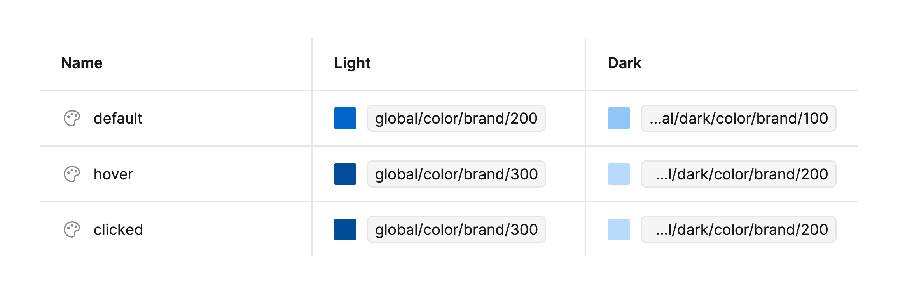

Tokens are only available as part of PatternFly 6. In order to make use of our token system, you will need to install the PatternFly 6 design kit [using our onboarding guide](/get-started/design) and make sure that your product is [upgraded to PatternFly 6](/get-started/upgrade). 

## Using tokens in Figma

Our tokens are set up as [variables](https://help.figma.com/hc/en-us/articles/15339657135383-Guide-to-variables-in-Figma) and [styles](https://help.figma.com/hc/en-us/articles/360039238753-Styles-in-Figma) in Figma, within our [Design Tokens and Styles Library](https://www.figma.com/@PatternFly). They define all of the design elements used in PatternFly, including color, font size, spacing, dimensions, and more.

Figma tokens align with the segments in [our token variable structure](/tokens/about-tokens#token-names), but they use a forward slash (/) in place of a double hyphen (--).

  

PatternFly 6 elements, including components, charts, and extensions, are built with tokens. Therefore, you will typically not need to work with tokens directly. The exception to this is if you are deviating from our built-in customization options. [See these instructions for more detail.](#making-customizations)

Because tokens are set up behind the scenes, they enable you to customize components as you add them to your design. Before you insert a component into a Figma design workspace, you can adjust its properties and variable modes to fit your specific use case. 

This allows you to quickly swap between different variants and enable/disable component enhancements. For example: 

  

Once you've inserted a component into your workspace, you can continue to customize its appearance in [Figma's design sidebar](https://help.figma.com/hc/en-us/articles/360039832014-Design-prototype-and-explore-layer-properties-in-the-right-sidebar). When choosing colors, styles, and effects, you will see a list of tokens to choose from.

### Customizing designs with tokens

If you're working on a custom design, you may need to adjust a component beyond the predefined options. For example, you may need to add text or custom spacing where it isn't already present. When you create custom designs, use tokens appropriately to achieve the style and structure you need. Choose the semantic token that is the best fit for your needs. 

Our tokens are intentionally scoped so that they can only be used to modify relevant visual attributes. For example, a token may have its color scope limited so that it can only be used as a fill color or a stroke color. This means that, while you can use tokens to customize a design, you will only be able to use certain tokens in certain situations. This helps ensure that you're using tokens that are conceptually relevant to the design element that you're working on.
