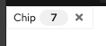

import { Button, ClipboardCopy, Divider, PageSection } from '@patternfly/react-core';
import { CopyCodeBlock } from '../copyCodeBlock/copyCodeBlock';

<PageSection variant="light">
# Fundamentals

PatternFly Core is based on the principles of <a href="http://bradfrost.com/blog/post/atomic-web-design/" target="_blank">Atomic Design</a> and <a href="http://getbem.com/introduction/" target="_blank">BEM</a> (Block, Element, Modifier).

Atomic Design is a methodology for creating design systems. Using Atomic Design, user interfaces are broken down into reusable components that can be reassembled to create reusable interaction patterns.
PatternFly consists of isolated and modular structures that fall into three categories:
- Components are modular and independent structures concerned with presentation.
- Layouts allow for the organization and grouping of their immediate children on the page.
- Demos illustrate how to assemble components and layouts into complex structures.

## Components
In PatternFly, components are the basic building blocks of user interfaces. They cannot be broken down into smaller parts. Examples include the button, label, and badge components. A CodeSandbox link has been provided to experiment with and follow the proceeding steps.

<Button variant="primary" component="a" href="https://codesandbox.io/s/html-fundamentals-start-hy2erg?file=/index.html" target="_blank">CodeSandbox - HTML fundamentals</Button>

</PageSection>
<PageSection>
### Step 1. Add a button component.
Add a button element to the `<body>` of the `index.html` file. To apply PatternFly styling to the button, add the class `pf-v6-c-button`. To also apply ‘primary’ styling to the button and make it a bright blue color, add the `pf-m-primary` class.

<CopyCodeBlock>
{`<button class="pf-v6-c-button pf-m-primary" type="button">\n  Primary\n</button>`}
</CopyCodeBlock>

**Note:** A simple component can be reused multiple times.

<CopyCodeBlock>
{`<button class="pf-v6-c-button pf-m-primary" type="button">
Primary\n</button>\n<button class="pf-v6-c-button pf-m-primary" type="button">
Primary\n</button>`}
</CopyCodeBlock>

### Step 2. Build more complex components
Simple components can be combined to make more complex components that are still reusable.
When simpler components are used within more complex components, the layout of the elements are defined in the stylesheet for the complex component.
In this step, add a badge component to the chip component.

#### Step 2.1 
To build a chip component, replace the contents of the `<body>` in the index.html file with the following code snippet.

<CopyCodeBlock>
{`<div class="pf-v6-c-chip">
<span class="pf-v6-c-chip__text">
  Chip
</span>
<button class="pf-v6-c-button pf-m-plain">
  <i class="fas fa-times"></i>
</button>\n</div>`}
</CopyCodeBlock>

This is the default chip component that already has another component in it: the button. This is why the chip can be considered as a more complex component.

#### Step 2.2
Add the badge inside the chip. To do this, add this block of code between `pf-v6-c-chip__text` and `pf-v6-c-button`.

<CopyCodeBlock>
{`<span class="pf-v6-c-badge pf-m-read">
7\n</span>`}
</CopyCodeBlock>

**Note:** Remember, this is a component and not a demo because the chip component includes styles that handle how the badge looks within the chip. For example, when the badge component is added to the chip, it receives styling that gives it a margin. You can see that the badge in a chip has its own CSS variable, `--pf-v6-c-chip__c-badge--MarginLeft`, defined for the right margin under the <a href="/components/chip">CSS Variables section of the chip documentation</a>.

The resulting chip should match the following image.


</PageSection>
<Divider />
<PageSection>
## Layouts

In PatternFly, layouts allow for organizing and grouping elements. This tutorial covers just 1 of the 7 layouts.

### Step 1 
Copy code into the `<body>` of the `index.html` file.

<CopyCodeBlock>
{`<div>
<div class="pf-v6-c-card">
  <div class="pf-v6-c-card__title">
    Title
  </div>
  <div class="pf-v6-c-card__body">
    Body
  </div>
  <div class="pf-v6-c-card__footer">
    Footer
  </div>
</div>\n</div>`}
</CopyCodeBlock>

### Step 2 
Add the `pf-v6-l-bullseye` class to the card. This will center the card horizontally and vertically on the page.
Find the outermost `<div>` wrapper for the card and add the class `pf-v6-l-bullseye`.
It should look like: `<div class="pf-v6-l-bullseye">`

**Note:** It’s important to follow the documentation for layouts because it demonstrates where to add the layout class. The <a href="/layouts/bullseye/html" target="_blank">documentation for bullseye</a> specifies to add the class `pf-v6-l-bullseye` to the parent container of its child.
</PageSection>
<Divider />
<PageSection>
## Demos
Demos show how PatternFly’s components and layouts are put together to build more complex structures. Demos have no additional styling; they are strictly made from components and layouts. If styling is needed for a certain demo, then instead create new components or layouts, or variants of the components or layouts.

Create a form demo using components and layouts.

### Step 1. Add five form components
Copy and paste this block of code 5 times in the index.html file.

<CopyCodeBlock>
{`<form class="pf-v6-c-form">
<div class="pf-v6-c-form__group">
  <div class="pf-v6-c-form__group-label">
    <label class="pf-v6-c-form__label">
      <span class="pf-v6-c-form__label-text">
        Form label
      </span>
    </label>
  </div>
  <div class="pf-v6-c-form__group-control">
    <input class="pf-v6-c-form-control"/>
  </div>
</div>\n</form>`}
</CopyCodeBlock>

### Step 2. Apply a grid layout

#### Step 2.1 
Add one `<div>` wrapper around all 5 form components with the `pf-v6-l-grid` layout class. It should look like this:

```noLive
<div class="pf-v6-l-grid">
  /* 5 form components are here */
</div>
```

### Step 3. 
Wrap each form component in its own `pf-v6-l-grid__item` layout class. To do this, look for each `pf-v6-c-form` in `index.html` and wrap it in the `pf-v6-l-grid__item` class.
The wrapper should look like this:

```noLive
<div class=”pf-v6-l-grid__item”>
  /* code for individual form component */
</div>
```

### Step 4. Add the `pf-m-gutter` modifier class to the grid layout 
Adding the `pf-m-gutter` modifier class to the grid layout ensures there is equal spacing around all children.

Add the class `pf-m-gutter` after `pf-v6-l-grid` to the outermost wrapper, inside the quotation marks.
It should look like: `<div class="pf-v6-l-grid pf-m-gutter">`
**Note:** Learn how modifier classes work with layout classes by looking at PatternFly's <a href="/layouts/grid/html#usage" target="_blank">grid documentation</a>.

### Step 5. Add modifier classes to the grid item classes.
This step modifies the number of columns that a grid item spans. The maximum number of columns that a grid item can span is 12 (which is equivalent to 100%).
#### Step 5.1 
Find each `pf-v6-l-grid__item` that was added in step 3 and add the class `pf-m-[number from 1 - 12]`. The numbers across a row should add up to 12.

#### Step 5.2 
Add `pf-m-6-col` to the first 2 grid items and add `pf-m-4-col` to the last 3 grid items.

The first 2 grid items should look like: `<div class="pf-v6-l-grid__item pf-m-6-col">`
The second 2 grid items should look like: `<div class="pf-v6-l-grid__item pf-m-4-col">`
</PageSection>
<Divider />
<PageSection>
## Compare your results.

A fully constructed demo can be viewed and modified in the provided CodeSandbox solution. Compare your work with the solution.

<Button variant="primary" component="a" href="https://codesandbox.io/s/html-fundamentals-final-o7g08o?file=/index.html" target="_blank">CodeSandbox solution - HTML fundamentals</Button>

</PageSection>
