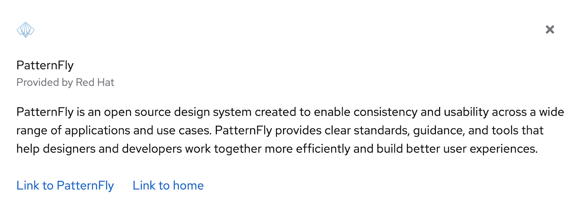
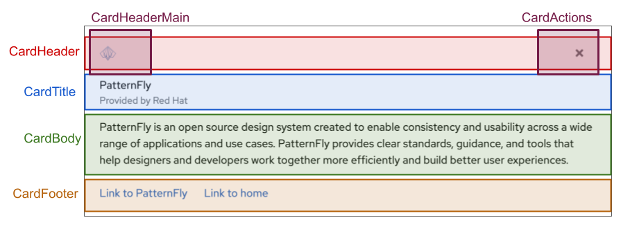

import { Button, ClipboardCopy, Divider, PageSection } from '@patternfly/react-core';
import { CopyCodeBlock } from '../copyCodeBlock/copyCodeBlock';

<PageSection variant="light">
# React fundamentals
PatternFly React is made up of components, layouts, and demos. The PatternFly React library provides a collection of React components used to build interfaces with consistent markup, styling, and behavior.

To become familiar with building UIs with PatternFly, you will build a PatternFly card. A card is a flexible element for containing any type of content. Cards are used on dashboards, in data displays, or for positioning content on a page.
</PageSection>
<PageSection>
## Step 1. Consider and evaluate the design
Consider the design in Figure 1 and evaluate which components and subcomponents compose the design. 

**Figure 1**

Figure 1 is a design using PatternFly's card component. To learn more, read the documentation for a card's <a href="/components/card" target="_blank">React implementation</a> and the <a href="/components/card/html" target="_blank">HTML structure</a>.
In PatternFly, subcomponents compose the various regions of a card so its structure is flexible enough to accommodate a range of designs. For example, a card can contain 1 or more of its various subcomponents such as `CardHeader`, `CardHeaderMain`, `CardActions`, or `CardTitle`.
In this exercise, create a card to match the design in figure 1 with an image, close action, header, body, and footer.

**Figure 2**

The design in Figure 1 can be broken down into the card’s various subcomponents, as demonstrated in Figure 2. The React components used to construct this card can be arranged, as demonstrated in the card structure code snippet below. You can also view and modify this code in the provided CodeSandbox.

<Button variant="primary" component="a" href="https://codesandbox.io/s/flamboyant-orla-gi8ho1" target="_blank">Codesandbox - React fundamentals</Button>

</PageSection>
<PageSection>
**Card structure**

<CopyCodeBlock>
{`<Card>
<CardHeader>
  <CardHeaderMain></CardHeaderMain>
  <CardActions></CardActions>
</CardHeader>
<CardTitle></CardTitle>
<CardBody></CardBody>
<CardFooter></CardFooter>\n</Card>`}
</CopyCodeBlock>

</PageSection>
<Divider />
<PageSection>
## Step 2. Build out the `CardHeader`
The `CardHeader` contains `CardHeaderMain` and `CardActions`.

### Step 2.1
Add a `brand` component to the `CardHeaderMain` component to place a product logotype on a screen. All that is needed is the source image or SVG and alt text. Here the PatternFly logo is used.

<CopyCodeBlock>
{`<Brand
src="https://pf4.patternfly.org/assets/images/pf-logo-small.svg"
alt="Patternfly Logo"\n/>`}
</CopyCodeBlock>

### Step 2.2
Add a close button to the `CardActions` component. Buttons communicate and trigger actions a user can take in an application or website. They come in several variants, such as `primary`, `secondary`, `tertiary`, `danger`, `plain`, `link`, and `control`.
Add a button using the `plain` variant.

<CopyCodeBlock>
{`<Button variant="plain"> </Button>`}
</CopyCodeBlock>

### Step 2.3
Add an icon inside the button. PatternFly React provides a variety of icons. They're easy to use and compile into SVG files. Use them inside buttons and other components.
Add a `TimesIcon` so that the card can be closed.

<CopyCodeBlock>
{`<TimesIcon />`}
</CopyCodeBlock>
</PageSection>
<Divider />
<PageSection>
## Step 3. Build out the `CardTitle`

### Step 3.1
Add the content component with a variant inside of the `<CardTitle>`. The content component can wrap any static HTML content that is placed on the page to provide correct formatting when using standard HTML tags. The content component comes in several variations, such as `h1`, `p`, `a`, `small`, `blockquote`, and `pre`.
Use the ‘p’ variation, which is specified with `component="p"`.
Add the following code inside the `CardTitle` component:

<CopyCodeBlock>
{`<Content component="p">
PatternFly\n</Content>`}
</CopyCodeBlock>

### Step 3.2
Add a subhead below the content added in Step 3.1. `Content` without component prop is used to wrap html elements and provides them with extra spacing and styling.
Add the following code below the content component that is inside of the `CardTitle`:

<CopyCodeBlock>
{`<Content>
<small>
  Provided by Red Hat
</small>\n</Content>`}
</CopyCodeBlock>
</PageSection>
<Divider />
<PageSection>
## Step 4. Add content to the `CardBody` component
Any filler text can be added as a child of the `CardBody` component.
</PageSection>
<Divider />
<PageSection>
## Step 5. Add content and a layout to the `CardFooter`

### Step 5.1
Add a split layout to the `CardFooter` component.

PatternFly offers several layout options, including grid, bullseye, and split layouts.
Use a split layout to separate a pair of buttons in the footer of the card. The split layout is designed to position items horizontally. Add a `<SplitItem>` component inside `<Split>` for each item in the layout.

<CopyCodeBlock>
{`<Split>
<SplitItem>
</SplitItem>
<SplitItem>
</SplitItem>\n</Split>`}
</CopyCodeBlock>

### Step 5.2
Add a button to the first `SplitItem` component. Use the link variant of the button and add an `isInline` property so that the buttons are inline rather than block elements.

<CopyCodeBlock>
{`<Button variant="link" isInline>Link to PatternFly</Button>`}
</CopyCodeBlock>

### Step 5.3
Add a button to the second `SplitItem` component. Use the same variant and properties as Step 5.2.

<CopyCodeBlock>
{`<Button variant="link" isInline>Link to home</Button>`}
</CopyCodeBlock>

### Step 5.4
Add a `hasGutter` property to the `Split` component to add more spacing between the buttons. The `Split` component should look like this with the `hasGutter` property set.

<CopyCodeBlock>
{`<Split hasGutter >`}
</CopyCodeBlock>
</PageSection>
<Divider />
<PageSection>
## Compare your results

A fully constructed card can be viewed and modified in the CodeSandbox solution. Compare your work with the solution.

<Button variant="primary" component="a" href="https://codesandbox.io/s/react-fundamentals-start-forked-0krbsb?file=/src/App.js" target="_blank">Codesandbox solution - React fundamentals</Button>

</PageSection>
