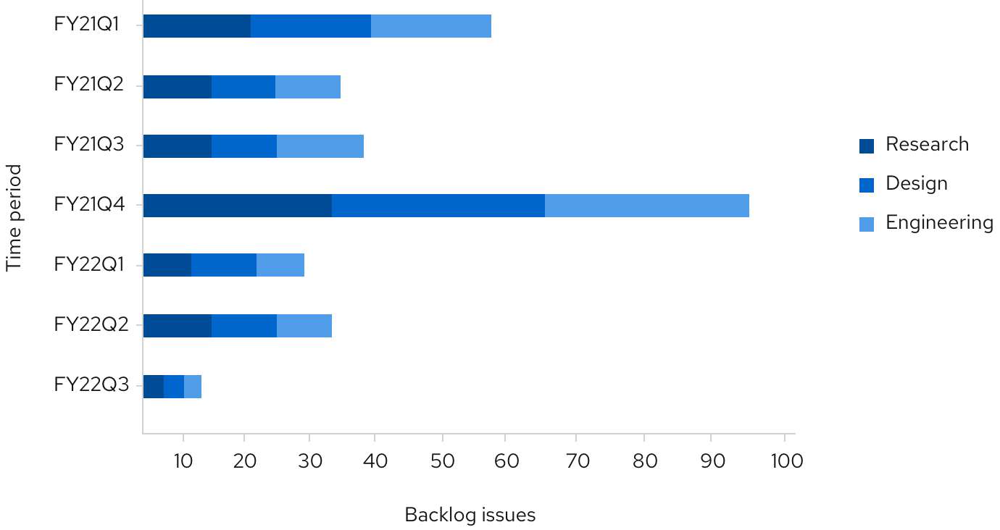
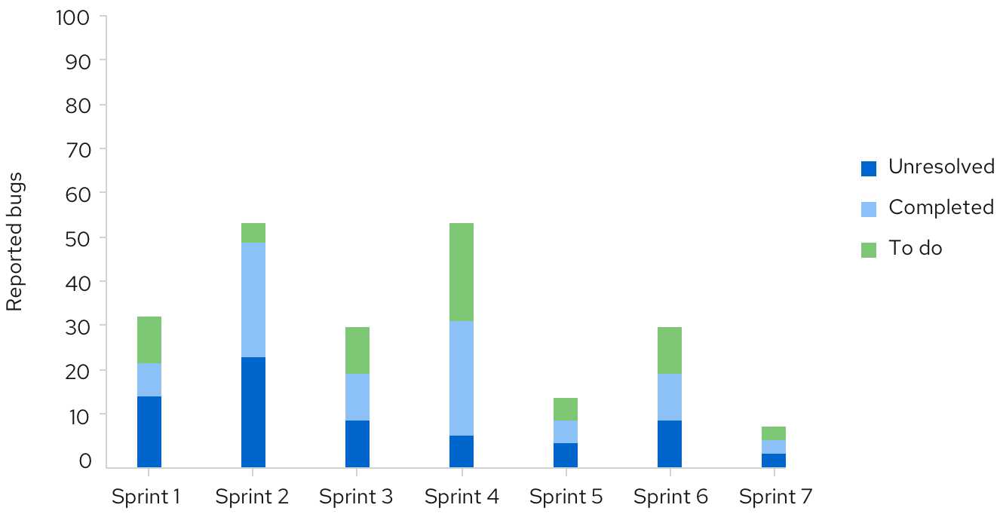

A **stacked bar chart** describes totals while allowing a degree of internal breakdown of its data. Stacked bar charts can be illustrated vertically and horizontally depending on available space and the described data.

## Usage 
An advantageous feature of stacked bar charts is the ability to reorder the stacked bars without changing the chart's overall total.

#### Example

 

The first series name is represented by the topmost stacked bar, and the last series name is represented by the bottommost stacked bar. For recommendations on series colors, see [colors for charts](/charts/colors-for-charts).
