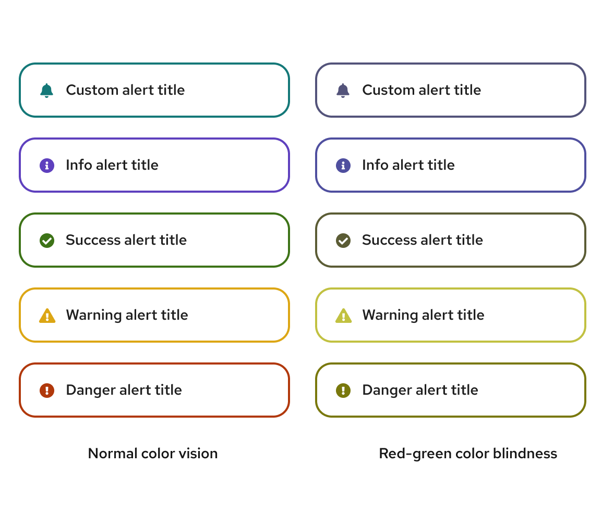
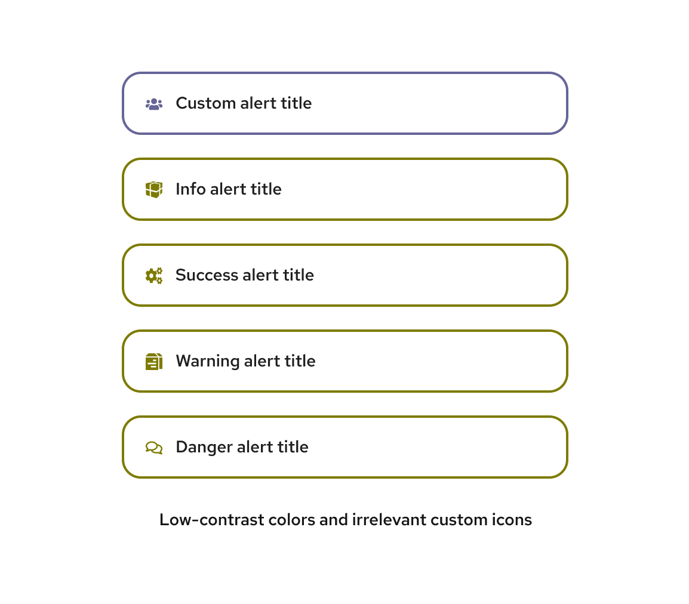

import { Card, CardBody, Grid, GridItem } from '@patternfly/react-core';

As described in our [accessibility guidelines](/accessibility/about-accessibility), users may interact with your product through a variety of assistive technologies. In addition to [developing for accessibility](/accessibility/develop-for-accessibility), you must also incorporate it into your product's visual design. 

## Color and contrast

Color and contrast go hand-in-hand for visual design accessibility. 

For example, you should consider contrast when using colors commonly affected by color perception deficiency (such as those described in ["Overview of Low Vision" by W3C](https://www.w3.org/WAI/GL/low-vision-a11y-tf/wiki/Overview_of_Low_Vision#Color_Perception)). Different colors in a UI should be distinguishable for users across the color perception deficiency spectrum, typically by ensuring that each color has a different contrast weight. 

Designing with contrast in mind also benefits users with light sensitivity.

PatternFly components use [our color palettes](/design-foundations/colors) to pass color contrast tests. As long as you follow our recommendations, any UI built with PatternFly components should have proper contrast between colors, making them distinguishable for users with different types of color perception and light sensitivity. 

It's important not to solely rely on color for conveying information. Even though PatternFly components pass color contrast tests, they also use icons to further help with identification, which can be especially helpful for users with a form of color blindness.

If you go beyond our recommendations to combine PatternFly colors in other ways, please be sure to check your color contrast with a contrast checker. When you alter the colors and/or icons used in PatternFly components, know that they may no longer be accessible for all users. 

## Content 

The text in your UI should also be accessible to users with low vision. For example, links should be descriptive and concise, essential content should not be hidden in the UI, and text should scale appropriately as the UI window is resized or magnified. 

To help simplify and strengthen the way that users process content, it is important to carefully consider your text size, font, letter spacing, margins, and spacing. PatternFly supports accessibility in these areas through our [typography](/design-foundations/typography) and [spacing](/design-foundations/spacers) guidelines.

## Understanding low vision 

In addition to following the previous recommendations, it is helpful to develop an understanding of low-vision users, so that their needs are a key concern as you design.

**Low vision** refers to any visual impairment that impedes a person’s ability to perform everyday tasks, which cannot be corrected with glasses, contacts, medicine, or surgery. 

There are 4 types of limitations as a result of low vision.

1. **Visual acuity**: A measure of a person's visual sharpness, with 20/20 being the standard.
1. **Field of vision**: The area of vision that people can see clearly when their eyes are in a fixed position. Some users have a restricted field of vision, such as central or peripheral field loss.
1. **Color perception**: How people see colors. Some of your users may have deficiencies in color perception that affects their ability to see certain colors. This is commonly called "color blindness", but many people with color perception deficiencies can still see most colors. 
1. **Contrast and light sensitivity**: The way that people perceive luminance (the contrast of foreground and background). 

We do our best to make PatternFly accessible for low-vision users by default, but it is important that you consciously design with these needs in mind to ensure that your final design has proper color, contrast, and content accessibility.
