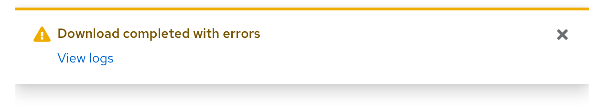
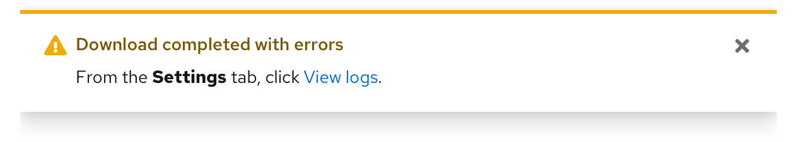

import { Checkbox, List, ListItem } from '@patternfly/react-core';

## Accessibility

To implement an accessible PatternFly **alert** and **alert group**:

- Add an [alert group](/components/alert-group) for an alert to be rendered inside of if you intend or expect the alert to dynamically appear or update, such as a toast alert. Be sure to read the [alert group accessibility](/components/alert-group/accessibility) documentation to use it and the alert component together in an accessible manner.
- Ensure the alert group exists in the DOM on page load when one is intended or expected to be rendered.
- If the alert does not contain a description below the alert's title, then the alert's title should be a non-heading element such as a `span` or `div`.
- If the alert contains a description below the alert's title, then the alert's title should be a heading element. Headings should be ordered by their level and heading levels should not be skipped. For example, a heading of an `h2` level should not be followed directly by an `h4`.

For the PatternFly React library:

- Pass in the `isLiveRegion` prop to the alert group when intending or expecting to render alerts that will dynamically appear or update.

For the HTML/CSS library:

- Pass in the `aria-live="polite"` attribute to the alert group when intending or expecting to render alerts that will dynamically appear or update.

## Testing

At a minimum, an alert and alert group should meet the following criteria:

<List isPlain>
  <ListItem>
    <Checkbox id="alert-a11y-checkbox-1" label="If an alert will dynamically appear or update, it is rendered inside of an alert group component." />
  </ListItem>
  <ListItem>
    <Checkbox id="alert-a11y-checkbox-2" label="If an alert is using a heading element for its title, the heading level fits the page heading level order so that heading levels are not skipped." />
  </ListItem>
  <ListItem>
    <Checkbox id="alert-a11y-checkbox-3" label="If an alert does not have any description below its title, the title is wrapped in a non-heading element such as a 'span' or a 'div'." description="Without a description, a heading element in the title may cause other, unrelated content that follows seem related when navigating the page via rotor menus."/>
  </ListItem>
  <ListItem>
    <Checkbox id="alertGroup-a11y-checkbox-1" label="The alert group exists on page load and is not dynamically rendered." description="This should always exist in the DOM, especially when alerts will dynamically appear or update within it." />
  </ListItem>
  <ListItem>
    <Checkbox id="alertGroup-a11y-checkbox-2" label={<span>If alerts will dynamically appear or update, the alert group has the <code className="ws-code">aria-live="polite"</code> attribute.</span>} description="This will allow assistive technologies to announce dynamically rendered alerts." />
  </ListItem>
</List>

## React customization

The following React props have been provided for more fine-tuned control over accessibility.

### Alert React properties

| Prop | Applied to | Reason | 
|---|---|---|
| `customIcon={[custom icon]}` | `Alert` | Allows setting a custom icon for the alert. When passing in this prop, be sure the icon has `aria-hidden="true"` to remove it from the accessibility tree, which will prevent assistive technologies from potentially announcing duplicate or unnecessary information without visually hiding it. |
| `timeout={[number in milliseconds or true]}` | `Alert` | Automatically dismisses the alert after the specified time in milliseconds. A value of "true" will dismiss the alert after 8000 milliseconds. When customizing this prop, be sure to provide ample time for users to perceive the alert before it gets dismissed, especially if users have to navigate to another page for additional details related to the alert. |
| `component="[the element to use as the alert title]"` | `Alert` | Sets the element to use as the alert title. Default is h4. If a description is provided, the element should be a heading level and heading levels should not skip in the DOM order. If a description is not provided, the element should be a non-heading element such as a `span` or a `div`. |
| `toggleAriaLabel="[text that labels the alert toggle]"` | `Alert` | Adds an accessible name to the alert toggle when the `isExpandable` prop is also passed in. The value passed in should provide context as to which alert will be expanded/collapsed and what type of information is within the expandable area. By default the value is "[alert variant] alert details". |
| `variantLabel="[text that prefaces the alert title]"` | `Alert` | Adds variant label text to the alert title that is accessible only to assistive technologies and is not visually rendered. The value passed in should provide additional context that prefaces the alert title. By default the value is "[alert variant] alert:". <br/><br/> The value of this prop and the `title` prop will automatically be applied to the toggle button for expandable alerts if the `toggleAriaLabel` prop has an empty string passed in as its value. |
| `aria-label="[text that labels the alert close button]"` | `AlertActionCloseButton` | Adds an accessible name to the alert close button. The value passed in should generally indicate that the button will close the alert and what alert will be closed, typically by referencing the alert title. By default the value is "Close [alert variant] alert: [alert title]". |
| `variantLabel="[text that prefaces the alert close button label]"` | `AlertActionCloseButton` | If the `aria-label` prop is not passed into this component, this prop adds variant label text to an alert close button that is accessible only to assistive technologies and is not visually rendered. The value of this prop and the alert's `title` prop are combined to create an accessible name for an alert's close button. The value passed in should provide additional context that prefaces the `title` text. <br/><br/> By default the value is the same as the `variantLabel` on the alert component. |

### Alert group React properties

| Prop | Applied to | Reason | 
|---|---|---|
| `isLiveRegion` | `AlertGroup` | Makes the alert group a live region by setting `aria-live="polite"` and `aria-atomic="false"`. Instead of passing this prop in, you can manually set `aria-live` and `aria-atomic` by passing them in individually. Pass this prop in if you intend or expect the contents of the alert group to be dynamically updated. |
| `isToast` | `AlertGroup` | Adds styling to position alerts in the top-right corner of the viewport. When passing this prop in, the `isLiveRegion` prop must also be passed in. For more information about accessibility with toast alerts, read the [toast alerts](/components/alert/accessibility#toast-alerts) section of the alert accessibility tab. |
| `overflowMessage="[text to display for the overflow message]"` | `AlertGroup` | When functionality is added for overflowing alerts, this prop adds a custom message for the hidden overflow. When passing this prop in, the message should include how many alerts are currently within the overflow and should update as alerts are added or removed. This will allow users of assistive technologies to be notified when an alert is added to the overflow, as otherwise the addition of the alert and the alert contents itself will not be announced to them. <br/><br/> When passing this prop in, the `isLiveRegion` prop must also be passed in. For more information about alert overflow, read [alert group - managing overflow](/components/alert-group/design-guidelines#managing-overflow). |

## HTML/CSS customization

The following HTML attributes and PatternFly classes can be used for more fine-tuned control over accessibility.

### Alert HTML attributes and classes

| Attribute or class | Applied to | Reason | 
|---|---|---|
| `.pf-screen-reader` | `.pf-c-alert__title <span>` | Should be used to add text to the alert title that is accessible only to assistive technologies and is not visually rendered. The text content of this element should state the type of alert and should preface the alert title. |
| `aria-label="[text that labels the alert close button]"` | `.pf-c-button.pf-m-plain` | Adds an accessible name to the alert close button. The value passed in should generally indicate that the button will close the alert and what alert will be closed, typically by referencing the alert title. |
| `hidden` | `.pf-c-alert__description` | Hides the expandable alert description content. **Required** when `aria-expanded="false"` is passed into `.pf-c-alert__toggle`. |
| `aria-expanded="[true or false]"` | `.pf-c-alert__toggle` | Indicates whether the alert toggle is expanded (true) or collapsed (false) to assistive technologies and that the expandable alert description is hidden. **Required**. |
| `aria-label="[text that labels the alert toggle]"` | `.pf-c-button.pf-m-plain` | Adds an accessible name to the alert toggle when the `aria-expanded` attribute is also passed in. The value passed in should provide context as to which alert will be expanded/collapsed and what type of information is within the expandable area.  |
| `aria-hidden="true"` | `.pf-c-alert__icon <i>` | Removes the expandable alert toggle icon from the accessibility tree, preventing assistive technologies from potentially announcing duplicate or unnecessary information without visually hiding it. **Required**. |

When using JavaScript to automatically dismiss alerts, read the `timeout` prop row in the [React customization](#react-customization) section for details on an accessible implementation.

### Alert group HTML attributes and classes

| Attribute or class | Applied to | Reason | 
|---|---|---|
| `aria-live="polite"` | `.pf-c-alert-group` | Makes the alert group a live region. **Required** when alerts are intended or expected to dynamically appear or update within the alert group. |
| `.pf-m-toast` | `.pf-c-alert-group` | Adds styling to position alerts in the top-right corner of the viewport. When passing this prop in, `aria-live="polite"` must also be passed in. For more information about accessibility with toast alerts, read the [toast alerts](/components/alert/accessibility#toast-alerts) section of the alert accessibility tab. |

When using an overflow button for alerts, read the `overflowMessage` prop row in the [React customization](#react-customization) section for details on an accessible implementation.

## Additional considerations

Consumers must ensure they take any additional considerations when customizing an alert or alert group, using them in a way not described or recommended by PatternFly, or in various other specific use-cases not outlined elsewhere on this page.

### Toast alerts

Toast alerts present special challenges for accessibility. Assistive technologies announce the arrival and message content of an incoming toast alert, but user focus will not be placed there, making it difficult for users to directly act on the alert itself. In any toast alert containing links for further user action, include text that describes how the user can navigate through the UI to perform the action.
 
For example, the following toast alert is not accessible because it does not include text that explains to the user where to go within the UI to perform the action:



In contrast, the following toast alert is accessible to users with total, limited, or no vision because it includes text that explains to the user where to go within the UI to perform the action:



### Aria-live

When intending or expecting the alert group to contain alerts that dynamically appear or update, the recommended method of creating a live region is by using an `aria-live` value of "polite".

If the alert group is intended or expected to contain time sensitive/critical information, `aria-live="assertive"` can instead be manually passed in. This should be used sparingly, as it will interrupt whatever task users are currently in the middle of.

### Aria-atomic and aria-relevant

You can further customize the way assistive technologies announce the contents of an alert group that is a live region via the `aria-atomic` and `aria-relevant` attributes.

- `aria-atomic="true/false"` sets whether assistive technologies should announce the live region as a whole, even if only part of the region changes, ("true"), or if only the changes to the region should be announced ("false"). For example:

  ```noLive
  <AlertGroup aria-live="polite">
  // rendered alerts...
  </AlertGroup>
  ```

  In the above code block, if there were 2 alerts already rendered within the alert group and `aria-atomic="true"` was passed in, another alert being rendered into the container would cause all 3 alerts to be announced. If `aria-atomic="false"` were passed in instead, only the new alert would be announced.

- `aria-relevant` sets what types of changes are relevant to a live region and what qualifies as an update to it. The value passed in is a space-separated list of one or more of "additions", "removals", or "text", or "all" for all 3. The default value is "additions text" if there is no ancestor with this attribute passed in. An example for when a value of "removals" is passed in:

  ```noLive
  <AlertGroup aria-live="polite" aria-relevant="additions text removals">
  // rendered alerts...
  </AlertGroup>
  ```

  In the above code block, if an alert is removed from the alert group, assistive technologies will announce the updated contents of the alert group (in this case, whichever alerts are still rendered inside of it).

## Further reading

To read more about accessibility with alerts and alert groups, refer to the following resources:

- [ARIA Authoring Practices Guide - Alerts](https://www.w3.org/WAI/ARIA/apg/patterns/alert/)
- [WCAG 2.0 success criterion 2.2.3 - no timing](https://www.w3.org/TR/UNDERSTANDING-WCAG20/time-limits-no-exceptions.html), if intending to use alerts that automatically get dismissed