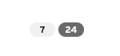

A **badge** is used to annotate other information like a label or an object name. Badges are typically used to reflect counts, like number of unread notifications. Badges are not interactive.

**Keyboard users** should not be able to focus on a badge.

**Screen reader users** should be able to have a screen reader describe the contents of and purpose of a badge when it pops up, but not focus on it otherwise.

No props need to be added or modified for badge accessibility.

**As a caution**, badges can be styled using a variety of colors. Do not rely on color alone to communicate information 
because it causes barriers to access for many readers. For example, colorblind and low vision users may not be able 
to perceive the color differences, and screen readers do not announce colors to non-sighted readers.

Since the badge doesn't get an accessible name and isn't focusable, each badge must have adequate contextual information 
provided in the surrounding UI to convey the same information the color alone is conveying. A developer could consider
using a label with an icon in it to supplement the color.

Note how difficult it is to determine that there are unread or actionable items associated with either of the badges
in Figure 1 with its lack of visual cues. Compare Figure 1 to Figure 2 where there is an icon
used to indicate that the second badge is associated with actionable or unread content.

Figure 1.

Figure 2.

