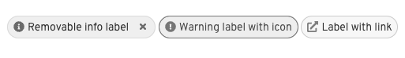

A **label** highlights an element on a page to draw attention to it or make it more searchable. Labels can also be used to tag items of the same category.

**Keyboard users** should be able to interact with the label if it contains interactive elements such as a link or close button. The user should be able to focus on an interactive part of a label using **Tab** to move forward and **Tab + Shift** to move backward through interactive elements.

**Screen reader users** should be able to navigate to the label and read the label text.

The following props/attributes have been added for you or are customizable in PatternFly:

| React component | React prop | Which HTML element it appears on in markup | Explanation | 
|---|---|---|---|
| Label | closeBtnProps | .pf-c-label | Customize the props on the close button of the label. For example, to change the `aria-label`, pass `closeBtnProps={{'aria-label': 'new label'}}` to the Label component. |

As a caution, labels can be styled using a variety of colors. Relying on color alone to communicate information causes barriers to
access for many readers: colorblind and low vision users may not be able to perceive the color differences, and screen
readers do not announce colors to non-sighted readers.

Since the label doesn't get an accessible name and isn't focusable by default, each label must have adequate contextual information
provided in the surrounding UI to convey the same information the color alone is conveying. A developer could consider
using a label with an icon in it to supplement the color, or be sure the text on the label is descriptive.

Compare Figure 1 to Figure 2. Both figures include a blue informational label,
a red error label , and a cyan link label. Note how difficult it is to determine the difference between the labels
in Figure 1 with its lack of visual cues. In Figure 2, icons and updated text have increased the amount of helpful 
infomation available without color.

Figure 1.

Figure 2.

