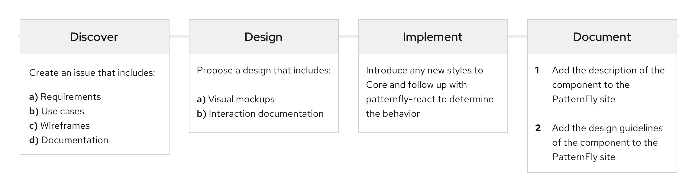

The PatternFly open source community depends on contributions to help our design system grow and evolve. We encourage everyone, regardless of background, to make suggestions for enhancements, contribute new design patterns and ideas, help identify bugs in code, and more. With your help, we can stay on top of the latest and greatest implementation solutions.  

## PatternFly on GitHub
PatternFly has a few repos you can contribute to:
- [patternfly](https://github.com/patternfly/patternfly): For core HTML and CSS contributions. All component contributions should start in Core.
- [patternfly-react](https://github.com/patternfly/patternfly-react): For React contributions.
- [patternfly-org](https://github.com/patternfly/patternfly-org): For PatternFly website content and design documentation contributions.

## Requesting new features and enhancements
PatternFly is built on the needs of our community of stakeholders. To request a new feature or an enhancement to an existing feature, the first step is to open a new issue in the [patternfly-design repo](https://github.com/patternfly/patternfly-design/issues). Your issue should include the following:
*    Requirements
*    Use cases
*    Preliminary designs (if available)
*    Project timelines (dates needed, etc.)

The PatternFly team will review and prioritize your issue, taking into account scope and technical constraints. If accepted, your feature request will be placed on the [PatternFly feature roadmap](https://github.com/orgs/patternfly/projects/4?fullscreen=true) and queued to the PatternFly design backlog. After this, the PatternFly design team will work with you to create a design proposal and facilitate reviews.

### PatternFly feature lifecycle

## Get help
If you run into trouble and need support, the PatternFly team is here to help. Simply go to the [PatternFly forum](https://forum.patternfly.org/c/support) and add a new topic to get in touch with us. We'll always do our best to answer your questions and connect you with the right people quickly.
