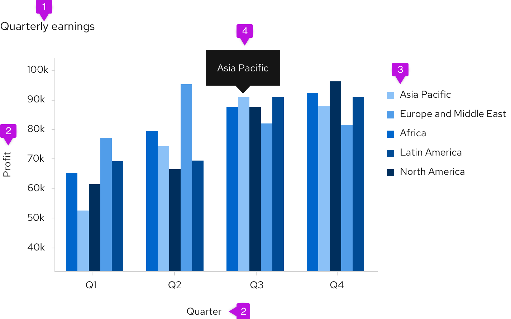
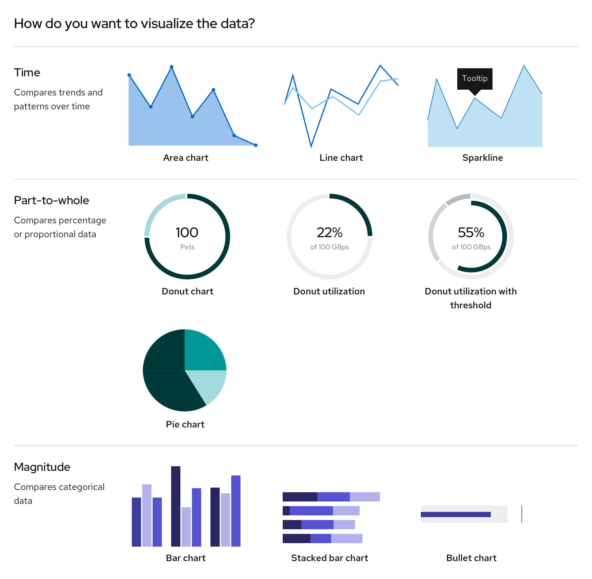
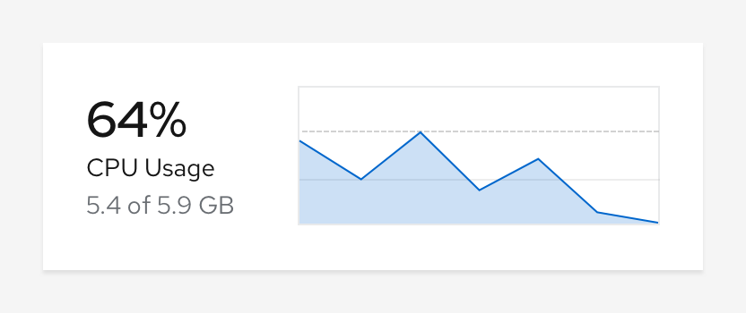
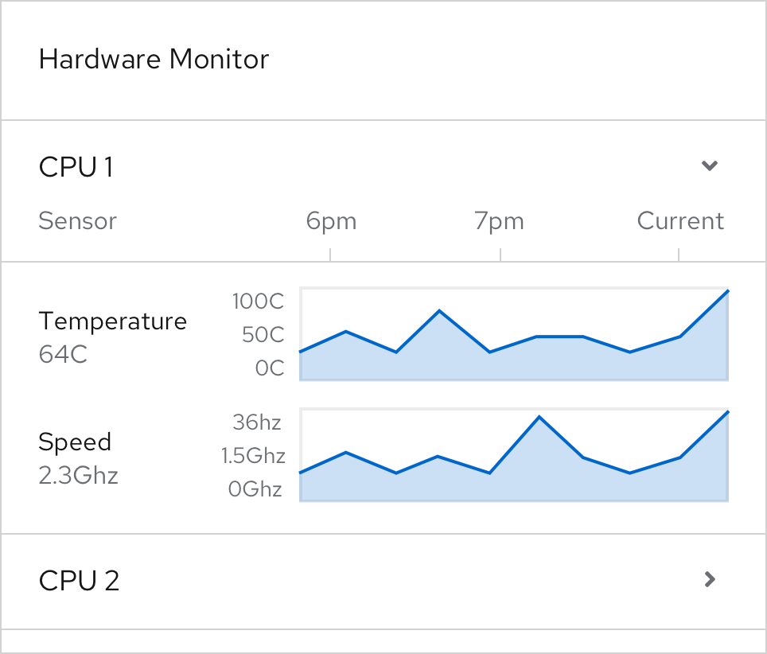
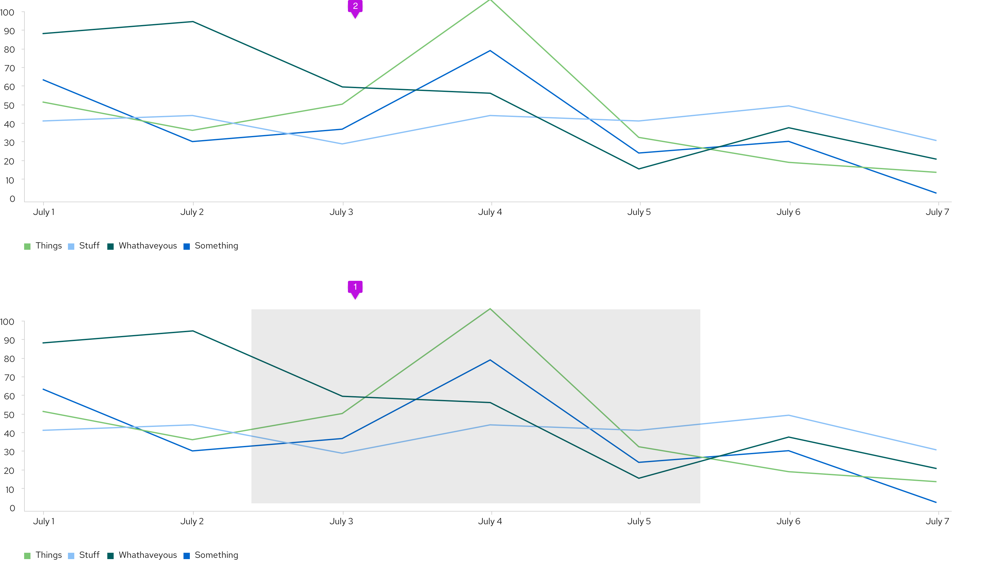
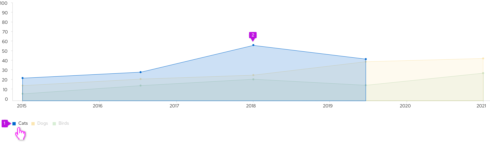
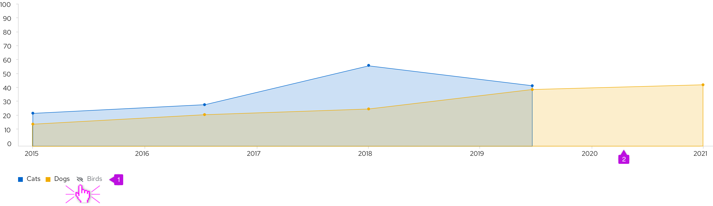

_Charts are only available in React_

A **chart** visualizes data in an application. The type of chart you use will depend on your use case and the type of data you need to display.

## Elements
 

1. **Title:** Titles should be left-aligned and appear above your chart.
2. **Axis labels and scale values:**  We recommend using tick marks to clearly mark scale values on the y-axis. The text for axis labels and scale values should be 12px font in standard text color. All scale values should be equally distributed across the axis and the axis label should fall outside the scale values, centered with the axis line.
3. **Legends:** We recommend using legends when charts include more than one variable and therefore use more than one color. When datasets are overlapping, an [interactive legend](#interactive-chart-legends) can be used. If space is not available to display names of horizontal and vertical axes, a legend must be added instead. The legend should list the colors that each variable obtains and the name of the variable. The text on the legend should be 14px size and standard text color. They can either be placed left-aligned to the right of the chart or centered below the chart.
4. **Chart tooltip:** A tooltip will appear on hover over certain elements of a chart, like bars in a bar chart or segments in a donut chart. [Chart tooltips](/charts/tooltip-chart) should display the specific values related to the element the user is hovering over. 

## Chart types
 

- [Area chart](/charts/area-chart/design-guidelines): Use to show trends over a continuous scale (usually time).
- [Bar chart](/charts/bar-chart/design-guidelines): Use to show and compare categorical data. Can be plotted vertically or horizontally.
  - [Stacked bar chart](/charts/stack-chart/design-guidelines): Use to show and compare categorical data of more than one variable. Can be plotted vertically or horizontally.
- [Bullet chart](/charts/bullet-chart/design-guidelines): Use as an extension to the bar chart to measure data with thresholds and static ranges.
- [Donut chart](/charts/donut-chart/design-guidelines): Use to show the relationship of a set of values to a whole, or progress completion as a percentage; best used to display data with a small number of categories (example: 2-5 categories).
  - [Donut utilization](/charts/donut-utilization-chart/design-guidelines): Use to show utilization for an object as a percentage.
  - [Donut utilization with threshold](/charts/donut-utilization-chart/design-guidelines#donut-chart---utilization-with-threshold): Use to show utilization for an object as a percentage in relation to threshold values.
- [Line chart](/charts/line-chart/design-guidelines): Use to compare several data sets, or to show data over a period of time.
- [Pie chart](/charts/pie-chart/design-guidelines): Use to show percentages or proportional data.
- [Sparkline](/charts/sparkline-chart/design-guidelines): Use to show how values change over time for multiple sets of data. Useful alternative to the line chart when multiple lines need to be plotted.

## Charts in cards
If a chart lives in a card, the title of that chart will be placed on the header of that card instead of the chart. The rest of the chart guidelines should be followed for the chart itself.

## Brush and zoom
The brush and zoom properties allow for magnification of an area, bar, line, or stack chart. If desired, more advanced features can be added through [Victory](https://formidable.com/open-source/victory/guides/brush-and-zoom/).

### Example

1. **Window:** Click and drag to create a window around the section of the chart that you want to zoom in on.
2. **Magnified chart:** The portion selected will appear above the full chart view.

## Interactive chart legends
For charts that graph more than one data set, use interactive legends to highlight or isolate certain data sets.  This would work well for [line](#line-chart), [area](#area-chart), or [stacked](#stacked-bar-charts) charts, where data sets can overlap.

### Example
On hover

1. **Legend:** When a user hovers over a legend label, opacity lowers for all other legend labels.
2. **Chart:** Data corresponding to the hovered legend label is highlighted since opacity lowers for all other data sets, too. 

On click

1. **Legend:** When a user clicks on a legend label, it becomes disabled and the color swatch is replaced with an eye-slashed icon.
2. **Chart:** Data corresponding to the clicked legend label is hidden from view.
