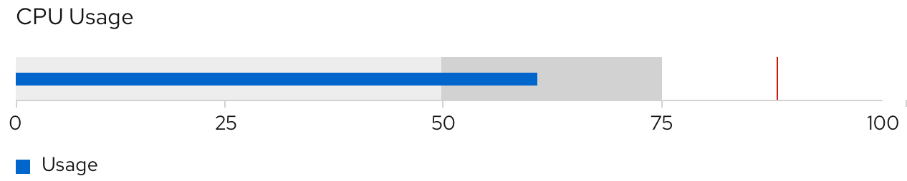

A **bullet chart** can be thought of as an extension to a bar chart that measures a dynamic value with thresholds and target values. While similar to [donut utilization charts](/charts/donut-utilization-chart), bullet charts can show underages and overages of data (below 0% and above 100%), visualize horizontally or vertically, and pack large amounts of information into a compact space. 

## Usage
Bullet charts are most often used to measure sets of performance data or utilization. They can be used for similar use cases as [donut utilization with threshhold charts](/charts/donut-utilization-chart#donut-utilization-threshold-examples). For example, a user can use a bullet chart to measure values of a set compared to the whole, while also illustrating related thresholds, target values, and underages or overages. 

When deciding which chart to use, consider the type of data you are dealing with and the importance of tracking underages or overages in that data. Also consider the amount of space you have to visualize the data and its surrounding information. Bullet charts consolidate data and therefore take up less space than donut charts. They fit very well within text-dense areas, since they can be horizontally or visually illustrated. Bullet charts can also measure data by percentages or integer values; donut charts cannot.

### Example
