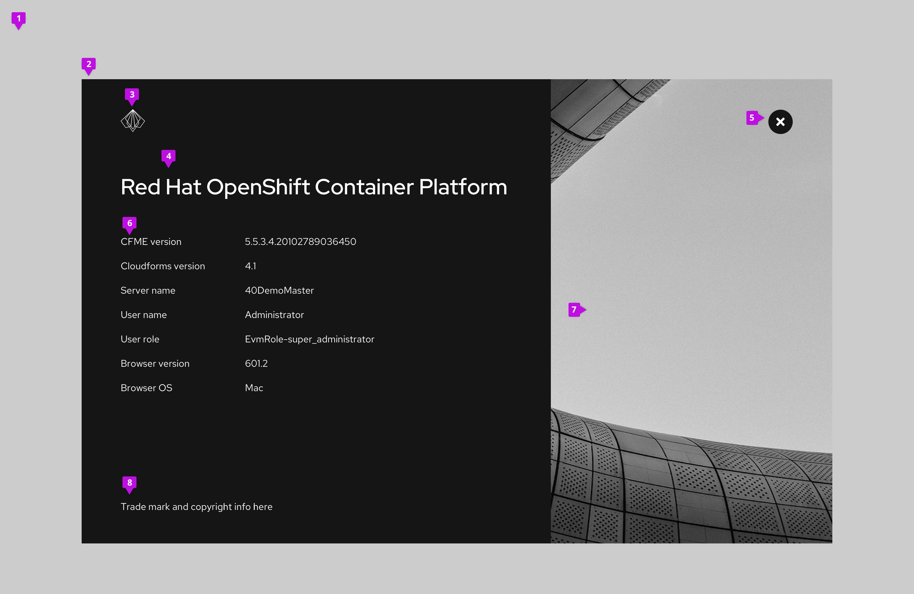

## Elements

1. **Backdrop:** Blurs any interface elements in the background to bring the modal content into focus
2. **Modal**
3. **Branding:** Provides logo and branding for the product. Substitute your own logotype by providing an SVG that can be scaled proportionately to fit the space.
4. **Product title**
5. **Close button**
6. **Content:** Label and version
    * When version and build information are both shown: Version 6.3 (Build 5)
    * When version only: Version 6.3
    * When build only: Build 5
7. **Modal image:** The modal image should be the same as the [background image](/components/background-image) you use for your application.
8. **Trademark and copyright information:** Optionally include legal text. Suggested format for copyright -  Copyright (c) 2018 Company

## Usage
Use an about modal to provide information about a product including the product name, logo, version numbers, and any appropriate legal text.

## Behavior
About modals are clicked into through a users interaction with a button, link, or icon component. When the modal is launched, the user can only see content inside it, until clicking the close button. 

### Accessing the about modal

Provide access to an about modal using a help icon in the application masthead. Clicking the help icon will launch a dropdown menu. The help menu should always include an option labeled "About" that launches the about modal.

