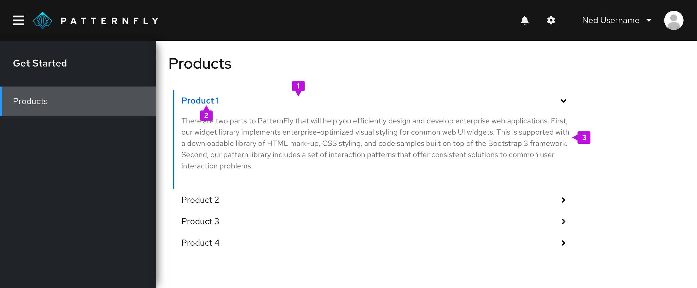
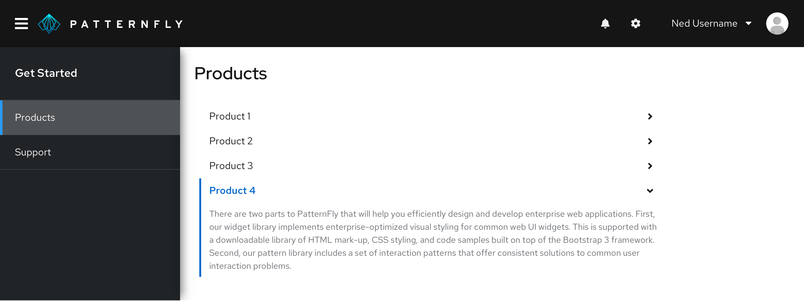
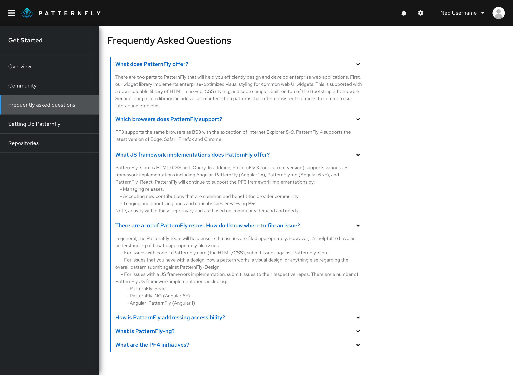

An **accordion** is an interactive container that expands and collapses to hide or reveal the nested content. It takes advantage of progressive disclosure to help reduce page scrolling by allowing users to choose to show or hide more detailed information as needed.

## Usage
Accordions are one of many ways to handle large amounts of content. They are useful when you have a large amount of content, but limited space, with the header title giving an overview of the content that is hidden underneath it. Users can click or tap on the collapsed accordion to expand the content area and view additional details. Due to their high interaction cost, we recommend that you use them sparingly when you need an additional layer of structure to your content.

## Single expand behavior
This pattern is used to bring focus to a single row at a time. It is ideal for content that is mutually exclusive and does not need to be shown all at once. Whenever a new row is expanded, the previous one closes. Another benefit of this is real-estate management.

### Use case
Depending on the content, it can be useful to only expose users to one section at a time. This is particularly useful when working with forms. By default the first row is always open with all the others closed. Users can choose to close all rows, but only one can be opened at once.

### Examples
This variant is mostly used with navigation and sub-navigation.

1. **Header:** Interactive link that expands or collapses to reveal the nested content.
2. **Label:** Summary descriptions of the nested content.
3. **Content panel:** Area that holds the information associated with the header.

## Multiple expand behavior
This pattern gives users the ability to open multiple rows at a time. It keeps the content always available and each row expands or closes per user interaction.

### Use case
The accordion is used not only to help shorten the page length, but also provides a grouping structure with a summary headline for each section. Users can still choose to expand all rows to display the additional information.

### Examples
Some common use cases include using an accordion in the FAQ section and product comparison.

## Accessibility
When implementing this component, consider the following guidance to ensure that it is <a href="https://www.section508.gov/">508 compliant</a>.

1. Use unique and descriptive labels for each header bar. This allows both sighted users and those with assitive technologies to quickly scan through the content, without having to expand individual panels.
2. Avoid adding complex interaction to the accordion. This can often cause loops or traps that prevent users from efficiently navigating the content using a keyboard.

