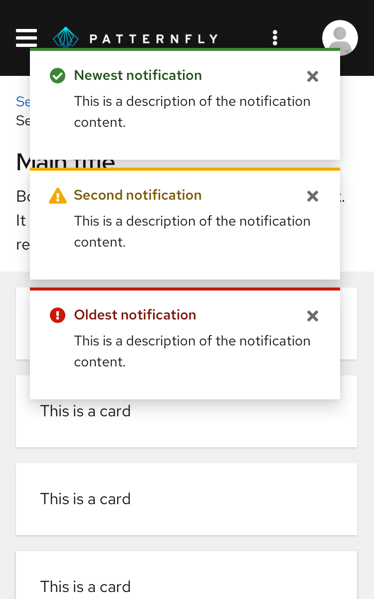

An **alert group** stacks and positions 2 or more alerts in a layer over the main content of a page. Alert groups should always rank alerts by age, stacking new alerts on top of old ones as they surface.

Use an alert group when you need to position multiple alerts on the same page, mainly [toast alerts](/components/alert/design-guidelines#elements). Toast alerts continue to stack until a user dismisses them or they reach an automatic timeout (8 seconds is recommended).

## Elements

1. **Newest notification:** Always appears at the top of the alert group.
2. **Second newest notification:** Moves down when a newer notification surfaces.
3. **Oldest notification:** Continues to move down the stack as newer notifications surface, until a user closes it.
4. **Overflow footer (optional):** Use this when you do not want to display more than a specified number of alerts at the same time on the user's screen. See [Managing overflow](#managing-overflow) for more information about overflow footer interactions.

## Placement
Use 8px of padding between each alert in an alert group. Alert group alignment on a page will depend on your use case.

**For desktop views**, right-align alert groups over your page content. Each alert should stack on top of one another with 8px of padding in between.

**For mobile views**, center alert groups over your page content.

## Managing overflow
If you don't want multiple alerts to stack and fill the screen until the user dismisses them, you may use the overflow footer in an alert group to manage overflow. When applying overflow, you should decide how many alerts to display before showing the footer. A threshold of 3 alerts is recommended. After that, additional alerts added to the screen will cause older alerts to be hidden, and only the most recent 3 alerts are displayed.

The overflow link should be configured to navigate to a place where the user can view and manage a complete list of incoming alerts. If a [notification drawer](/components/notification-drawer) is being used, it should open the drawer. You may customize the text accordingly to reflect the result of clicking the link. However, we recommend displaying the number of new/unread notifications present to give the user feedback about how many additional notifications are remaining to view as in the example below.

See our [alert guidelines](/components/alert/design-guidelines/#using-toast-alerts) for more information about using toast alerts.
