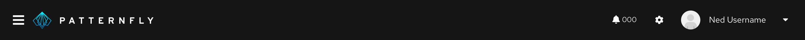

## Usage

There are four size variations available to use for different scenarios. The typical usage for an avatar is to represent the current user in the masthead. However, based on your product's use cases and needs, there is room for customization.

### Small (24 px)
This size variation should be used in components such as accordions, data lists, tables, etc.

### Medium (36 px)
This size variation is the default avatar size and should be used in the masthead component.

 

### Large (72 px)
This size variation should be used in components such as cards.

 

### Extra Large (128 px)
This size variation should be used in components such as profile displays.

## Accessibility
For information regarding accessibility, visit the [avatar accessibility](/components/avatar/accessibility) tab. 
