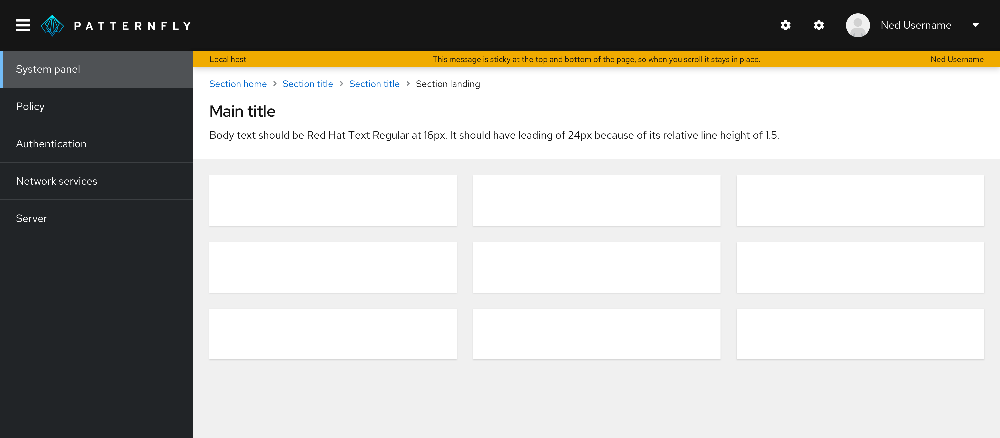

A **banner** is a 1-line, full color, full width container that can be used to communicate short snippets of information to users. Banners are un-intrusive, non-dismissible, and only support link buttons.
 
For use cases requiring more than a single line of content or requiring important actions for the user to take, the flow should make use of the [inline alert](/components/alert/design-guidelines#inline-alerts) or [hint pattern](/components/hint/design-guidelines) instead, as they allow for more flexibility around these use cases. 
 
## Usage
PatternFly offers 5 different banner types detailed below.
 

 
|Type     |Background color    |Text color  | Usage
|---------|---------------|----------------| ------------------ |
|Default  |Grey  (--pf-global--BackgroundColor--dark-400) | Black |Use for generic messages with no associated severity
|Info     |Blue  (--pf-global--info-color--100)|Black| Use for general information messages |
|Danger  |Red  (--pf-global--danger-color--100) |White| Use for high severity messages
|Success|Green  (--pf-global--success-color--100) | White | Use for positive, success messages|
|Warning |Orange  (--pf-global--warning-color--100) | Black | Use for warning or medium severity messages |
 
PatternFly suggests that users adopt one of these 5 colors, as they’ve been tested against their text colors for accessibility. However, if colors outside of these suggestions are used, we encourage using discretion when selecting the inner text color.
 
### Placement
 
All banners should be a solid bar that spans the top and/or bottom of either:
1. The full page, above the masthead.
 
   
 
2. The content area of the page, below the masthead.
 
   
 
In all cases, the banner should be sticky to the top (and to the bottom as well, if using a bottom banner in addition to the top banner).
 
### Padding
 
The padding above and below a banner will depend on where you place it.
 
**If you place your banner above the masthead,** the padding above and below should be 0px, as the banner should touch the masthead.
 

 
**If you place your banner below the masthead and inside the page body,** there should be no padding on top of it, and in most cases, you should have 24px padding between the banner and whatever comes under it. The only exception is when you have breadcrumbs directly underneath the banner –– in that case, the padding should be 16px.
 

 
### Examples
 
Banners are flexible and can be used for any content, so they span several use cases.
 
#### To indicate that an application/site is offline
 
In this example, a banner is used to indicate to the user that the site is undergoing maintenance and that they will have limited functionality as a result. The banner is shown at the top and bottom to ensure that the user does not miss this disclaimer.
 

 
#### To indicate that an application upgrade is available
 
In this example, the user is notified of an available upgrade through a banner at the top of the page. Since the use case here is to convey information, an informational banner was used.
 

 
#### Government system classification banner
 
In this example, a banner is used to display classification level on a webpage. When an information system is deployed into the U.S. Government, it must be approved of what type of data to process, such as data classification. This classification banner communicates what types of data users are working with.
 

