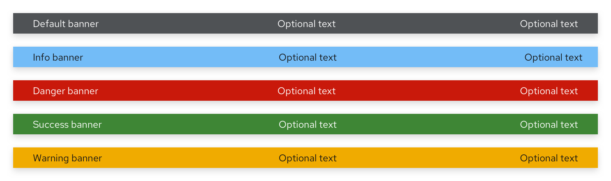
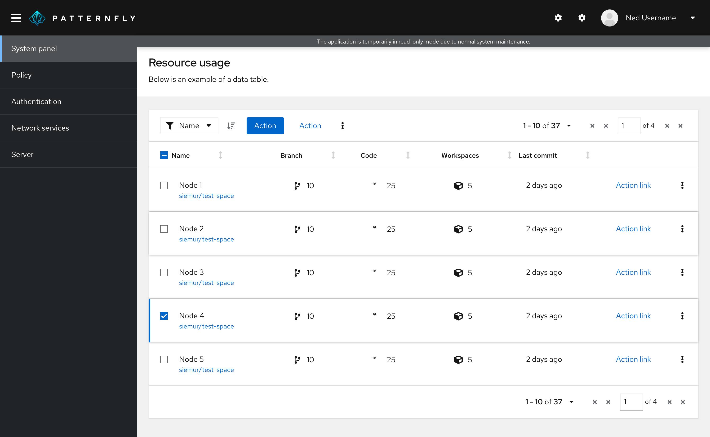
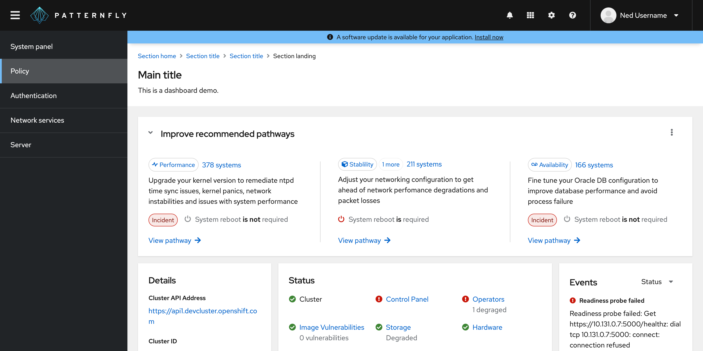
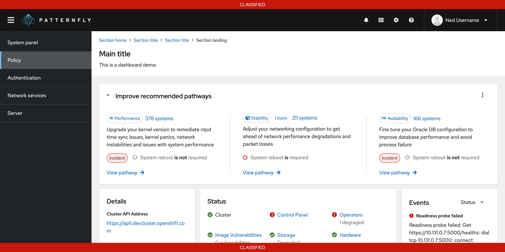
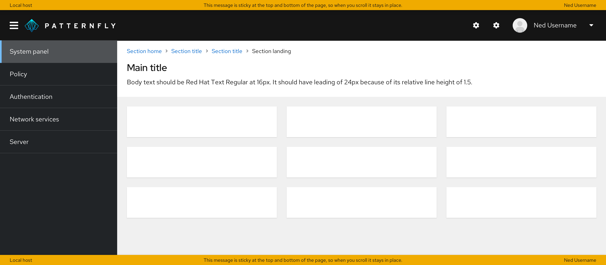
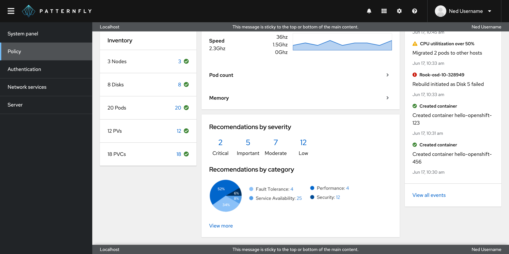

## Usage

PatternFly offers 5 different banner types detailed below.
 

 
|Type |Background color |Text color | Usage |
|-|-|-|-|
| Default | `--pf-global--BackgroundColor--dark-400` | White | Generic messages with no associated severity |
| Blue | `--pf-global--info-color--100` | Black | General information messages |
| Red | `--pf-global--danger-color--100` | White | High severity messages
| Green | `--pf-global--success-color--100` | White | Positive, success messages |
| Gold | `--pf-global--warning-color--100` | Black | Warning or medium severity messages |

PatternFly suggests that users adopt one of these 5 colors, as they’ve been tested with their text colors for accessibility. However, if colors outside of these suggestions are used, we encourage using discretion when selecting the text color.

### When to use
 
Banners are flexible and can be used for any content and for several use cases outlined in the following examples.
 
- **To indicate that an application/site is offline.** In this example, a banner is used to indicate to the user that the site is undergoing maintenance and that they will have limited functionality as a result. The banner is shown at the top and bottom to ensure that the user does not miss this disclaimer. Since this is a general, non-severe message, a default banner was used.
 
   
 
- **To indicate that an application upgrade is available.** In this example, the user is notified of an available upgrade through a banner at the top of the page. Since the use case here is to convey information, a blue status banner was used.
 
   
 
- **Government system classification banner.** In this example, a banner is used to display classification level on a webpage. When an information system is deployed into the U.S. Government, it must be approved of what type of data to process, such as data classification. This classification banner communicates what types of data users are working with. Since this information is considered highly important, a red banner was used.
 
   

### When not to use

Do not use banners: 

- For use cases requiring more than a single line of content. Use an [inline alert](/components/alert/design-guidelines#inline-alerts) instead.

- For use cases requiring important actions for the user to take. Use a [hint](/components/hint/design-guidelines) instead. 

## Variations 

### Placement
 
All banners should be a solid bar that spans the top and/or bottom of either:
- The full page
 
   
 
- The main content area of the page
 
   
 
In all cases, the banner should be sticky to where it is used.

## Spacing

### Padding
 
The padding required above and below a banner will depend on where it is placed.
 
- **When placed above or below the page,** the padding above and below should be 0px, as the banner should touch the top and/or bottom of the page.
 
  
 
- **When placed above the main content area,** there should be no padding above the banner, and in most cases there should be 24px padding below it. The only exception is when breadcrumbs are directly below the banner — in that case, the padding should be 16px below the banner.

  

- **When placed below the main content area,** there should be 24px padding above the banner and no padding below it.

  
 
## Accessibility 

For information regarding accessibility, visit the [banner accessibility tab](/components/banner/accessibility).
