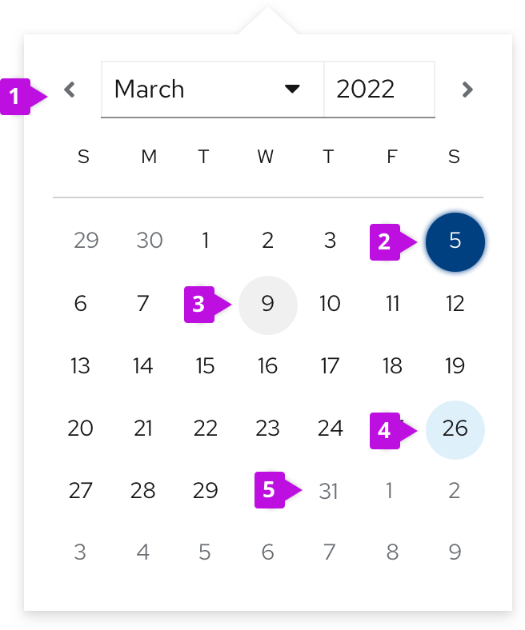

## Elements

1. **Selection arrows**: allow users to navigate between months.
2. **Selected date**
3. **Current date (today’s date)**: Indicates the day users access the calendar. Always highlighted.
4. **Hover state**
5. **Disabled state**

## Accessibility 
For information regarding accessibility, visit the [calendar month accessibility](/components/calendar-month/accessibility) tab.
