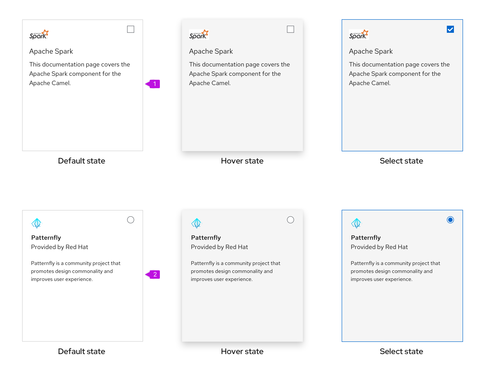

 
## Elements
 
A card usually consists of four parts:
 
 
 
1. **Header (optional):** When included, defines the contents of a card. Card headers can contain images as well as the title of a card and an actions menu represented by the right-aligned kebab. In most cases, your card should include a header. The only exceptions are when cards being used as a layout element to create a white background behind other content.
 
2. **Title:** Communicates the title of a card if it's not included in the header. If a card will be utilized as a selectable and clickable card, the title needs to be made as a linked text to trigger action and indicate interaction.
 
3. **Body:** Provides details about the item. A card body can include any combination of static text and/or active content.
 
4. **Footer (optional):** Contains links, actions, or static text at the bottom of a card.
 
## Usage
Cards primarily appear in [catalog views](#cards-in-catalog-views), [primary-detail views](#cards-in-primary-detail-views), and [dashboards](#cards-in-dashboards).
 
### When to use
Use cards to:
- To visually group content or distinguish information from the rest of a page’s content. Examples include dashboards and catalog views.
- To organize content in layouts with multiple columns or grids. 
- To compare separate groups of information, and make it selectable or clickable
- To make media easier to scan, such as images or videos. 
 
### When not to use
**Never** use a card to show a dense amount of repetitive, related content. Use a [data list](/components/data-list) or [table](/components/table) view instead.
 
### Images
Only include meaningful images on your cards (don’t add them for decoration). Images should help users identify specific content types.
 

 
1. Place smaller images inside the card’s header.
 
2. Place larger images or charts within the card’s body.
 
### Border treatments
 
PatternFly offers 2 types of border treatments for cards:
 

 
1. **Default card:** By default, cards will have a thin (1px) drop shadow to differentiate them from the background of a page and give them a slightly raised appearance. Use the default appearance when placing cards on a gray background.
 
2. **Flat card:** Flat cards have a 1px gray border. Flat cards are recommended for use against a white background as the solid border will better differentiate a card from the page background.
 
### Cards in catalog views
 
Use cards in a catalog view to present users with a series of selectable items, typically arranged into a grid.
 
Note that this view uses cards with a multi-select option so that bulk actions can be performed from the toolbar on a group of cards at once. For more information on cards used in a catalog or card view, see the [card view design guidelines](/demos/card-view/design-guidelines).
 

 
### Cards in primary-detail views
 
Use clickable cards when you want to present an overview of a set of objects and then examine the details. Here, the details of different projects can be displayed in a side-by-side primary-detail view.
 

 
### Cards in dashboards
 
Use cards in a dashboard view to visualize information. Each card should display a different and specific piece of information, such as a bar chart, area chart, or other data type.
 

 
## Variations
 
Cards are flexible and customizable to your use case. Here are some different ways to use a card to represent the same content. Choose a layout that considers the usage context and the space you have to work with.
 

 
1. The first version places an image in the header with a separate title. The CTA that would direct the user to a new page is located in the footer.
 
2. In the second version, the title is moved to the header area to give a more compact footprint.
 
3. In the third version, the card header contains an image as well as text to define the card title. The title is a link, allowing users to drill into the details of the card. This makes the footprint of the card smaller. The linked title should be reserved for when using a card that can be both clickable and selectable, where clicking the title would open the primary-detail drawer or navigate the user to a new page and selecting the card would be done by clicking on the checkbox.
 
### Expandable cards
 
The header element can be made expandable in situations where you want to hide the card content and reduce its footprint. In the collapsed state, only the card title is shown, and the user can click the expansion toggle to view the rest of the card content.
 

 
 
### Selectable cards
It is often useful to make cards selectable.  If there are no other links on the card, and a checkbox or radio button is present, the card only allows for a single action in which the whole card could be clicked to make the selection. PatternFly supports two types of selectable cards:
 

 
1. **Multi-select card:** Features a checkbox in the upper righthand corner, which allow users to indicate which cards to include in global actions.
 
2. **Single-select card (with radio button):** Features a radio button in the upper righthand corner, which allow users to indicate which option they are selecting.

### Clickable cards
Cards can be made clickable to trigger an action, such as opening a primary-detail drawer, or navigating to a new page. If there are no other links on the card, the card only allows for a single click action in which the whole card can be clicked to view more details.

### Selectable and clickable cards
Cards can be both selectable and clickable. When having both actions available in a card, the interactions differ from solely selectable cards or solely clickable cards.

For cards with both, the selectable aspect changes so only clicking on the checkboxes on the top right selects a card, instead of the whole card, and the clickable aspect changes so only the linked header will be clickable, instead of the whole card.

 
## Spacing
### Content spacing
 
PatternFly supports three types of cards:
 

 
1. **Compact (recommended):** Compact cards use 16px spacing with an 8px spacer between the header and body, and a 16px spacer between the body and footer.
 
2. **Standard:** Standard cards use 24px spacing with a 16px spacer between the header and body and 24px between the body and footer.
 
3. **Large:** Large cards use 32px spacing with a 24px spacer between the header and the body and 32px between the body and footer. Large cards are generally used for presenting marketing content or anyplace where a lower content density is desired.
 
## Accessibility
 
For information regarding accessibility, visit the [card accessibility page](components/card/accessibility).
