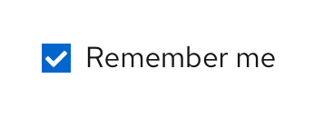

## Usage
Checkboxes allow users to choose **1 or more items** from a list of options.

You can also use a single checkbox to allow a user to enable or disable a feature or setting, along with a save button. 

### When to use

* Use checkboxes if you’re presenting 5 or fewer options to the user. If you’re presenting more than 5 options, use a [select list](/components/select/design-guidelines) instead.
* Use checkboxes if the user can select multiple options. If the user can only select 1 option, then use radio buttons. 

### Labeling and alignment

Checkbox labels fall to the right of the checkbox control. If placed vertically, all checkbox controls should be aligned with the left edge of other controls or input fields, in the form or on the page. 

You can use headings to label a group of checkboxes. The placement of headings will depend on the layout of other content in the form or on the page you’re designing. For more information on how to arrange checkboxes, see our [forms documentation](/components/form/design-guidelines).

You also have the option to use progressive disclosure by nesting other controls underneath a checkbox. The nested options would be enabled or disabled when the user selects or deselects a checkbox.

### When to use switches vs. checkboxes

The main difference between a switch and a checkbox is that a switch changes an option and saves it simultaneously, while checkboxes require a separate action such as pressing a “Submit” or “Save” button to save the selection. 
* Use checkboxes when the options do not save automatically and require the user to perform an additional action to save changes (in this case, pressing the “Save changes” button).

    

* Use a switch for situations where you are turning a series of one or more independent options on or off.

    

* Use checkboxes when you may have an indeterminate state where you can select all, none, or some actions.

    
