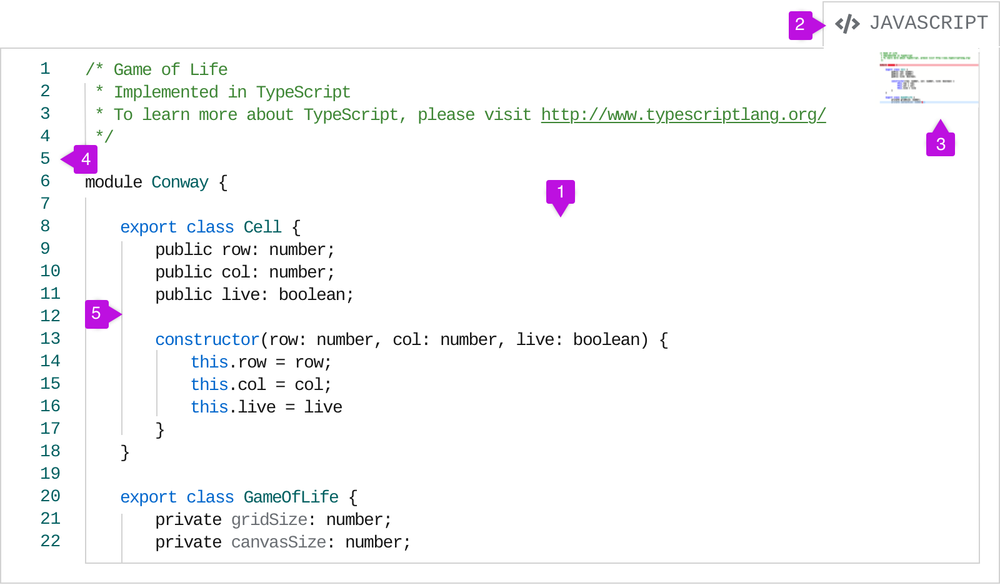
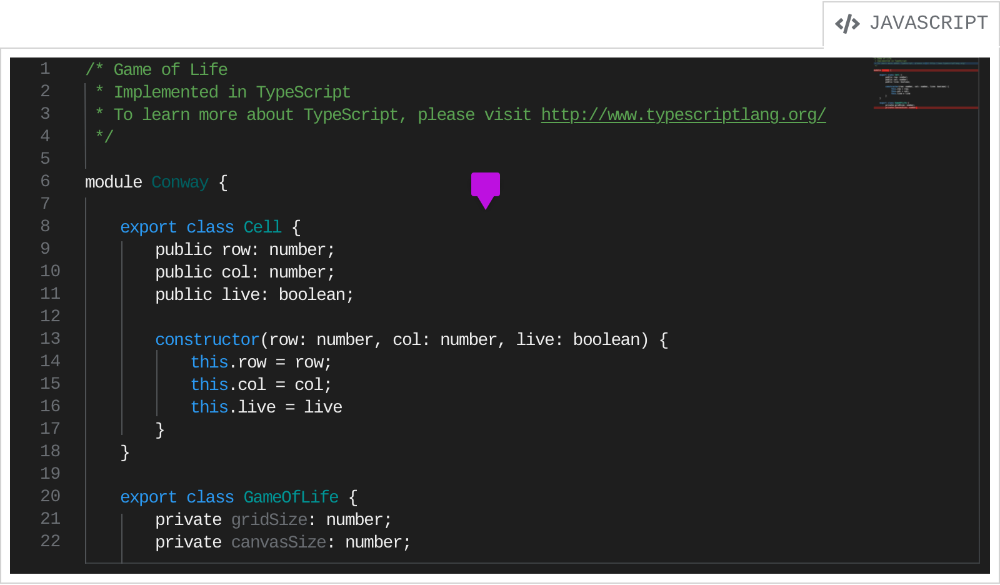
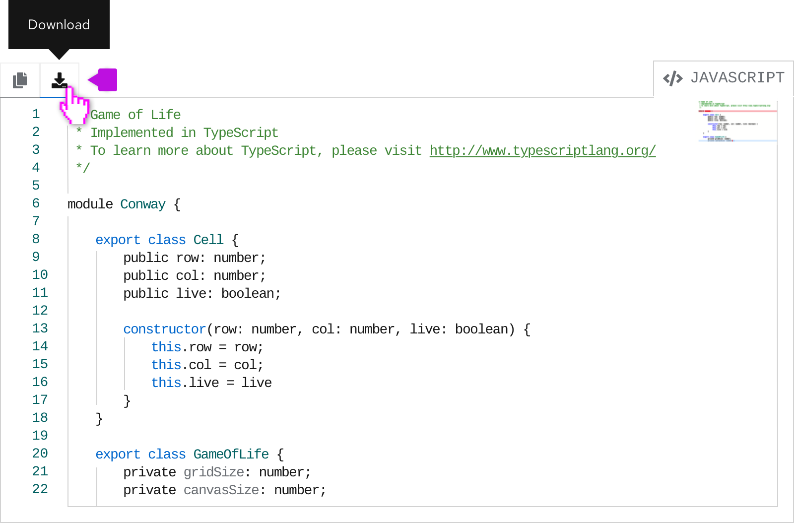
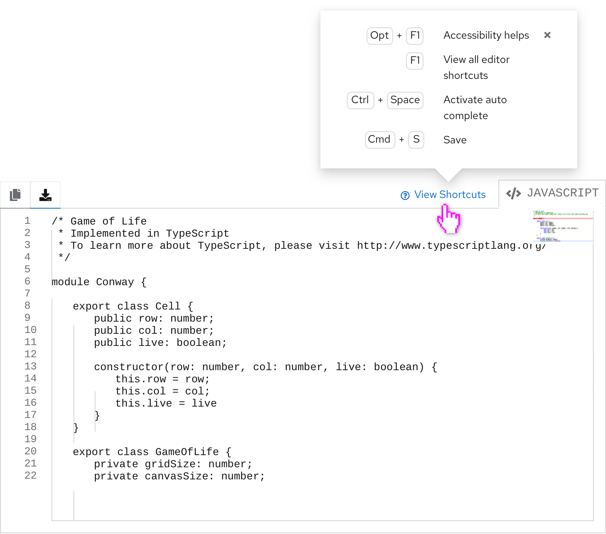
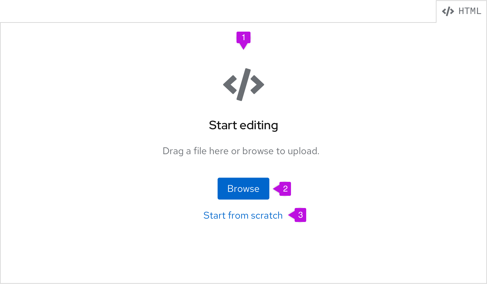
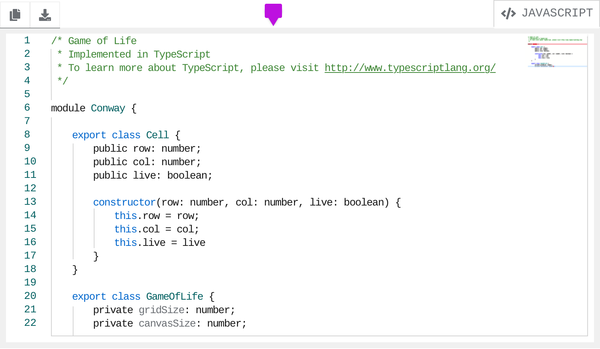

## Elements
By default, the bulk of the code editor is the text editor itself. The component is extremely flexible, so many of the features are optional. Much of the functionality of the Monaco Editor has been carried over to the code editor, so it’s possible to further customize the component based on their options.

### Light theme editor

1. **Text editor:** The text of the editor sits in this container. Syntax highlighting is automatically built into the editor, but can be customized if necessary.
2. **Language indicator (optional):** This tab indicates the language that the code is written in. 
3. **Minimap (optional):** This displays an overview of the contents of the editor. It can be used to scroll through the editor, rather than using the standard scrollbar that appears on the right of the editor.
4. **Line numbers (optional):** These will populate to accompany the lines of text that appear in the editor.
5. **Indentation indicators:** These vertical lines help make indentation clearer. They appear per indentation level.

### Dark theme editor
We recommend using the light theme editor by default, but there is also a dark theme code editor available. All editor functionality remains the same whether a light or dark theme is used.

Syntax highlighting will update automatically to adapt to the dark background. The editor still remains within the code editor container so only the inner area adapts the dark theme.

## Usage
Use a code editor when you:
1. Want the user to create or edit large blocks of code.
2. Want to display large blocks of code (see [Displaying code in a code editor](#displaying-code-in-a-code-editor) for guidance on when to use a code editor over a [code block](/components/code-block)).

### Creating or editing with a code editor
#### Using actions
Code editors can optionally include actions that are attached to the editor itself. Use a code editor with actions when you want the user to be able to perform some sort of action using the code.

Actions are represented by an icon and should include a tooltip on hover explaining what action they perform. Some typical actions that are used are **Copy to clipboard**, **Download**, and **Upload**.

#### Keyboard Shortcuts
You can use the “View shortcuts” link in your code editor that, on click, opens up a popover containing a variety of keyboard commands and shortcuts with descriptions for developers.

### Empty state
You can use an empty state in a code editor to indicate that a user can drag a file or browse to upload.

1. **Empty state:** We recommend always using the code icon for code editor empty states. The text can be changed to fit the use case.
2. **Browse:** Selecting **Browse** will bring up the file browser, which may look different depending on the operating system.
3. **Start from scratch:** Selecting this will turn the code editor into editing mode and allow the user to start typing their code or allow them to paste it in.

### Displaying code in a code editor
Use the read-only state of the code editor when you only want to display large blocks of code. In this case, the user will not be able to edit the code. If you are dealing with minimal lines of code that are read-only, and don’t require the use of line numbers and advanced formatting, use [code blocks](/components/code-block) instead.

The border of the code editor will turn gray to indicate that it is read-only. The user can still highlight text in the editor, but won’t be able to edit. Adding actions is optional and should be determined by use case.

## Accessibility 
For information regarding accessibility, visit the [code editor accessibility tab](/components/code-editor/accessibility). 
