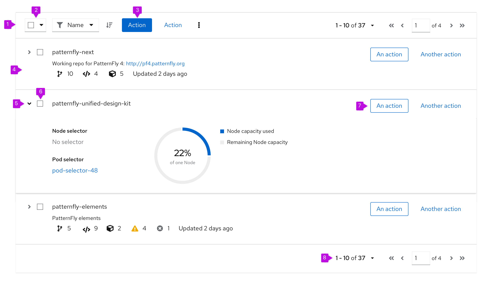
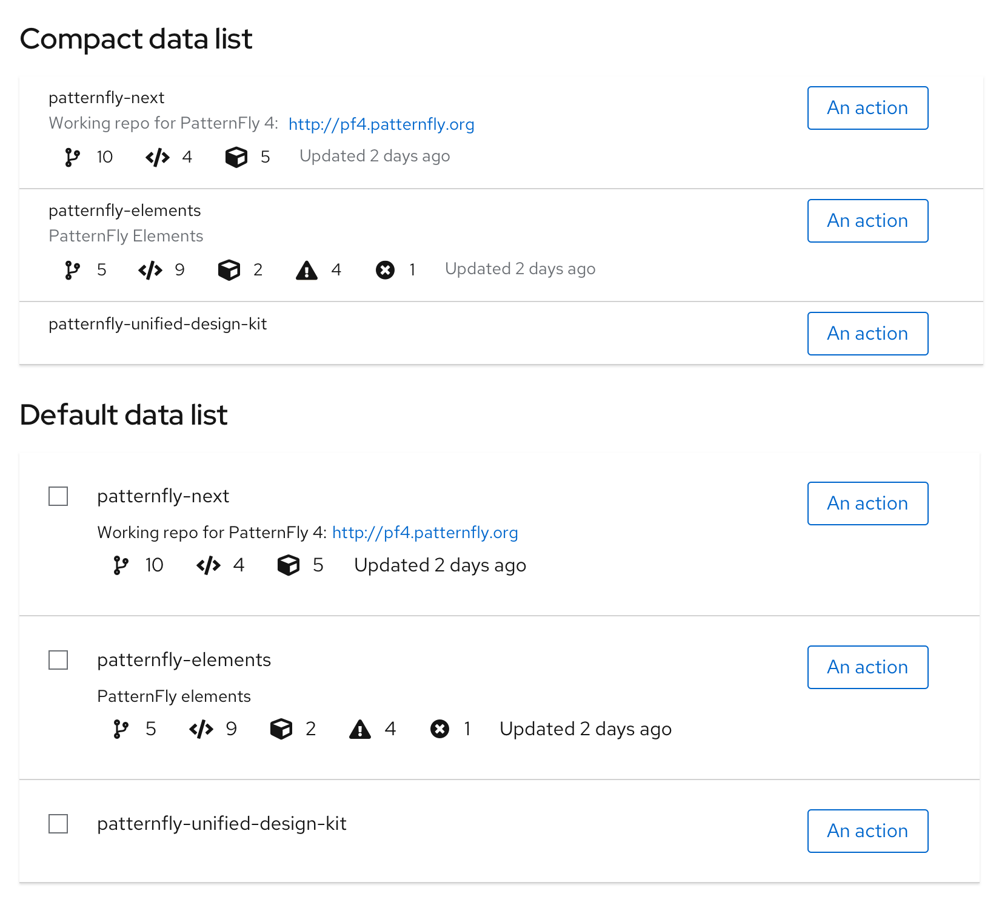
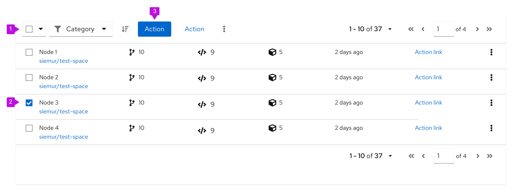
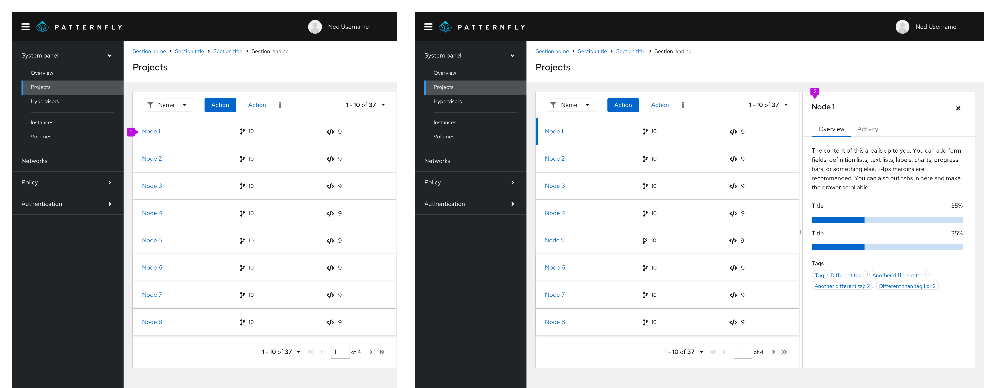
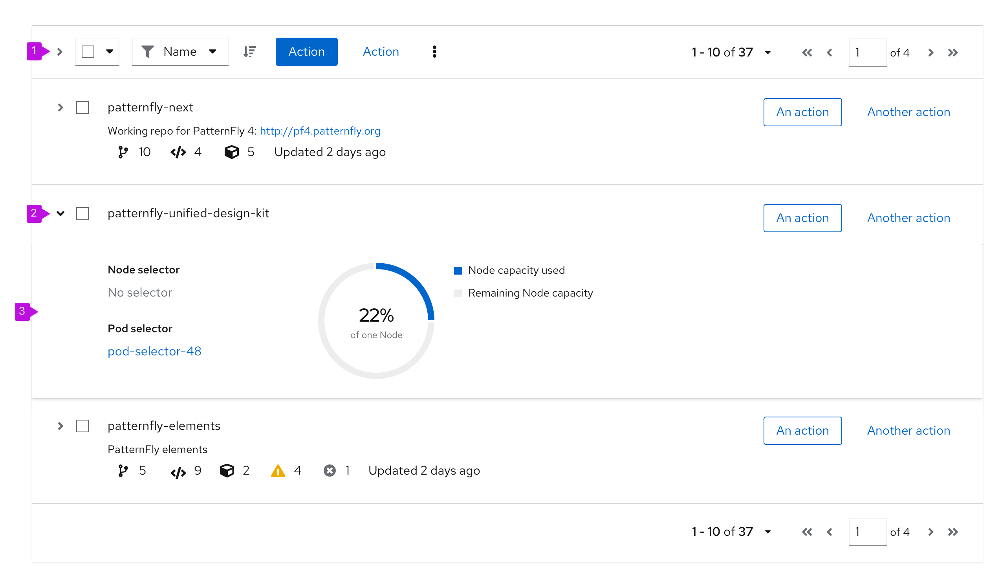
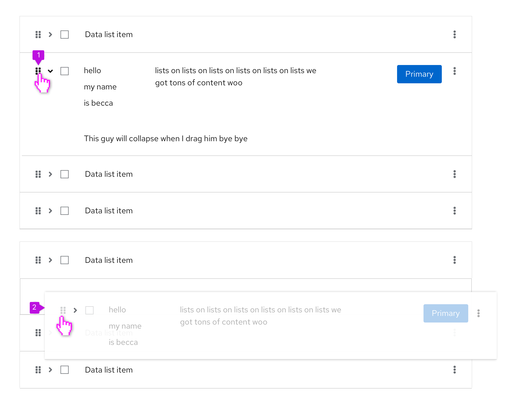
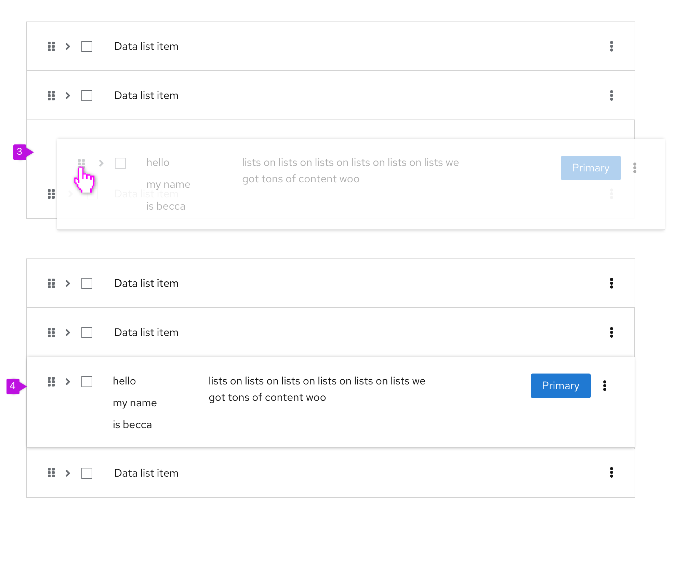
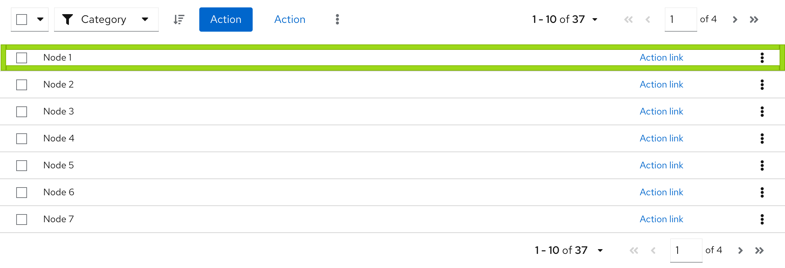
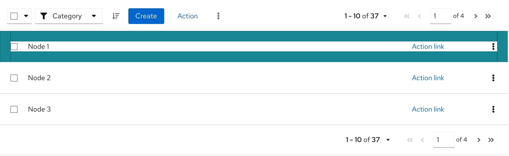

## Elements
The elements mentioned below are similar for a data list with compact or default spacing. This example shows a data list with compact spacing. 

 

1. **[Toolbar](/components/toolbar/design-guidelines):** Sits above the list and contains controls for manipulating list data. Common actions include filtering, sorting, and pagination.
2. **[Bulk selection](/guidelines/bulk-selection):** When present, selects all items in a table. If pagination is being used, this will only select items on the current page. See [bulk selection](/guidelines/bulk-selection) for more information.
3. **Global actions:** Actions that apply to all selected items.
4. **Row:** Row height may be variable and sizes to the content. Rows in a data list may take any supported layout.
5. **Expand:** Expands this row.
6. **Select checkbox:** Selects this row.
7. **Inline actions:** These actions apply only to the current row/item.
8. **Pagination footer:** When present, provides navigation to additional pages.

## Usage
Think of each row in a data list as a container for some formatted content. In PatternFly, data list rows can accept any [layout](/layouts/bullseye) supported by the design system as long as all rows apply the same layout. Here are some common layouts that may be useful in a data list:

* **[Grid](/layouts/grid):** Displays content in a responsive grid.
* **[Level](/layouts/level):** Justifies content evenly over the width of the row and vertically aligns items in the center of the row.
* **[Split](/layouts/split):** Distributes content evenly with a main content area in the center.
* **[Flex](/layouts/flex):** Enables more customization control over the alignment and spacing options provided in the other layouts.

PatternFly offers 2 components for displaying large data sets: data lists and [tables](/components/table/design-guidelines). While they satisfy similar use cases, choosing the correct component to use in your design will be dependent on the type of data you need to display.

Data lists can also appear in primary-detail views. Visit the [primary-detail guidelines](/patterns/primary-detail/design-guidelines) to learn more about the functionality. 

### When to use a data list vs. a table
**Use a data list when**:
* The information you want to display is not easily structured into a tabular format.
* Content displayed varies between rows and you want a more flexible layout. 
* You plan to embed rich content like a chart or an image into a row.

**Use a table when**:
* The information you want to display is easily structured into a tabular format.
* The clarity of your content would benefit from well defined columns and headings.

## Variations
PatterFly supports 2 main types of data lists:

1. **[Compact data list](#compact-spacing):** Use when you want to show as much data per page as possible.
2. **[Default data list](#default-spacing):** Use when you don’t have to minimize paging.

See [when to use compact vs. default spacing](#when-to-use-a-data-list-vs.-a-table)for more information about the styling and usage.

 

### Data list capabilities
Every data list can be extended with these functionalities:

* **[Selectable data list](#selectable-data-list)**
* **[Clickable data list](#clickable-data-list)**
* **[Expandable data list](#expandable-data-list)**
* **[Draggable data list rows](#draggable-data-list-rows)**

### Selectable data list
The selectable data list provides checkboxes that enable users to select one or more rows in the list. Users may then act on those selections using options in the [toolbar](/components/toolbar/design-guidelines).

 

1. **[Bulk selection](/guidelines/bulk-selection):** When present, selects all items in a table. If pagination is being used, this will only select items on the current page. See [bulk selection](/guidelines/bulk-selection) for more information. 
2. **Checkbox:** Enables a user to select a row.
3. **Global actions:** Actions that can be applied to **all** selected items. If actions in the data list are restricted to a single row or object, keep the actions at the individual row level, instead of in the toolbar.

#### When to use

* **Use an actionable data list** when you need to enable a user to select and act on multiple items in the list.

* **Don't use an actionable data list** when users can not take any actions on data list items/rows.

### Clickable data list
The clickable data list can be used when data lists need to provide additional information while keeping the row information available via a primary-detail drawer. This can be done by clicking on the row itself.

 

1. **Row:** Enables the user to click on the row to trigger the action of opening a primary-detail drawer
2. **Primary-detail:** Additional drawer of information that allows the user to still see the data list

### When to use

* **Use a clickable data list** when you need to allow the user to trigger an action of opening a primary-detail drawer to view more information
* **Don't use a clickable data list** when users don't need to see more information in addition to the data list information

### Expandable data list
The expandable list adds an expansion panel to every row to reveal more details about the item.

 

1. **Expand all (optional):** Expands or collapses every row in the data list at the same time.
2. **Expansion caret:** Toggles the expansion open and closed for the individual row.
3. **Expansion panel:** A container that is revealed when the expansion is open. It can accept any supported layout to present additional content to the user.

#### When to use

**Use an expandable data list when:**
* You have more information than will comfortably fit inside a row.
* You want to provide a way for advanced users to access information that is not applicable to all users.

### Draggable data list rows

Draggable data list rows can be added to any data list and allow you to customize the order of rows within a data list.

 

1. **Drag icon:** To indicate a row is draggable, use the fa-grip icon. Use grip-vertical to indicate the ability to move a vertically-oriented component via drag and drop. Use grip-horizontal to move a horizontally-oriented component via drag and drop. For example, if you are selecting items to be dragged from two parallel lists.
2. **Dragged row:** When dragging a row, it becomes slightly less opaque and floats above the static rows to indicate that it is the one moving.

 

3. **Dragged row positioning:** When positioning the row, the other elements in the data list will move to indicate the dragged row’s position.
4. **Final position:** After the row has been placed where desired, the data list becomes static again, until the user decides to drag another row.

#### When to use
Use draggable data list rows when you want to allow users to order their choices within a list. A common example of this is [column management](/components/table/react-demos#column-management-with-draggable). Users can choose the number of columns and the order they are shown in a table by selecting and dragging rows in the **Manage columns** modal. Another common use case is ordering the importance of roles or types relative to a resource.

## Spacing
Whether to use a data list with compact or default spacing is up to you and your use case. However, here is some guidance for when to use which option. You can see examples of each option for comparison. 

### Compact spacing 
A data list may sometimes need to be compact to make more rows visible at a time. The more rows you can see, the less you need to use [pagination](/components/pagination/design-guidelines). Compact spacing is recommended for data with a simple structure. See an example below. 

**Use compact spacing when:**
* You need to show as much data as possible on one page.
* You need to show data in a small space, like in a modal or wizard.
* You need to minimize paging.
* Readability is a secondary concern.

 

**Example:**
* You can see more data on one page. 
* You have a good overview about the structure of data.
* The structure of data is simple, informative and have less visual elements. 

### Default spacing 
A data list may sometimes need more space for rich graphical data. See an example below.

**Use default spacing when:**
* You don’t have to display a lot of data on one page.
* You use many visual indicators that are placed in columns, such as icons or charts.
* You don't have to minimize paging.
* Readability is a primary concern. 

 

**Example:**
* You can see less data on one page. 
* You will need a pagination to see more rows.
* Data structure includes many visual elements.

## Alternative solutions
Alternative to a data list include [tables](/components/table/design-guidelines) or [card views](/components/card/design-guidelines#card-views). Card views and data lists have similar properties, but information in a card view is chunked into a grid of individual cards. In choosing between a data list and a card view, consider the type of data that will be displayed and the format that best suits that data. If you cannot easily fit all of the data that needs to be displayed into a card, a data list might be a better solution.
