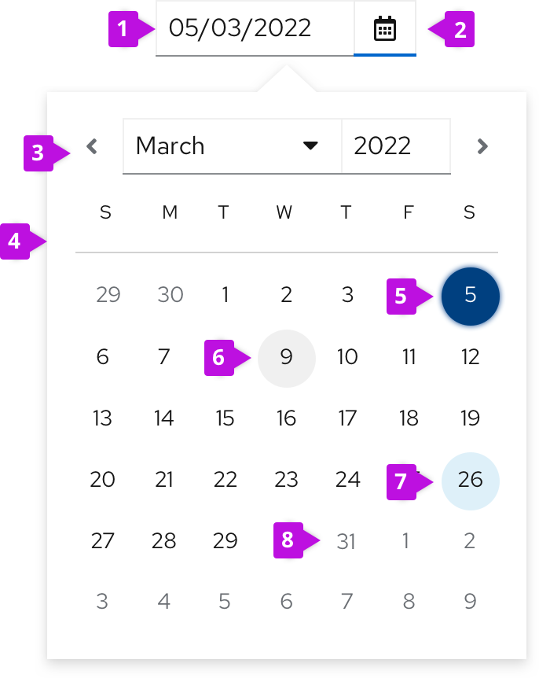

## Elements

1. **Date fields**: Displays a user’s selected date. Always fill the date field with a placeholder date format (MM/DD/YYYY) or a pre-selected date before users make their selection via calendar or keyboard. The date field should never be empty.
2. **Calendar icon**: Opens a calendar upon selection.
3. **Selection arrows**: Allow users to navigate between months.
4. **Calendar**: Allows users to select and navigate between days, months, years. 
5. **Selected date**
6. **Current date (today’s date)**: Indicates the day users access the calendar. Always highlighted.
7. **Hover state**
8. **Disabled state**

## Usage
Use date pickers to enable users to select or input a date for use cases like item filtration or scheduling in a form.

### Single date selection
A date picker allows users to select a single date. When a user enters a new date by date field input or calendar selection, the new date automatically replaces any placeholder or previously-selected value in the date input field.

For more guidance on writing date formats, see the [content](#date-format) section.

### Date range selection
Two date pickers can be used together to specify a date range. The first one functions as a start (“from”) date and the second one functions as an end (“to”) date. By default, when a user selects a start date, the end date will automatically display as the next calendar day.

1. **Selected start date**
2. **Time range**
3. **Selected end date**

### Date and time range selection
Combine a date picker and time picker when you want users to select a range of times across multiple days.

**Behavior**

When date pickers and time pickers are combined, each control’s behavior will remain the same. After users select the start date and time, the end date and time will be automatically set to the same hour of the next day.

Depending on your use case, time pickers and date pickers can be arranged in 2 ways: Horizontal alignment and vertical alignment (in this case labels are recommended).

**Horizontal**

For horizontally arranged date and time pickers, connect each combined date and time picker with "to" so that users know which date defines which point of the date range. Always arrange each date and time picker in chronological order from left to right, with the start picker on the left and the end picker on the right.

**Vertical**

For vertically arranged date and time pickers, always include field labels like "Starts" and "Ends" to indicate which picker corresponds to which point of the date range. Always arrange each date and time picker in chronological order from top to bottom, with the start picker on the top and the end picker below.

#### "All day" checkbox
Consider using adding an "All day" checkbox to a date and time picker to simplify user input when selecting specific dates, or selecting and entire day for an event. Checking the "All day" checkbox will disable the time field and include all hours of their selected dates into their inputs.

## Variations

### Date picker in a toolbar
Use date pickers in a toolbar to filter by date ranges.

#### Date picker in attribute filter
Date range fields can be added to an attribute filter as an attribute. Selecting the Date range attribute will display a date picker, and push other content in the toolbar to the right - in this case, the CTA button. The date(s) selected should display as chips under the filter.

#### Date picker filter group
Date pickers can be added to a toolbar as filters, placed next to other stand alone filters. Since horizontal space is limited in toolbar filter groups, use placeholder text to designate the range’s start and end dates.

For more guidance on using filter groups, see our [toolbar design guidelines](/components/toolbar/design-guidelines).

Some use cases may call for a two-lined toolbar. If your toolbar spans two lines, include your dropdown and filters on the top line and your date pickers below.

For more information about using different types of filters, see our [filters guidelines](/guidelines/filters).

##### Additional dropdown for simplified date-range filtering 
Add an optional dropdown to date-range filters within a toolbar to allow users to filter by the most common date-range options associated with the corresponding table. 

When a user selects an option from this additional dropdown, the date picker automatically populates with the first and last day of their specified range.

Example:  If a user selects **Last month**  from the date-range dropdown, the date picker will display the first day (11/1/2020) and last day (11/30/2020) of that date range. 

Once the date picker displays these prefilled values, users can edit each one. Upon customizing the date range, a user’s selected dropdown option will change from **Last month** to **Custom**.

### Date pickers in a form
Use a date picker in a form to display basic scheduling options, typically for future events. In some use cases, you may preselect and display the most common date options users can choose from based on your app such as ‘Execute command now’ or ‘Don’t repeat execution’

Some use cases will call for more advanced scheduling options, such as scheduling an action to take place at or before a certain date, repeat on a certain day or interval, or end after a certain number of occurrences.

## Content considerations

### Date format
Date formats are product-specific and often depend on user locale. To minimize confusion, choose one date format and keep it consistent. If one date picker displays MM/DD/YYYY, be sure to repeat the same date format throughout your interface.

Learn more about recommended date and time conventions in our [date and time guidelines](/ux-writing/numerics).

### Placeholder text
Always use placeholder text in date fields to provide an example of the accepted date format. Placeholder text will disappear after users begin inputting their own date.

Example: MM/DD/YYYY

For more information about writing effective placeholder text, see our <a href="https://www.patternfly.org/v4/components/form/design-guidelines">form design guidelines</a>. 

### Helper text
Use helper text to provide permanent guidance below the date field.

For more information about writing effective placeholder text, see our <a href="https://www.patternfly.org/v4/components/form/design-guidelines">form design guidelines</a>. 

### Error message
Use field level error messages to alert users when their inputted date or date format is invalid. Always specify what went wrong so that users can quickly identify the problem and fix it.

Examples:
* Select a date within valid range.
* Enter a valid date: *MM/DD/YYYY*. 

For more information about writing effective error messages, see our <a href="https://www.patternfly.org/v4/ux-writing/error-messages/">UX writing style guide</a>.
