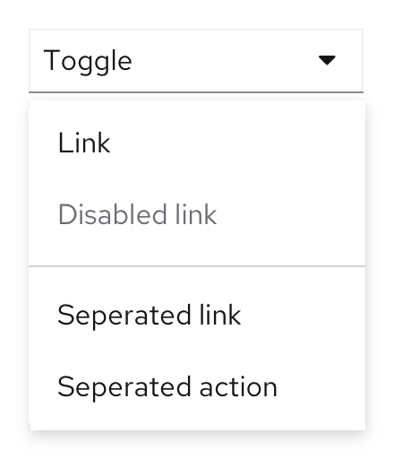

A **divider** is a horizontal or vertical line that is placed between screen elements to create visual divisions and content groupings. 

## Usage
Use a divider as a visual cue to help to convey content separations and groupings.

A **vertical divider** can be used to separate items within a horizontal list, such as a menu or toolbar. 

A **horizontal divider** can be used to separate items within a vertical list, such as a dropdown menu.

A divider can also be used to visually separate content sections, potentially spanning the entire width of the content area. 

