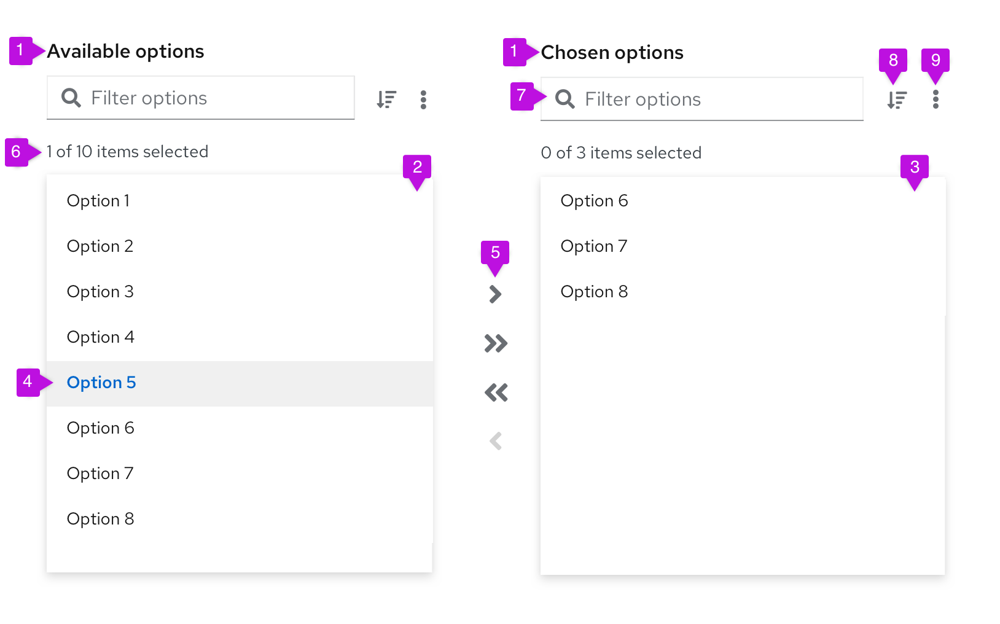

A **dual list selector** allows users to select and move items from one list of available items to another list of selected items. Unlike a select list, a dual list selector separates the available options and the selected options into two separate lists, which allows users to easily scan the items they selected.

## Usage
Dual list selectors are useful when you have a large set of options for users to pick from that would be difficult to digest in a select list. They’re useful in forms, wizards, and modals as a way for users to make selections from a list of options.

### When to use
**Use a dual list selector when:**
* You have a long list of items for users to pick from.
* You want to distinguish the available items from the chosen items.
* You want the ability to group the list of items
* The user can select a large number of items and separating selections from available options would be helpful.

**Do not use a dual list selector when:**
* Users have a list of actions to choose from. Instead, use a dropdown menu or tree view 
* The list of items to choose from has fewer than 20 items. Instead, use a select list.

## Types of dual list selectors
There are two types of dual list selectors: basic dual lists and expandable dual lists.

### Basic dual list 
A basic dual list contains a flat list of items for the user to choose from. 

1. **List labels:** List labels distinguish between the list of available items and the list of chosen items. These labels can be changed based on your use case, and they should be clear and concise. 
2. **Available items list:** The available items list is a list of items that users can choose from. Available list items can have a single level or multiple levels. 
3. **Chosen items list:** The chosen items list is a list of items that users have selected and moved from the available items list. 
4. **Selected item:** A selected item refers to the  visual state of the item when it has been selected by a user.
5. **Arrows:** Arrows are buttons that give users the ability to move items from one list to another. The arrows will enable and disable based on user selections. Single arrows move only selected items. Double arrows move everything from one list to the other (in the direction of the arrow), whether the list contains manually selected items or not.
6. **Number of items:** The number of items is an indicator of how many items are selected among the total items available in the list.
7. **Filter:** The filter is a search field that allows users to filter the list of items.
8. **Sorting (optional):** The sorting ability enables users to sort the list of items presented for easier scanning.
9. **More actions (optional):** The more actions (kebab) menu  stores added actions, such as exporting.

### Expandable dual list
An expandable dual list contains a multi-leveled list of items for users to choose from. Items can be nested in a hierarchical tree to show different groupings or categories, and the list can have up to three levels.

1. **Folder:** group of items that can be selected and moved from one list of options to the other. When a folder has a mix of selected and unselected items, the checkbox should have a mixed state. When all items in a folder are selected, the folder checkbox should have a selected state.
2. **Item:** item within a folder that can be selected and moved.
3. **Selected item:** visual state of an item when it has been selected by a user. 
4. **Number of items:** indicator of how many items are selected, among the total items available in the list. <u>In expandable lists, only non-folder items are included in the item count.</u>
5. **Badge (optional):** number of items inside a folder.

### Dual list behavior
Users can select one or more items from the available list and use the arrows to move these items to the chosen list. Users can filter down the items by using the search input field.

In an expandable dual list, when users move an item from the available list to the chosen list, the item still appears in its original group structure. For example, if the item Option 6  in the group Folder 2  is moved from the available list to the chosen list, the Option 6 item will appear in the chosen list under the Folder 2 group.  It won’t appear as a stand-alone, single-level item.

