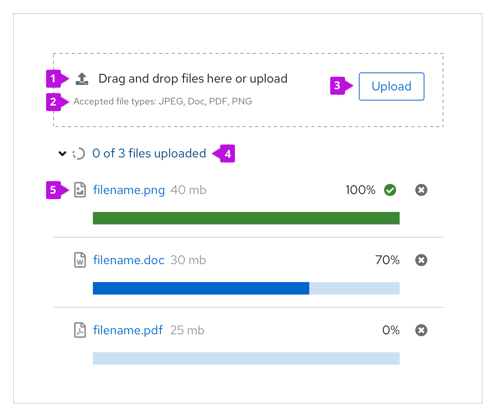
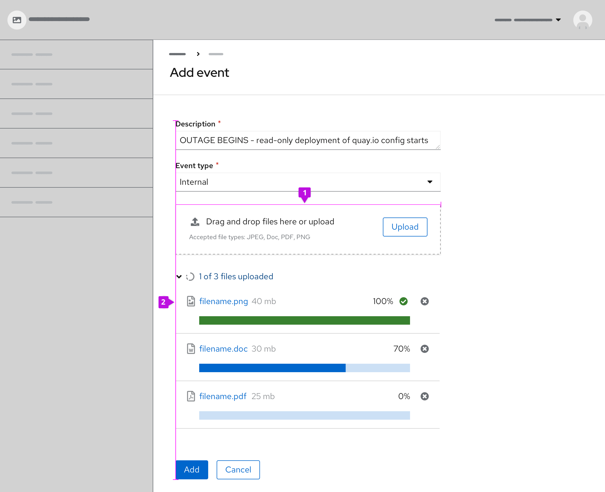
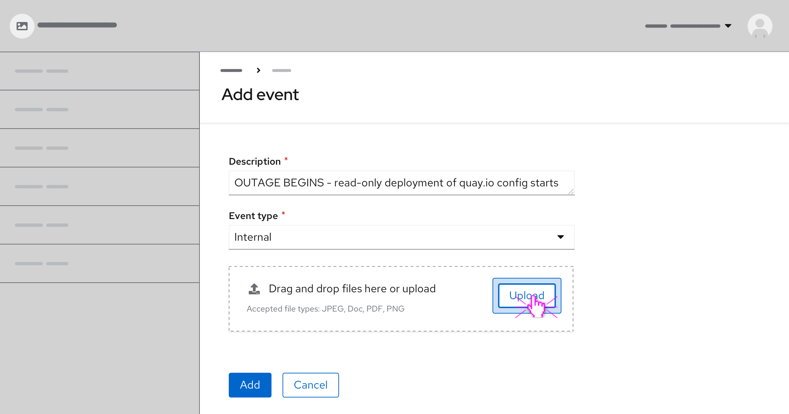
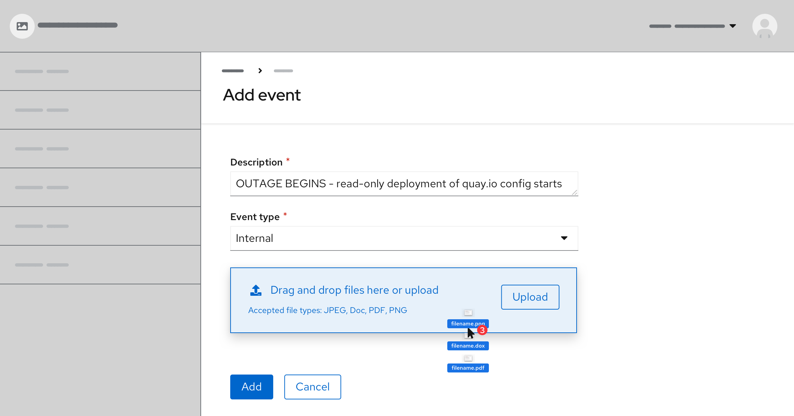
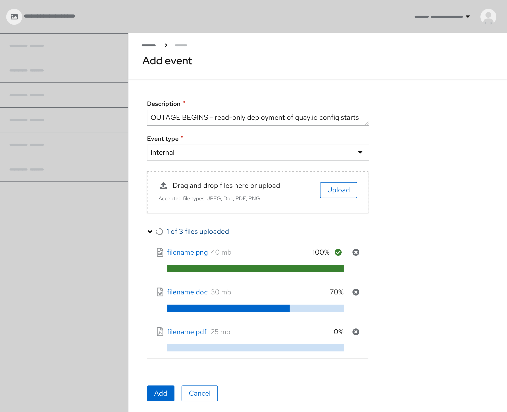
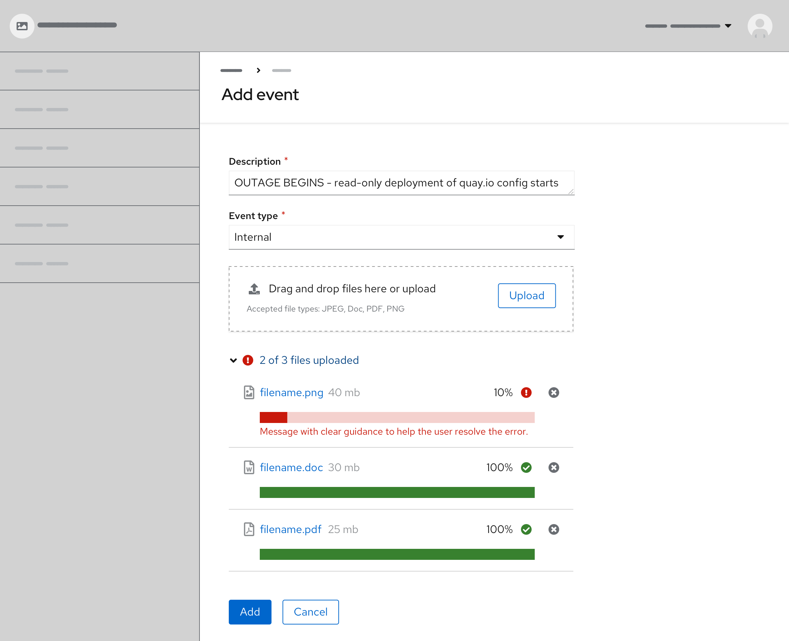

A file upload component is commonly found in forms, but can also live as a standalone element.

*Note: This component is for both single and multiple file upload scenarios that do not require a text preview. For a single file upload that supports text preview, see the [file upload component](/components/file-upload).*

## Elements

### Multiple file upload component

Most multiple file upload components contain 5 basic elements:

1. **Label:** Text to inform users on how a user can interact with the component. The text should describe that you can either drag and drop a file into the drop zone or click on the button to upload a file.

2. **Description:** Assistive text to help the user make an informed selection on file type and size.

3. **Button:** A button to upload files if preferred.

4. **Accordion text:** Describes the total number of files uploaded and if they are complete or in progress.

5. **Progress upload:** The name of the uploaded file, along with file size, progress bar, and percentage.

## Usage/Best practices

**When to use:**
* Uploading 1 or more files.

* Uploading files by dragging and dropping.

* Showing the process of uploading. If large file sizes will be supported in your context, showing progress is important. However, if the file size supported will always upload in a matter of a few seconds this may not be necessary.

**Best practices:**

1. **Sizing:** Modify the drop zone to fit your context. For example, when placing the component in forms, align the width of the drop zone to the form fields.

2. **Alignment:** Left align the dropzone with content on the page. Multiple files will stack vertically underneath.

The component can be set to restrict specific file types and sizes according to your needs.

## Behavior

### Basic workflow
* Drag and drop or select the file(s) to upload
* The upload loading state is indicated by the use of the progress bar
* Filename and x appear once the file is uploaded

### Upload file(s) via the Upload button
Users have the option to upload files by clicking the button inside the drop zone. Clicking on the button prompts a file selector dialog to open. Once users select 1 or more files from the dialog, the files will populate below the drop zone on the page. The file(s) may display a loading state before uploading is successfully completed.

### Drag and drop file(s)
Users have the option to directly upload files by dragging and dropping them into the specified drop zone area.

When dragging files into the drop zone area, the drop zone changes color to indicate the active area. Once the cursor hits the drop zone area it changes with a preview of the file(s) users are about to upload. The style of cursor change is rendered by the user's browser.

### Loading states
A file that is being uploaded has 3 distinct states—waiting, in progress and uploaded.

### Validation
When a specific file cannot be uploaded successfully, the corresponding file will show an error state. Error messages should provide clear guidance to help the user resolve the error.

