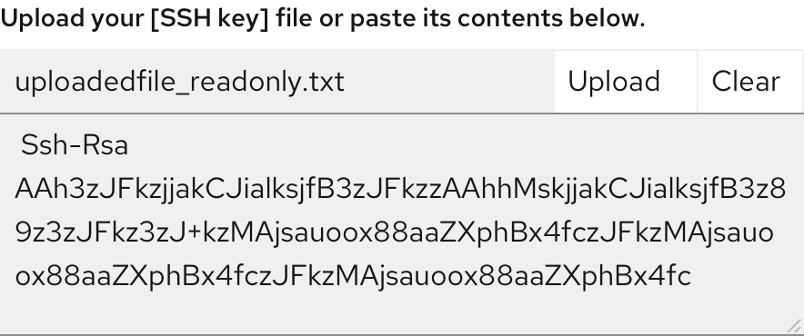
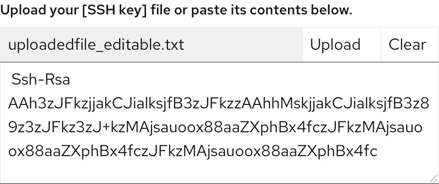

## Elements
 

1. **Label**: Text to inform users about how they can interact with the component. The text should describe that you can either drag and drop a file into the drop zone, or click the button to upload a file.

2. **Button**: A button to upload files if preferred. 

## Usage

Use a single file upload component when only one file can be uploaded. If multiple files need to be uploaded, use the [multiple file upload component](https://www.patternfly.org/v4/components/file-upload---multiple/). This component is recommended for the use of text files where content can easily be displayed in the text area, but all file types are supported.

Once the file is uploaded, the user can edit the content.

To upload, a user can either:
- Drag and drop the file into the box.
- Browse their device for a file to upload.

### Best practices

- Show the process of uploading. If large file sizes will be supported in your context, showing progress is important. However, if the file size supported will always upload in a matter of a few seconds this may not be necessary. 

## Behavior
When the user hovers over the file upload component, a message should appear telling the user they can drop files there. 

### Upload complete non-editable

 

Once the file is uploaded, users cannot edit the text displayed. The text box should be greyed out to indicate it cannot be changed.

### Upload complete editable

 

Once the file is uploaded, the user can edit the text displayed by clicking within the text box.

### Loading states

 

While a file is being uploaded, the waiting icon is displayed.

### Error 

 

When a specific file cannot be uploaded successfully, the corresponding file will show an error state. Error messages should provide clear guidance to help the user resolve the error.
