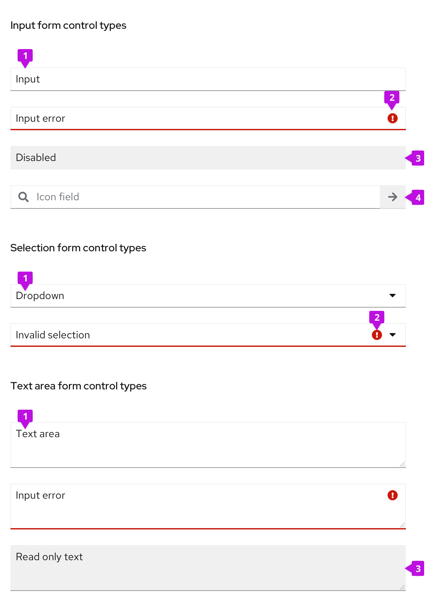
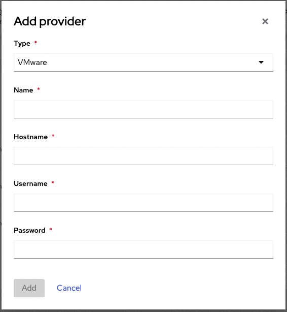
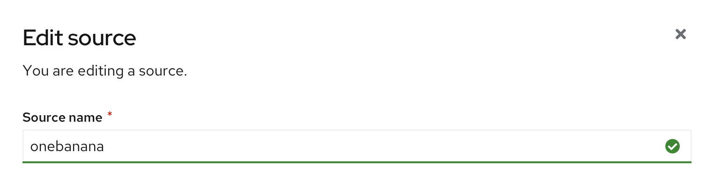
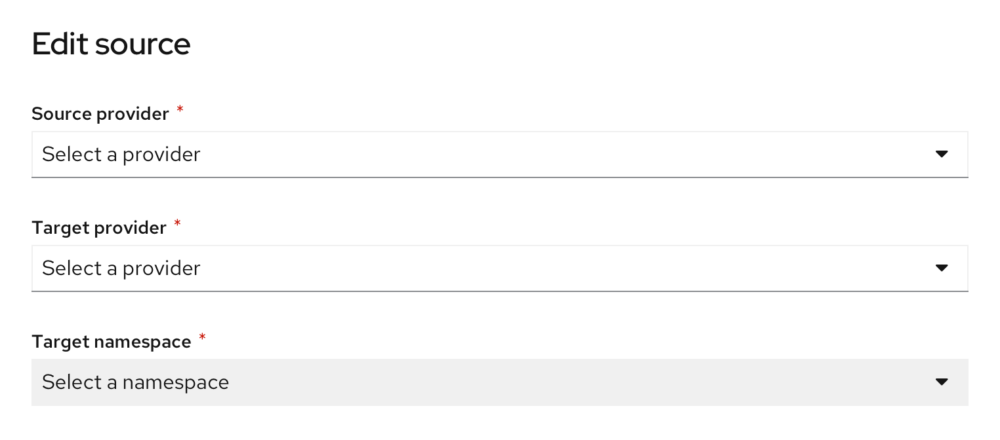
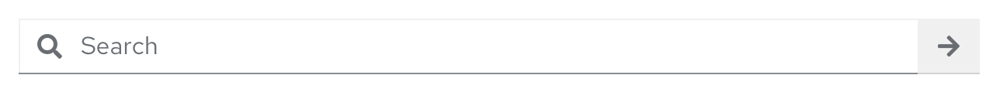

Form control can be applied to various input components, including text boxes, dropdowns/select lists, and text areas.

## Usage
While form controls are useful in providing feedback on user input, they don't need to be implemented for every input instance. Only use form controls when it is essential to convey information to the user. For example, if any string is valid for a text input, or any selection in a list is acceptable, form controls are not necessary.

## Variations
While form control styles differ slightly depending on the component, they all use some combination of underlines, color, and icons to give users **feedback** on their inputs and selections. For example, if a user types an invalid string into a text box, the box changes state to indicate the error.

1. **Default component:** State of the input component before any form control is applied.
2. **Status area:** Icon and underline color indicate the status of the input or selection.
3. **[Grey-out controls](#grey-out-controls):** Actionless form control can be either disabled or read only. The only difference visually is the underline for read only input.
4. **Form fields with icon:** Custom icons can be included in input fields.

### Status/state controls
Status controls are the most prominent form control. Error, warning, and success variations should be used in real time to give users feedback on their inputs or selections.

#### Error controls
Use error controls when a user inputs incorrect information or selects an invalid option from a dropdown menu. Error indicators are often accompanied by helper text to further specify the user error. Read more on error messaging in the [forms guidelines](https://www.patternfly.org/v4/components/form/design-guidelines#errors-and-validation).

#### Success controls
Use success controls to indicate valid user input for fields that require a specific form of input. In the example below, the name entered must be unique, so the success state indicates availability. Alternatively, an error control would be used to indicate a name that is already in use. **Only use success controls if the input must be validated.**

### Grey-out controls
Input fields should be grayed out when the user cannot perform actions. Gray-out controls indicate that a field is either temporarily disabled, or permanently read-only.

#### Disable controls
Disable controls indicate dependency and can be used to guide the user in a sequential workflow. In the example below, the field Target namespace is disabled, because the user must select a Target provider first. The component is disabled until the user makes the first selection, because namespace options are dependent on the selected provider. Disabled controls should be used over read only controls in scenarios where there is a way for a field to become enabled, for example, in the case of user access/permission restrictions.

#### Read only controls

Use the read only state when an input will *never* be editable. This state differs slightly from the disabled state in that read-only is never changeable. 

#### Plain variation
Use when you don't have the need to copy to clipboard.

#### Boxed variation
Use when you have a need to copy to clipboard.

### Custom icons
Icons can be included within form fields to indicate the type of input required. The most common example is the Search field, shown below. All icons should be right-aligned within the input component.

As a designer, you can choose to design input components with custom icons. Make sure that whatever icon you choose informs the user about the type of input that field requires.
