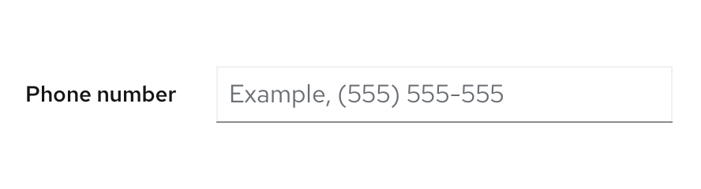
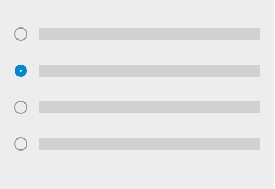
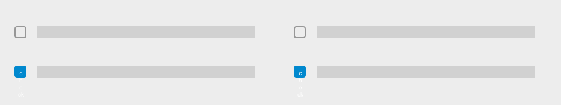

Use forms to accomplish tasks reliant on user-inputted information like logging in, registering for accounts or services, configuring settings, or completing surveys.

## Elements

Most forms contain four basic elements:

1. [**Labels:**](#labels) Indicate desired information for each field.
2. [**Text inputs:**](#text-inputs) Provide space for users to enter text.
3. [**Data inputs:**](#data-inputs) Allow users to enter information that is not freeform text using components like checkboxes, radio buttons, or dropdowns.
4. [**Buttons:**](#buttons) Enable a user to submit or exit a form.

### Labels
Always provide labels for text and data inputs so that users understand the information each form field asks of them. Default to top-aligned labels unless you’re working within limited vertical space, then use left-aligned labels. 

Maintain consistent form label alignment throughout your application or interface.

#### Top-aligned labels

Top-aligned labels are preferred over left-aligned labels because they provide a closer proximity between a label and its corresponding input and allow the most horizontal space to accommodate long label content. These characteristics support more responsive and scannable form design.

#### Left-aligned labels

Avoid using left-aligned labels unless you’re working with limited vertical space. 

To accommodate mobile views, left-aligned labels should responsively adjust to top alignment for smaller screens.

For guidance on how to write effective form labels, see the [content](#content-considerations) section.

### Text inputs

Follow our [text input guidelines](/components/text-input/design-guidelines) for using text inputs in a form.

### Data inputs

PatternFly provides a variety of input components that enable a user to make a selection. Each component supports a specific use case:

#### Switch

Use a [switch](/components/switch/design-guidelines) to toggle between 2 different states in a form.

#### Radio buttons

Use [radio buttons](/components/radio/design-guidelines) when users can only choose 1 option from a list of 2 to 5 mutually exclusive options.  

#### Checkboxes

Use [checkboxes](/components/checkbox/design-guidelines) to enable users to select all, some, or none of the available options from a list of up to 5 items.

#### Select lists

Use a [select list](/components/select/design-guidelines) to enable users to select 1 or more options from a list of more than 5 items.

#### Data input arrangement

Data inputs can be arranged in 3 different ways depending on space considerations.

1. **Horizontal placement:** Use when vertical space is scarce or to arrange three inputs or fewer.

    
    

2. **Vertical placement:** Use when quick scanning is ideal or to arrange more than three inputs.

    

3. **Multi-column grid:** Use when space is constricted and labels are short.

    

### Buttons

Form submit buttons should be disabled until a user starts filling out the form or edits the form in any way. However, this recommendation varies according to a form’s context:

* For short forms like wizards, disable submit buttons until all conditions required to submit the form are met. This setting reduces the need to return validation errors due to incomplete form submissions.
* For long scrolling forms, don’t disable the submit button since the missing field and submit button may not be visible on the screen at the same time.
* For a submitted form, disable the submit button while a user's responses are processing to avoid a duplicate submission.
* For a processing form, use feedback messages and progress indicators like spinners or progress bars if the processing time might exceed user expectations.

## Variations

### Form sections

Form sections sort form fields into non-hierarchical groups based on common information type, step, or visual preference. Form sections are ideal for breaking long forms into simple, evenly spaced segments with all information exposed. 

Default to grouping data with form sections, especially if all form fields are required. If you need to visualize complex or nested information, use [field groups](#field-groups) instead.

To distinguish between form sections, title them based on the reason you grouped their inputs together. You may forego form section titles and solely rely on the added spacing between sections, but don't leave section titles blank if that empty space will confuse your users. If you do decide to forego the form section titles, add an `aria-label` to indicate why you're sectioning each set of form fields together.

To view an interactive example of form sections, see our [form sections demo](/components/form/#form-sections).

### Field groups

Field groups sort form fields into hierarchical, collapsible groups based on theme. All field groups are nested and indented by default, so they create a clearer information architecture between groups. Since all elements won't be visible at all times, always title field groups based on their purpose. Field groups are ideal for building a more dimensional form structure or condensing lengthy forms into digestible, expandable segments.

PatternFly field groups support a required title, description, and actions. 

Use field groups to:

- Group form fields in a more complex way.
- Reduce information overload.
- Hide unrequired fields. 
- Use multiple instances of the same element without causing visual confusion.
- Designate an area to configure advanced options.

Because field groups call for more clicks, tabs, and interactions to reach form fields, they require additional accessibility considerations. Clearly label field group content so that it's clear to all users. For more field group accessibility guidance, see the [Accessibility guidelines](#accessibility).

**Example:** For a form with multiple field groups, distinguish between each one by adding titles that convey each group's unique theme such as *Routing*, *Build configuration*, *Deployment*, or *Scaling*.

To view an interactive example of field groups, see our [field groups demo](/components/form#field-groups).

## Usage

Due to their interactive nature, forms often include features that help communicate field importance and guidance as users complete them. 

### Types of user guidance
Types of user guidance include:
* [**Required fields:**](#required-fields) Call attention to input fields crucial to user success.
* [**User help:**](#user-help) Assists users in context through placeholder text, helper text, and popovers.
* [**Progressive disclosure:**](#progressive-disclosure) Hides and shows fields based on user selections to simplify their workflow.

#### Required fields

Reserve required fields for information vital to user success. Indicate a required field with an asterisk ( * ) to the right of its field label.

If all form fields are required, don’t use an asterisk for each one. Instead, provide a message at the top of the form: “All fields are required.” If all fields are optional, provide a similar message at the top of the form: “All fields are optional." 

#### User help

There are 3 different methods for providing assistance within a form: [placeholder text](#placeholder-text), [helper text](#helper-text), and [popovers](#popovers).

##### Placeholder text

Within a form field, placeholder text provides an example of the required or recommended format for text input. 

**Use placeholder text when:**

* The requested data type requires data to be inputted with specific format or syntax requirements.
* The requested data type might be unfamiliar to the user.

**Never use placeholder text when:**
* Replacing field labels 
* Communicating crucial information since it disappears as soon as a user begins typing in a field.

If your placeholder text shares an example, precede it with “Example,” followed by a space so that users accessing the form with screen readers will know the difference between the field label and the provided placeholder text. 

**Examples:**

* *Example, John Smith*
* *Example, (555) 555-5555*
* *MM-DD-YYYY*

For more information about writing effective placeholder text, see the [content](#content-considerations) section.

##### Helper text

Helper text is brief, permanent text below a form field that helps a user provide the right information specific to that input, like entering a unique project name or data point. Helper text may wrap to two lines, but it should never extend past the width of its corresponding input field.

Align helper text with the specific input for which it offers assistance. If your helper text contains information about the label rather than the input field, place it with the label instead.

For more information about writing effective helper text, see the [content](#content-considerations) section.

##### Popovers

[Popovers](/components/popover/design-guidelines) are useful for fields that might require additional background or explanation. Popovers may also link to external help pages or other related documentation. 

In a form, indicate a popover with an unfilled question mark circle that reveals information when clicked. Place popovers to the right of their corresponding form label.

 

 **Use popovers when:**

* Guiding users to where they can find essential information needed to complete a given form field.

* Providing content that requires formatting like numbered or bulleted lists, or that requires you to include additional elements like buttons, links, or images.

Never hide critical information inside a popover, since popovers only surface when a user triggers them.

For more information about writing effective popovers, see the [content](#content-considerations) section.

#### Progressive disclosure
Use progressive disclosure to hide and show form fields based on a user’s selection to keep their workflow short and allow them to focus on fields relevant to them. Progressive disclosure also avoids using color to indicate whether or not a field is available, making forms more accessible for users with visual impairments.

 

### Errors and validation

When a form field submission results in an error, let users know as soon as possible and as close as possible to the error. Default to presenting error states on a form using field level errors whenever possible. 

In some use cases, you may choose to use inline errors at the top of a form to emphasize errors within it. These inline errors should always be a supplemental component used in addition to field level errors. 

After a form error occurs, users won’t have access to placeholder text (replaced by their input) or helper text (replaced by field level errors). Because these resources will be unavailable until the error is corrected, error messages should answer two essential questions:

* What is the error?
* What can the user do to fix it?

**Example:** Instead of “Invalid input,” provide an error message that includes the correct format to re-write the input: “Date format must be MM-DD-YYYY.”

 

Errors can be validated at two points in the workflow: On loss of focus or on submission. The error state you use depends on whether validation happens on the client side (loss of focus) or server side (on submission).

#### Error validation on loss of focus
Validation on loss of focus occurs as soon as a field loses focus. It alerts users of errors immediately after they complete their input through inline validation, allowing them to quickly see and address issues.

Validate errors on loss of focus when:

* A user enters data in an invalid format.
* A user leaves a required field blank.
* A user leaves a required field incomplete.

#### Validation with Test button

An inline Test button can be used as a way to validate the contents of a single input at any stage of a form workflow. For example, if users want to check a link to an external code repository they can use the Test button to confirm access without changing focus to and from the form input or waiting until for final submission.   

  

#### Error validation on submission
Validation on submission occurs when a user attempts to submit a form. In this scenario, the user completes the form in its entirety and the page reloads with any errors detected.

For validation on submission, supplement field level errors with an [inline alert](/components/alert/design-guidelines#inline-alerts) to make it simple for the user to quickly identify and address areas that need attention. The inline alert should be placed below the form’s header and description, and it should equal the total width of the form. 

Learn more about writing error messages in the [content](#content-considerations) section.

## Spacing
Forms may be placed in several contexts including on a page, in a wizard, or in a modal. Your chosen form placement may impact specific spacing considerations, but general form spacing requirements apply across these contexts.

### General spacing
Always add 24px of spacing underneath each form input. If a form input includes helper text, this 24px spacing should start below the helper text. Spacing between data inputs like checkboxes and radio buttons should also be 24px when on the same line or stacked on one another. For more spacing information, consult the [PatternFly spacer guidelines](/guidelines/spacers#considering-line-height-and-padding).

### Button spacing

Place submit or cancel buttons on the bottom left of a form, left-aligned with all form fields. Buttons should be placed 16px apart in all contexts. Buttons for actions other than submitting or canceling the form may be placed elsewhere within a form depending on your use case. 

For more guidance on button placement, see our [button guidelines](/components/button/design-guidelines#button-placement). 

### Forms on a page

Left and top align a form within a page’s content area. A minimum of 24px padding should separate the form from neighboring elements.

When placing a form on a page, its width is customizable to your use case and should reflect factors including:

* The length of inputted content.
* The widest input field in the form.

To accommodate lengthy input fields, the maximum suggested width is 880px. Use your best judgement based on the context and content of your form –– 880px is typically too wide for most use cases.

All input fields in your form will be the same length, except for in a [multi-column form](#multi-column-forms) where you may place two or more adjacent fields in a single line. In a multi-column form, form inputs will share available width on that line.

### Forms in a wizard
Similar to an in-page form, forms in wizards should be left-aligned in the content area and have a minimum of 24px padding separating its content from neighboring elements. 

In a wizard, form error validation should occur when or by the time the user clicks the “Next” button. Don’t wait until the user has completed the whole wizard to notify them of possible errors and their location.

### Forms in a modal
Forms in a modal should be horizontally centered with the modal background and fill the modal width, leaving 24px between the form content and the modal background edges.

### Multi-column forms

Multi-column forms are forms that allow multiple inputs to share a single form line. Single column forms are recommended over multi-column forms since multiple columns can lead to confusion and may not support an accessible experience for all users.

If you choose to create a multi-column form, you may do so using any of the [layouts](/layouts/bullseye) offered in PatternFly including [grid](/layouts/grid) or [flex](/layouts/flex).

When grouping columns together in a multi-column form, organize them so that field information on the same line relates to one another. Common cases for this input field grouping include:

* First name, Middle initial, Last name
* City, State, ZIP code
* Credit card number, Expiration date, Security code

Never design multi-column forms to read like a magazine or newspaper column, where the left column is completed first before moving on to the right. The form itself should still move and be filled line by line from top to bottom, with related fields placed on the same line.

## Content considerations

When writing form content, use your understanding of the user’s task and context to plan your content hierarchy. As a user moves through a form, they input and select information based on the content provided, almost like a conversation. 

Forms combine several content types to guide users toward completion:

* Field labels
* Placeholder text
* Helper text
* Popovers
* Error messages
* Buttons

Follow these general guidelines for each content type as you structure content within a form.

### Field labels

Use field labels to specify the most critical information about what data the user needs to provide. Each label should be unique and identify all the information being collected. 

Whenever possible, keep field labels under five words and avoid using the same field label more than once in the same form.

**Examples:**

* *Full name*
* *Email*
* *Phone number*

### Placeholder text

Use placeholder text to demonstrate correct inputs so that users are aware of formatting expectations and specifications needed to provide information without errors. 

If your placeholder text demonstrates a correct input, introduce it as an example so that users can distinguish impermanent examples from field labels and their own inputted text.

**Examples:**
* *Example, John Smith*
* *Example, (555) 555-5555*

Placeholder text that doesn’t give an example doesn’t need to be introduced as one. If your placeholder text simply communicates a field's required format, write the format without an introduction.

**Examples:**
* *MM-DD-YYYY*
* *johnsmith@example.com*

**Note:** Once users start typing, placeholder text disappears. Consider communicating crucial formatting requirements or directions with helper text instead.

See our [text input guidelines](/components/text-input/design-guidelines) for more specific guidance on writing placeholder text for text input fields.

### Helper text

Use helper text to display critical secondary information that helps users input correct information on their first attempt. Describe any conditions for their inputted information to prevent unnecessary errors, like specifying that a name for a new asset must be a unique one.

### Popovers

Use popovers to supply background information and additional context as field-level help. Popover content should help define unfamiliar terms or concepts that novice users may not know offhand. Popover content can also help users find required information, such as an account number, order number, or employee ID.

**Examples:**
- *Find your order number in your order confirmation email or at the top of your paper receipt.*
- *You can find your employee ID number at the bottom of your employee ID card.*

See our [popover guidelines](/components/popover/design-guidelines#content) for more information on writing effective popover content.

### Error messages

Use error messages to help users break down barriers between form errors and successful form submission. Whether you surface error messages on loss of focus or on submission, be sure to alert users to specific errors within their form and provide key actions they can use to fix them.

If a user leaves a required field empty or incomplete, use a field level error message to communicate the error in as little words as possible: *Required* or *Required field*.

If a user formats an input incorrectly, avoid unclear error messages like *Invalid input*. Instead, specify what constitutes a valid input.

**Examples:**
* *Date format must be MM-DD-YYYY*
* *Enter a valid email: email@provider.com*

For more error message guidance, see our [UX writing style guide](/ux-writing/error-messages).

### Buttons

Use button text to clearly and specifically communicate the action it triggers. Whenever possible, use specific verbs to write button text that communicates what a user accomplishes by submitting a form.

**Example:** Instead of *Submit*, a submit button on a subscription form should read *Subscribe*.

For more button text guidance, see our [button content guidelines](/components/button/design-guidelines#content).

## Accessibility

This section highlights accessibility considerations to keep in mind when creating forms. For more accessibility guidance, see our [PatternFly accessibility guide](/accessibility/product-development-guide/).

### Form sections
Follow these best practices to create accessible form sections:

- Always label and associate form section content.
- If your form sections are untitled and visual separation is crucial to understanding and successfully completing your form, add an `aria-label` to indicate why each form section is grouped together. 

### Field groups
Follow these best practices to create accessible field groups:

- Always label and associate field group content. 
- When in doubt, add an `aria-label` to make sure screen reader users can access and understand all information for each field group.

- Use `
` tags to separate elements so that users can navigate from element to element from any viewpoint.

### Placeholder text

Never write essential information in placeholder text. Screen readers like JAWS and NVDA don’t read it, nor is it widely supported among other assistive technologies. Additionally, placeholder text often shows in a low gray-on-white contrast, which may be inaccessible for users with visual impairments. Treat placeholder text as a visual supplement –– any crucial formatting requirements should be written in helper text so that users with assistive technology won’t miss it.

### Multiple forms on a page

Whenever possible, default to including one form per page. Placing multiple forms on the same page may cause unnecessary confusion.

If multiple forms live on the same page, multiple submit buttons will, too. If both actions use the same button text, users accessing the page via screen reader won’t be able to distinguish between them. In this instance, descriptive button text is crucial to support successful form completion and submission for all users. 

Use a form's action to specify its submit button text:

* If submitting one form creates an account while the other signs the user up for a mailing list, write each action into unique button text: *Create account* and *Subscribe to mailing list*.

* If form actions aren't easily distinguishable or difficult to fit into a button, consider separating them onto separate pages or incorporating their titles into their submit buttons: *Submit [form title] form*.
