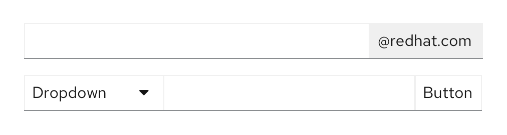

An **input group** includes multiple input types, like a text input and a button, in one control.

## Usage

Input groups can combine multiple elements. For example you could add buttons to 1 or both sides of a text input, like in a search field or an email input field. 

View more examples in the input group react tab.