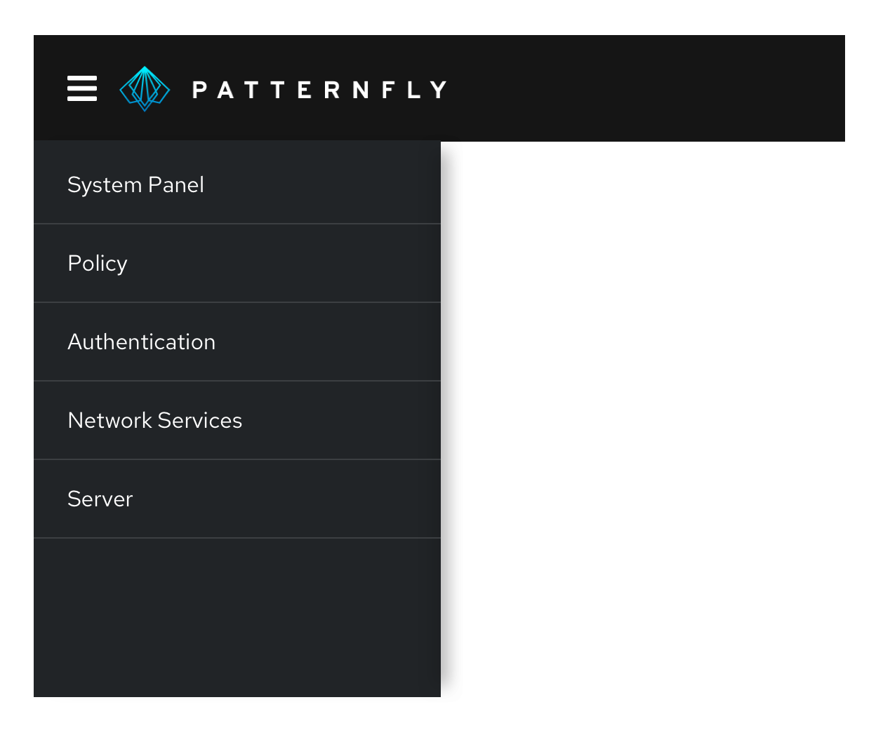
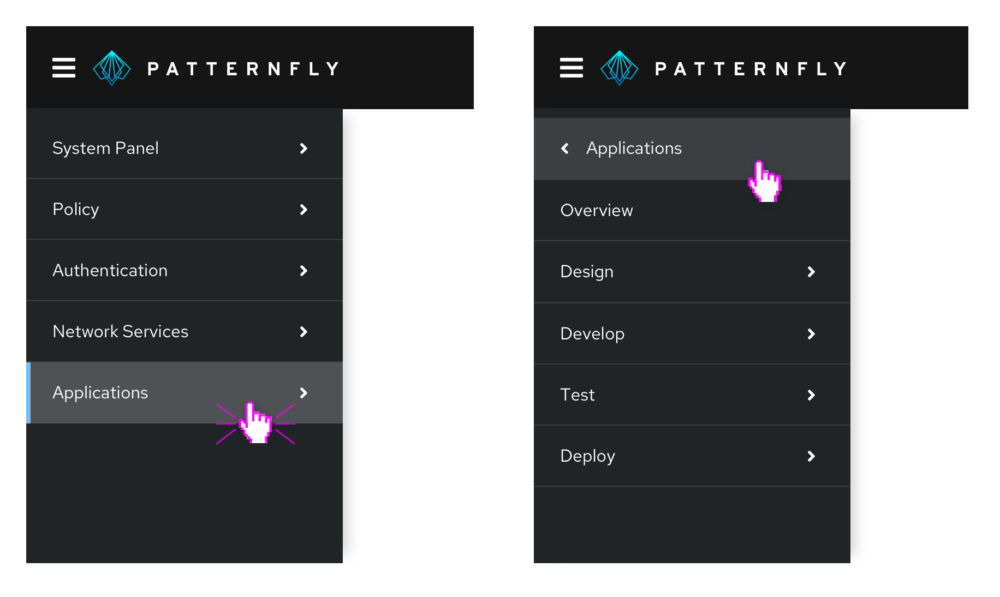
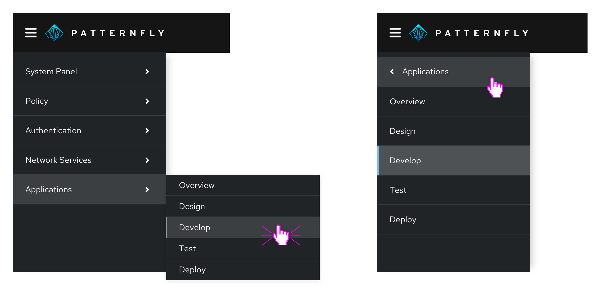
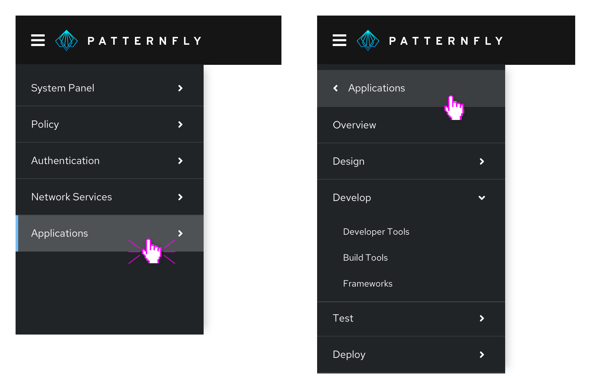
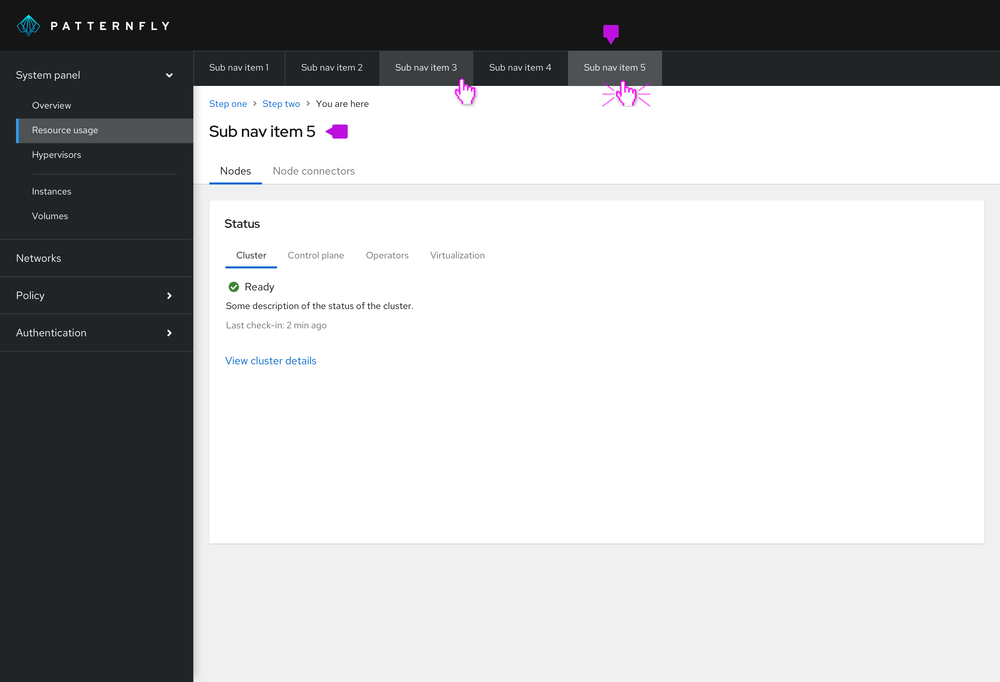
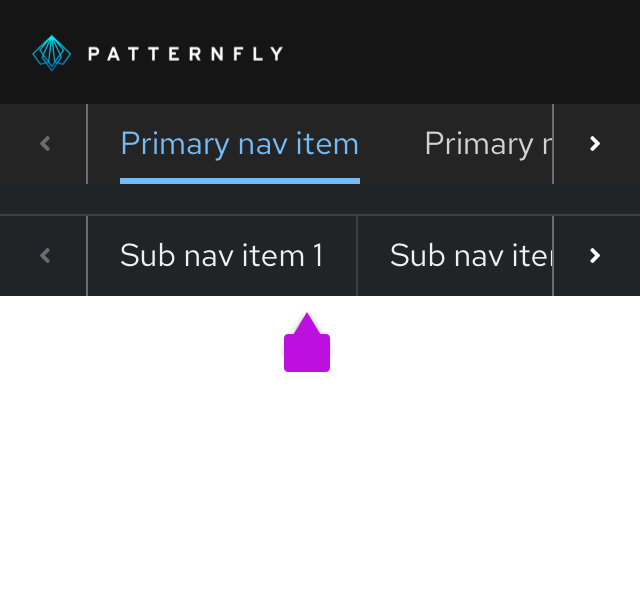

## Elements

1. **Masthead**
2. [**Horizontal navigation**](#horizontal-navigation)
3. **Menu icon button:** Provides a way for users to toggle vertical navigation
4. [**Vertical navigation**](#vertical-navigation)
5. [**Secondary horizontal navigation**](#secondary-horizontal-navigation)

## Usage
Use navigation to organize a pages structure and content for user clarity and convenience. Use cases differ depending on component variation.

## Variations
There are two main variations of the navigation component each of which contain subvariations. 

* [Vertical navigation](#vertical-navigation)
    * [Simple vertical navigation](#simple-vertical-navigation)
    * [Grouped navigation](#grouped-navigation)
    * [Expandable two-level navigation](#expandable-two-level-navigation)
    * [Expandable three-level navigation](#expandable-three-level-navigation)
    * [Fly-out navigation](#fly-out-navigation)
    * [Drill-down navigation](#drill-down-navigation)
* [Horizontal navigation](#horizontal-navigation)
    * [Secondary horizontal navigation](#secondary-horizontal-navigation)

### Vertical navigation 

Vertical navigation is hierarchical global navigation that displays navigation options from top to bottom on the left side of a screen. PatternFly vertical navigation can be collapsed to provide additional screen real estate by using a menu icon button at the top left.

#### When to use
* You have 5 or more primary navigation items
* You have secondary navigation items (even if you have less than five primary navigation items)
* You expect your application to be used on mobile devices

Patternfly vertical navigation system includes several variants as described below.

### Simple vertical navigation

When you only have one level of navigation to display, use a simple, single-level vertical navigation.

### Grouped navigation

When you have a small amount of secondary navigation items, you can group your items and display them persistently beneath the primary navigation items.

### Expandable two-level navigation

When you have a large number of secondary navigation items, you can use an expandable navigation to collapse and expand options as needed.

### Expandable three-level navigation

When you have three levels of navigation items, you can use a three-level expandable navigation to expose tertiary navigation items. Expansion works well when there are small numbers of items at the current level and the entire page hierarchy can be visualized at the same time.

### Fly-out navigation

Fly-out navigation exposes navigation items nested within a parent node in an overlay panel that appears to the right of the parent item on hover or click. Fly-out menus can be used to expose secondary or tertiary levels of navigation. While fly-out menus can be cascaded to display two or more levels of hierarchy below the parent page, this is not recommended as the mouse interaction required to navigate a multi-tiered flyout menu can be difficult for some users.

The advantage of fly-out menus is that they allow a user to easily scan through secondary menu items. When using fly-out menus, keep in mind that the page in view may not be exposed as a selected menu item at the top level. Therefore, when using fly-outs, we strongly recommend use of [breadcrumbs](/components/breadcrumb) to help users understand where they are currently working within the site hierarchy.

Also, consider how likely it is that your application will be used on a mobile phone. Fly-outs are not mobile friendly and may require substitution a different menu pattern across platforms (mobile vs desktop).

### Drill-down navigation

Drill-down menus replace the current navigation menu with the next set of child items in the page hierarchy when the user clicks on a parent item to drill down. A back link is provided at the top of the menu to return to the parent level.

Using drill-down navigation, only the navigation items for the current page and its siblings will be visible at any given time. This pattern is very mobile-friendly as it minimizes the need for scrolling to see the entire menu. However, it should be avoided if you expect users to frequently move between levels.

### Combining vertical navigation patterns

PatternFly's vertical menus are designed to be composable. This means that you can combine different patterns within the same navigation system to address the needs of users working at different levels in the page hierarchy.

When combining different types of menus:

* Use a consistent approach to represent items at the same level in the page hierarchy. For example, if drill-down is used from level 1 - 2, all items with children at that level should display the same behavior. Don’t mix fly-outs, drill-downs, and expansion at the same level.

* Consider how important or likely it is for users to move between levels and/or across to items at the same level but in different branches of the hierarchy. Drill-downs are most effective when users will spend most of their time moving between pages with the same parent node. Therefore, drilling into a lower level in the page hierarchy and then employing expansions or fly-outs to navigate between pages at that level can be an effective approach.

Here are some examples of hybrid navigation patterns that you may find useful.

#### Fly-outs with tertiary drill-down
By using fly-outs to expose secondary navigation items and then drilling into third level items, you can keep the current page and its siblings visible as the user works. This is a good pattern to use when you expect users to spend most of their time working within the same section of the application.

#### Two-level expansion with drill-downs
You can use expanded menus to expose the first two or three levels of page hierarchy and then drill-down to the lowest level. This pattern is preferred to using fly-outs with a drill-down when there are fewer secondary level items and/or you require a mobile friendly solution.

#### Drill-down with tertiary expansion

Consider using a drill-down menu at the primary level and expansion to expose levels two and three when you want to make it easy for users to move between items at levels two and three without the need to frequently move back to the primary level to explore other branches.

### Horizontal navigation 

Horizontal navigation is global navigation that displays navigation items from left to right in the application's masthead.

#### When to use
* You have less than 5 primary navigation items
* You have only 1 level of navigation and no secondary navigation items

### Secondary horizontal navigation

Use secondary horizontal navigation when you want to provide more granular navigation specific to a particular page or window in your application. This differs from [tabs](/components/tabs), since tabs would allow you to switch perspective on the same page, while each secondary horizontal navigation item would be sending you to a distinct URL. For example, a user might use global navigation to get to a settings page, and then use local navigation to access privacy and general user settings.

Secondary horizontal navigation can be paired with vertical or horizontal navigation. It provides deeper nesting to the vertical navigation, which may help prevent the navigation from becoming too long.

**Selected nav item:** The title of the page should reflect the selected horizontal navigation item. You can provide further nested information by using tabs.

We recommend either using horizontal navigation OR vertical navigation as your primary. The secondary horizontal navigation can be added to either and contains similar styling to the primary navigation either way.

Secondary horizontal navigation follows a similar responsive design as our other horizontal navigation types.
Overflow items can be navigated to by using horizontal scroll or the arrows.

