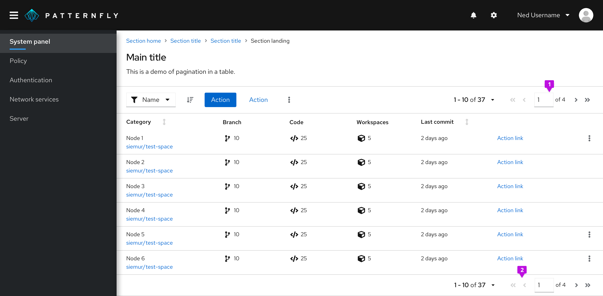
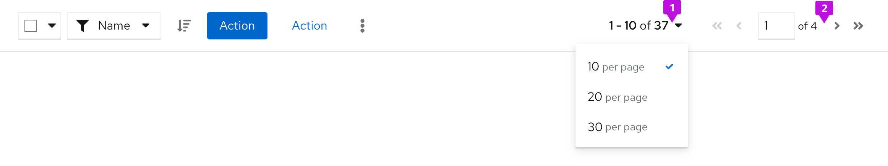

## Usage
Add pagination above and below content views so that users can easily navigate as they read through listed items on a page.

1. **Top pagination:** Always right-align pagination in the top toolbar, above content views.

2. **Bottom pagination:** Right-align pagination below content views, too. If you want the bottom pagination to be sticky so it does not scroll off the page when the content is taller that the viewport, place the pagination in a footer page section and apply the `pf-m-sticky-bottom` modifier section to 
create a sticky page footer.
## Variations 
### Full pagination

Use full pagination unless you're restricted to a narrow workspace, then use <a href="#compact-pagination">compact pagination</a>. Full pagination occupies more toolbar territory, so you'll have limited room for other items like bulk selectors, buttons, filters, or input fields.

[Overflow menus](/components/toolbar/design-guidelines#overflow-menu) allow you to incorporate these toolbar actions using less horizontal space. Toolbar actions automatically form into an overflow menu at specific breaking points. Learn how to customize these breakpoints in our [Toolbar](/components/toolbar/design-guidelines) documentation.

Desktop and mobile views connect with the same breakpoint specifications. On mobile, full pagination condenses to an item count. As a toolbar item, you can add and keep the item count in two ways: in both desktop and mobile views, or just in mobile view.

Desktop full pagination in toolbar

1. **Items in view:** Allows the user to select the item count (number of listed items) per page.

2. **Full pager:** Supplies all necessary pagination options including page-back and page-forward, page-first and page-last, and a manual option to type in a desired page number.

Mobile full pagination in toolbar

1. **Items in view:** At this screen size, the top toolbar only shows the item count to indicate items currently in view. It hides all other pagination controls.

2. **Full pager:** Supplies the same pagination options as the desktop full pager, but in the bottom toolbar.

### Compact pagination

Compact pagination fits more actions into top toolbars with limited space. Choose this compact variation when your top toolbar contains many items or looks overcrowded. As with full pagination, the compact variation condenses to an item count for mobile views.

Desktop compact pagination in toolbar

1. **Items in view:** Allows the user to select the item count (number of listed items) per page, as seen in full pagination.

2. **Compact pager:** Supplies the user with page-back and page-next controls only.

### Indeterminate pagination

Use indeterminate pagination if it’s difficult to calculate the total number of items or page count upfront. In these cases, you may use “many” instead of the usual page count that would appear.

The text indicator provides the user with a control that displays indeterminate page count or items.
