## Elements

A select component consists of a toggle control to open and close a menu of actions or links. Selects differ from [dropdowns](/components/dropdown) in that they persist selection, whereas dropdowns are typically used to present a list of actions or links.

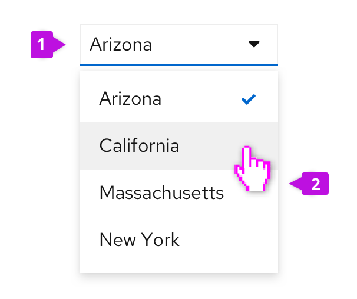

1. **Toggle:** The toggle is used to open and close the menu. It takes on all of the behaviors of a button. The toggle label always reflects the currently selected item or may hold a placeholder if nothing is selected.

2. **Menu:** The menu contains a list of options or values. Menus should optimally present 7 or less items for easy scanning by the user. For longer menus, items may be grouped or scrolling may be exposed by limiting the height of the menu. See the [menu component guidelines](/components/menu/design-guidelines) for more information about supported options, including use of icons, grouping, and descriptions. The Select component includes many common built-in menu variants. It’s also possible to attach a custom menu by using the [basic panel variant](/components/select/react#panel).

## Usage

Use case varies depending on type of select list:
* [Single select](#single-select)
* [Checkbox select](#checkbox-select)
* [Multiple select](#multiple-select)
* [Typeahead](#typeahead)

### Single select
Single select lists allow users to select a single, mutually exclusive option. When the user selects an option from the list, the selection appears in the toggle.

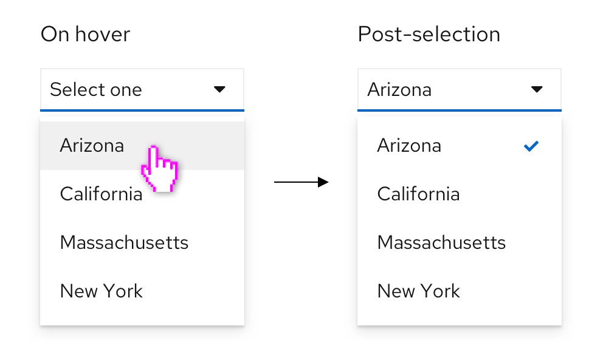

### Checkbox select
Checkbox select lists allow users to select one or more options from a known list of options, using checkboxes as a selection method. You may choose to have a badge display in the toggle to show how many items have been selected. A common use case for checkbox select lists is in a toolbar filter for a table or page.

#### Use checkbox select when
* Horizontal space is limited.
* It is not crucial for the user to see their selections in the toggle itself.
* Using a select list inside a toolbar. Toolbars have limited space, and the user will already be able to see their selection as chips below the filter itself.  

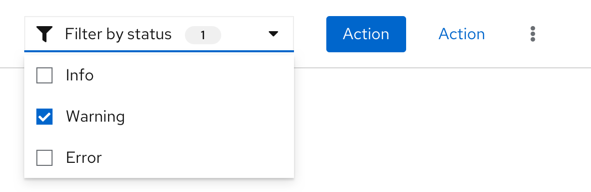

### Multiple select
Multiple select lists allow users to select one or more options from a list, with the selected options marked with a blue check. It differs from the checkbox select in that each option selected by the user appears in the top display area as chips. Once the number of selections reaches a certain number, the regular chips will be replaced by a gray chip indicating how many more items were selected. The default number of selections is 3, but you may change this number based on your use case.

#### Use multiple select when
* Horizontal space is not limited.
* It is useful for the user to see their selections from the toggle itself.
* In a form, where a user may benefit from being able to quickly scan their inputs before submitting.

### When to use checkbox select versus multiple select
Both the checkbox select and multiple select lists allow users to select multiple options from a list. However, there are some points to take into consideration when deciding which one to use.

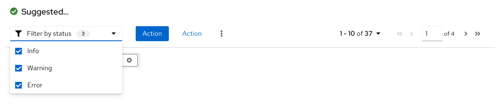

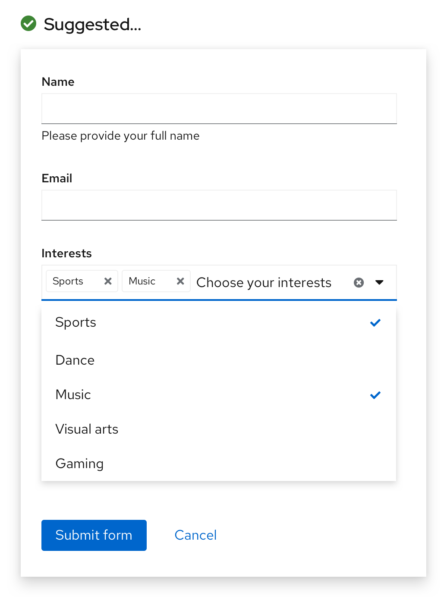

## Variations

### Select list with typeahead
Typeahead allows users to narrow a displayed list of options by typing into the input field. Type ahead is  recommended for lists with more than ten options and is available for single and multiple select lists. Although the typeahead within toggle functionality does not exist for the checkbox select, there is an option to add a typeahead capability within the menu of items if needed, as seen in this [grouped checkbox input with filtering](/components/select/react#grouped-checkbox-input-with-filtering) example.

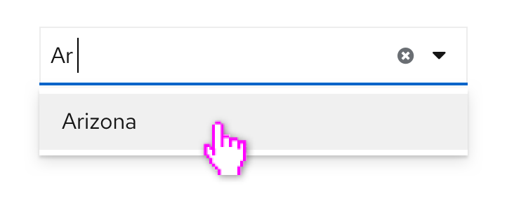

When providing fewer than 5 options, you can use [radio buttons](/components/radio/react) or [checkboxes](/components/checkbox/react) to display all options to the user simultaneously if you don’t have any space constraints.

### Select list with count
Select lists support the option of adding a number count to checkbox selects, both (1) as a badge in the toggle to indicate number of items selected, or (2) at the item level to indicate the number of items that match a certain filter option.

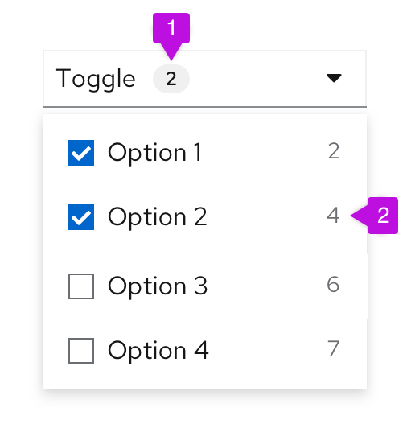

### Select list with view more
When a select list contains more than 20 items, and the processing load may be too big to load all options at once, you have the option to add a “View more” link at the bottom of the menu.
When the user clicks View more, more options are loaded and “view more” is replaced with the next available set of options.

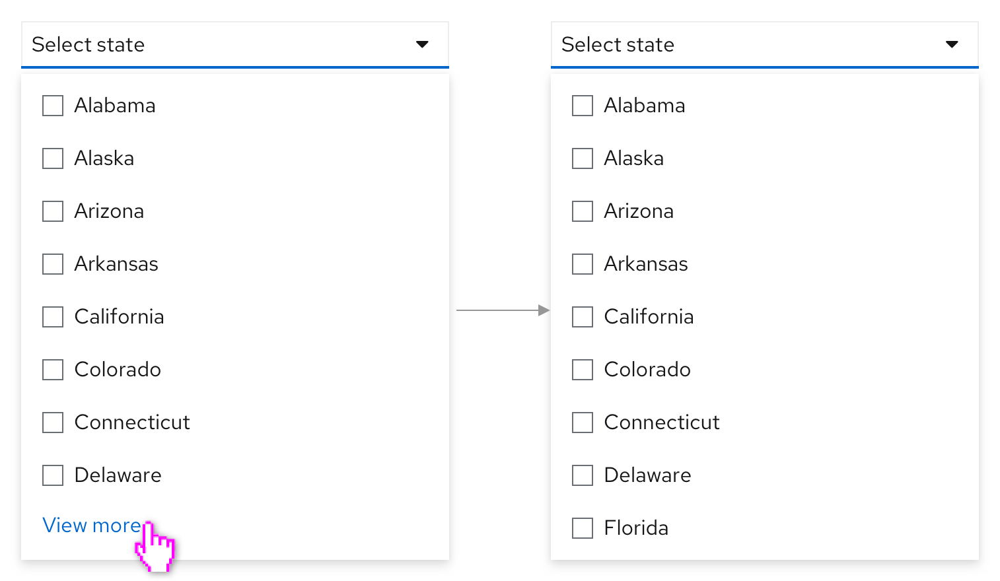

### Select lists with description
Descriptive text may be added below each menu item, but only when the menu item label itself may not be clear to all users. Keep descriptive text to two lines or less.

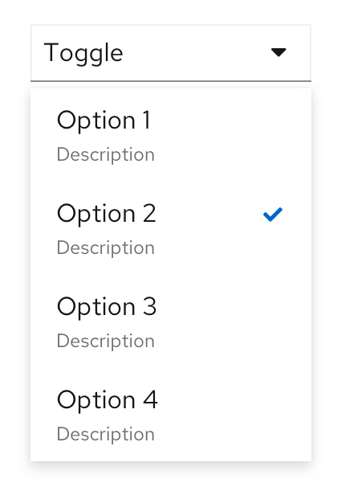

### Select lists with favorites
Favoriting can be associated with any select list option. In this case, making an item a favorite will duplicate it at the top of the menu. This may be useful when you have a long list of possible options to choose from and want to allow the user to “pin” a subset of items to the top of the select list.

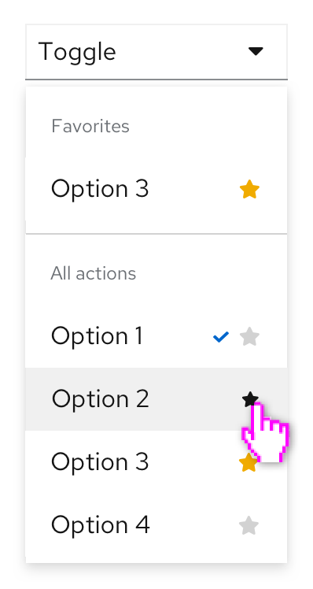

### Select lists with validation
Validation may be used to communicate field-level validation states, where appropriate. It is presented after the user completes their input, to let users know if their selection is acceptable. For example, if you were using the select list to allocate storage, you may need to give the user feedback if the value they selected will exceed their allotted capacity.

The Select component offers three validation-state presentations: Success, Warning, and Error. Depending on your use case, you may present one or all of these states to communicate the state of the user's selected input. The only required validation-state is the error state, which should be used when an input error occurs.

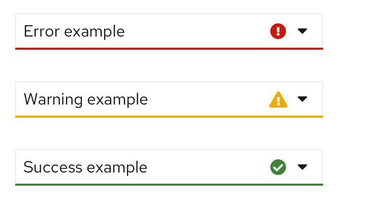

For more information about general form validation, see the relevant material in the [Form guidelines](/components/form/design-guidelines#errors-and-validation).
