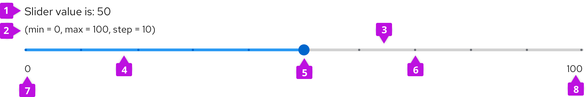
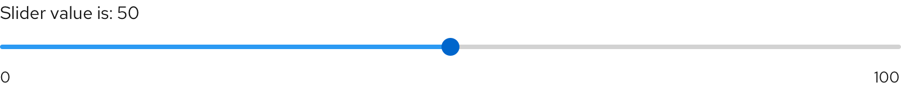
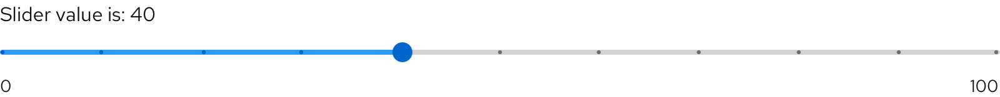
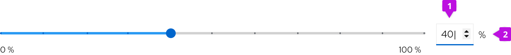
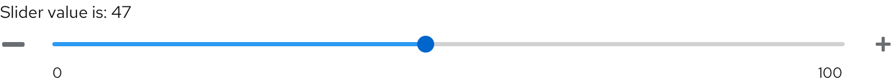
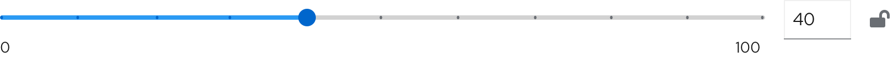
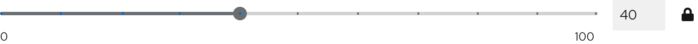

 
## Elements
 

 
1. **Slider value (optional)**: Displays selected numeric value.
2. **Helper text (optional)**: Provides supplementary information about the slider such as minimum and maximum values.
3. **Track**: Orders the range of values users can set and adjust onto one line.
4. **Filled track**: Illustrates a user’s selected numeric value within the slider’s pre-defined range.
5. **Thumb**: Indicates a selected numeric value on the track using a positional indicator, typically a dot.
6. **Tick marks (optional)**: Represents predetermined increments on the track to guide users toward positioning the thumb on set intervals.
7. **Minimum range parameter (optional)**: Marks the beginning of a slider with its minimum value.
8. **Maximum range parameter (optional)**: Marks the end of a slider with its maximum value.
 
## Usage
### When to use
Use a slider when:
* Users need a quick way to adjust values within a defined range, such as in a form.
* Users need to make small incremental changes.
* The numeric value can either be a whole number or fractional.
* You need to bypass device limitations, such as keyboardless interactions and form submissions on mobile.
 
### When not to use
Do not use a slider when:
* The numeric value range is infinite.
* The numeric value required is not part of a range, or is arbitrary. For this use case, use an [input group](/components/input-group)
instead.
* There is not enough space in the UI.
 
### Best practices
* Display a default numeric value that users can modify by using the slider or by typing directly into the input field, or scale using the increase or decrease buttons.
* Always keep the selected slider value visible to the user.
* Communicate maximum and minimum parameters of the range, especially with unusual parameters.
* Determine an increment size relative to your specific value range. Scale your increment size to accommodate values users can input in context. For example: If your range is from 0-10, structure your slider with increments of 1. If your range is from 0-100, structure your slider with increments of 1 or 10 or 25. Communicate different increments by adding tick marks to a slider.
 
## Variations
 
### Continuous slider

 
Allows users to select any value within the slider's range using a thumb indicator. Use this variation when any value within your slider’s range is valid for your use case.
 
### Discrete slider
 

Allows users to select a value by adjusting a thumb indicator to predefined values represented by tick marks on a track. Users can only select values indicated by a tick mark.  If they attempt to select an unmarked value, the thumb indicator will always shift to the closest tick mark.
 
### Slider within input groups
 
When a slider is combined with other elements, it allows users to better control value selection.
This variation combines multiple input types in one control and presents more options on how to adjust a selected value.
 
For more information about using input groups, visit our [input group guidelines](/components/input-group/design-guidelines).
 
 #### With default value input

 
1. **Number input in hover state**: Allows users to type in their numeric input or to adapt the slider value by using caret buttons.
2. **Unit (optional)**: Provides a unit symbol for the value in the input field, when applicable.
 
Value input is restrained by prescribed maximum and minimum parameters, and appears on the right side of the slider.

#### With thumb value

 
1. **Input field**: Allows users to type in their numeric input.
2. **Unit (optional)**: Provides a unit symbol for the value in the input field, when applicable.
 
In this slider variation, the value input is located over the thumb.
 
For more information about using number inputs, visit our [number input guidelines](/components/number-input/design-guidelines).

#### With buttons
 

 
Use buttons on either side of the slider to increase or decrease selected value by set increments.
 
#### With lock feature
 
Unlocked value

 
Locked value

 
Use a lock icon along with a slider if there is a use case to lock or unlock the slider value. Use a lock icon to display different user permissions or to indicate the possibility of automatic value alteration. Clicking on a lock icon results in locking a selected value and disabling the slider. If the user permissions allow it, users can unlock value by clicking on a lock icon.
