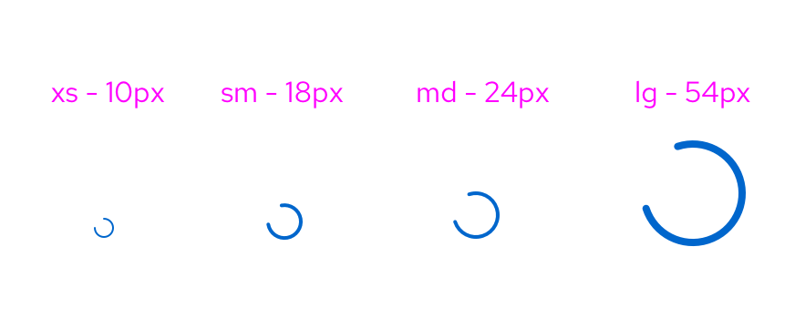
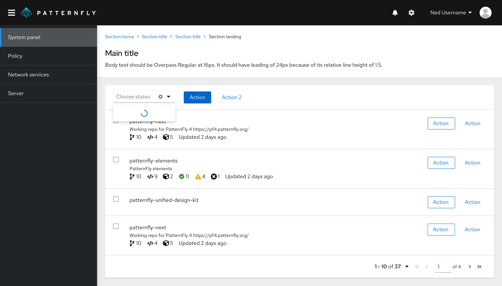
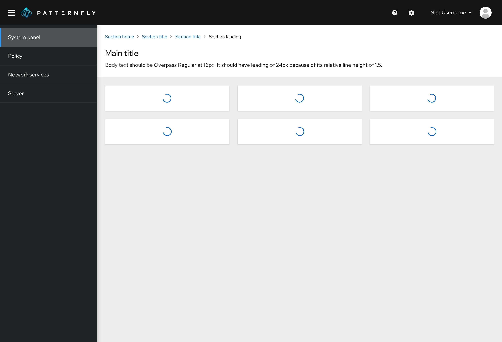
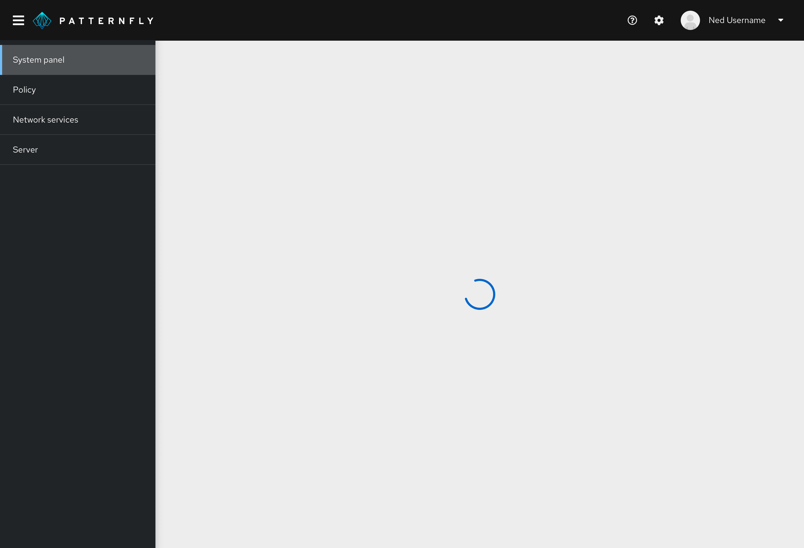

A **spinner** is used to indicate to users that an action is in progress. For actions that may take a long time, use a [progress bar](/components/progress) instead.

## Usage

Spinners are used to demonstrate data loading. Spinners are offered in different sizes that follow the sizing of our icons. These sizes include extra small, small, medium and large. Depending on the size of information you are loading and the space you are dealing with, we recommend using the spinner size that generally matches.

Use a spinner when the data you are dealing with is unknown in both quantity and shape. Spinners are also good to use when in progress of loading a screen that may not have any data, for example an [empty state screen or failed outcome](/components/empty-state). A common use case for spinners is within a table view, where the spinner can take up the area of the table before it loads.

Do not use a spinner to replace a [progress bar](/components/progress). Spinners are vague in their promises of results to the user and are best to use when the expected wait time is between 1-5 seconds. Do not use a spinner if the loading process is less than 1 second. For experiences longer than 5 seconds, use a progress bar.

## Spinner in context

Spinners are centered within the container AND the viewport by default in all use cases. Although this is the standard position of it, the spinner may be repositioned if necessary for particular screens and screen sizes.

### Spinner in select list (small)

### Spinner in cards within a dashboard (medium)

### Spinner in a data list or table (large)

### Spinner in a full page (large)

### When to use a loading spinner vs. a skeleton

**Show a spinner when:**
- You do not know what the populated data may look like. For example, if you are loading a form (as they are not all structured the same).
- Loading will likely fail or show an empty state while waiting for actions to complete.

**Show a [skeleton](/components/skeleton/react) when:**
- You know what the populated data is going to look like (even if it results in an empty state).
