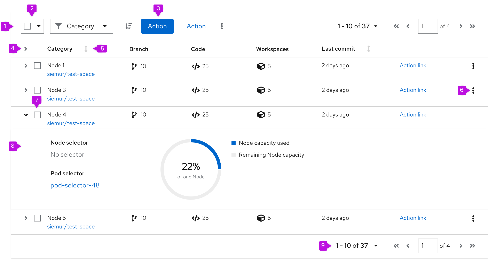
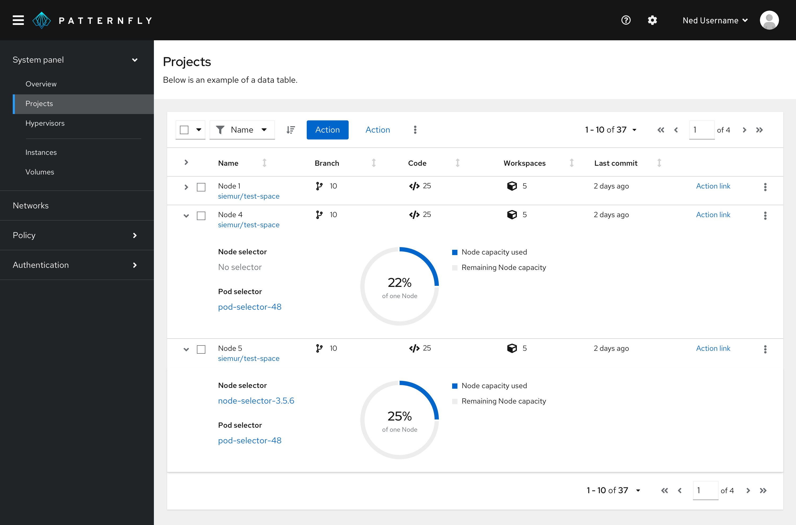
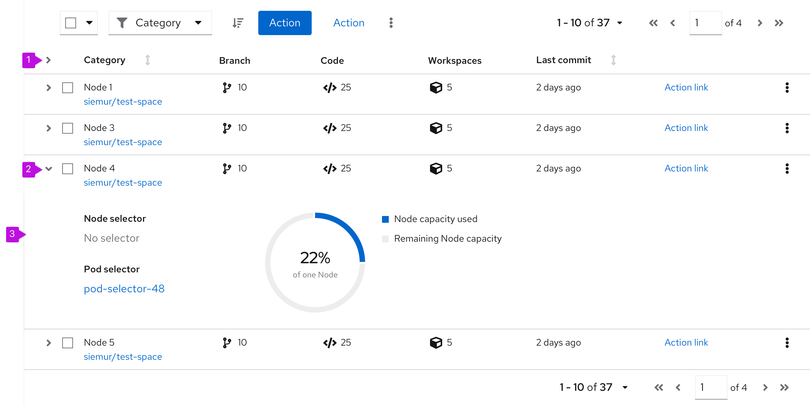
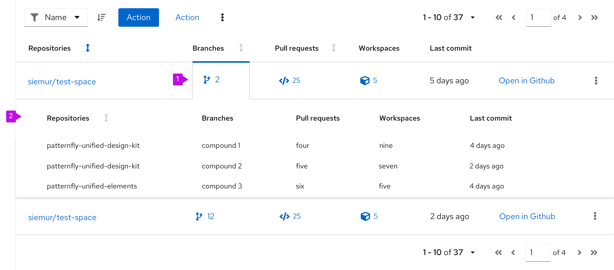
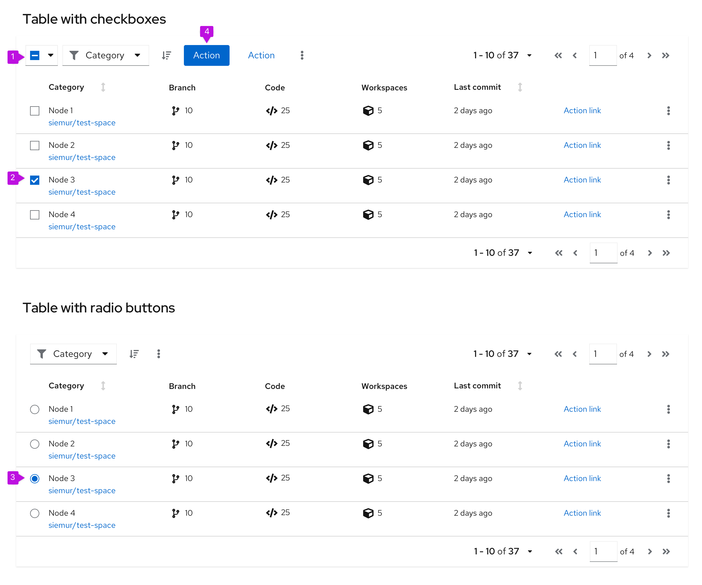
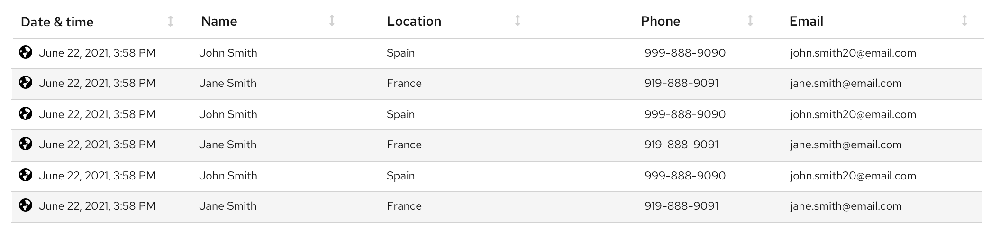
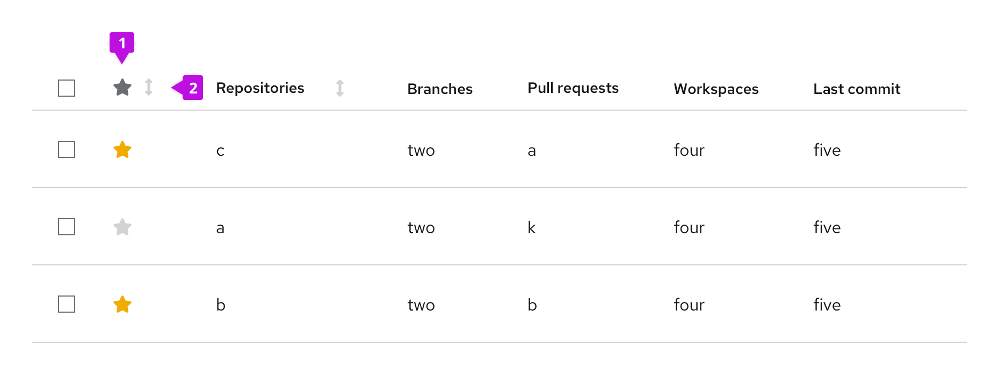
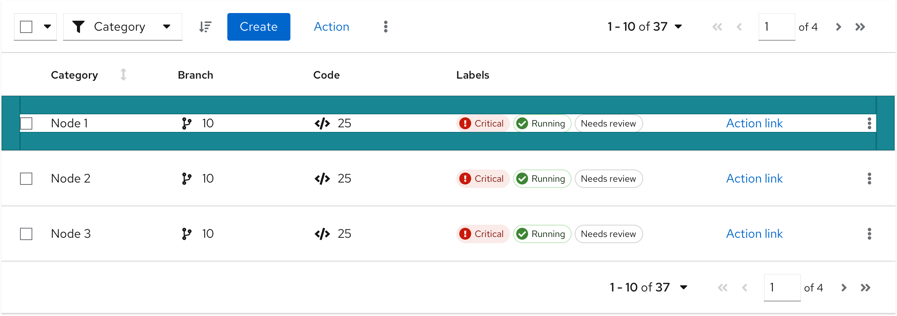

## Elements
The elements mentioned below are similar for a table with compact or default spacing. This example shows a table with a compact spacing.



1. **[Toolbar](/components/toolbar/design-guidelines):** Sits above the table and contains controls for manipulating table data. Common actions include filtering, sorting, and pagination.
2. **[Bulk selection](/guidelines/bulk-selection):** When present, selects all items in a table. If pagination is being used, this will only select items on the current page. See [bulk selection](/guidelines/bulk-selection) for more information.
3. **Global actions:** Actions that apply to all selected items.
4. **Expansion:** Expand all the rows in the table.
5. **Column headers:** Should align with the content they contain. If the user is able to sort on a column, the first click on the header will sort the content of the table on the content in that column. Subsequent clicks will toggle the direction of the sort. Table data can only be sorted on one column at a time. See [sorting by columns](#sorting-by-columns) for more information on the sort component.
6. **Inline actions:** Actions that apply only to the current row/item.
7. **Select checkbox:** Selects this row.
8. **Expanded panel:** Expanded table row content.
9. **Pagination footer:** When present, provides navigation to additional pages.

## Usage
When using tables you need to consider the structure of the data you want to display and organize that information into columns. Columns will typically have column headers. Every row within a table must have a consistent format. If the table row includes actions, they should always be placed in the rightmost column(s).

PatternFly offers 2 components for displaying large data sets: [data lists](/components/data-list/design-guidelines) and tables. While they satisfy similar use cases, choosing the correct component to use in your design will be dependent on the type of data you need to display.

Tables can also appear in primary-detail views. Visit the [primary-detail guidelines](/patterns/primary-detail/design-guidelines) to learn more about the functionality.

### When to use a table vs. a data list

**Use a table when**:
* The information you want to display fits into a structured, tabular format (in other words, has distinct rows and columns).

**Use a [data list](/components/data-list/design-guidelines) when**:
* The information you want to display cannot easily be organized into columns, or data is less structured. 

### Using lists and tables in a page
Lists and tables should be placed in the body of a page. The width should be set by the containing element.



In this example, a table is positioned in the body of a page in a card.

## Variations
PatternFly supports 2 main types of tables:

1. **[Compact table](#compact-spacing):** when you want to show as much data per page as possible.
2. **[Default table](#default-spacing):** when you don’t have to minimize paging.

See [when to use compact vs. default spacing](#compact-vs-default-spacing) for more information about the styling and usage.


### Table capabilities
Every table can be extended with these functionalities:

* [Expandable table](#expandable-table)
* [Compound expandable table](#compound-expandable-table)
* [Actionable table](#actionable-table)
* [Row striping](#row-striping)
* [Sortable table](#sorting-by-columns)
* [Table with favoriting](#table-with-favoriting)

### Expandable table



1. **Expand all (optional)**: Expands every row at the same time.
2. **Expansion:** Expands single row.
3. **Expansion panel:** Contains details associated with a row.

#### When to use
* You have more information than what will comfortably fit inside a row.
* You want to provide a way for advanced users to access information that is not applicable to all users.


### Compound-expandable table



1. **Expandable cell:** A cell that can be clicked to reveal more detail about an item. If the expansion for an item is already open, clicking on a different cell will close the current item and open a new one.
2. **Expansion panel:** Contains details associated with an expandable item.

#### When to use
* You want multiple expansion panels that relate to specific table columns.
* It would not make sense to combine all of this information into a single, simple expansion.

### Actionable table
The actionable table provides checkboxes or radio buttons that enable users to select one or more rows in a table. Users may then act on those selections using options in the [toolbar](/components/toolbar/design-guidelines),.



1. **[Bulk selection](/guidelines/bulk-selection):** When present, selects all items in a table with checkboxes. If pagination is being used, this will only select items on the current page. See [bulk selection](/guidelines/bulk-selection) for more information.
2. **Checkbox**: Enables a user to select a row. Use when multiple rows can be selected at the same time.
3. **Radio button**: Enables a user to select a single row at a time. Use when only one row can be selected at a time.
3. **Global actions:** Actions that can be applied to **all** selected items.  If actions in the table are restricted to a single row or object, keep the actions at the row kebab level, instead of in the toolbar.

#### When to use 
* You need to enable a user to select one or more items in the table, for example to make selections in a wizard, or to carry out actions in a full page table.

#### When not to use
* Users can not take any actions on table items/rows.

### Row striping
Row striping can help improve legibility of a table when presenting large amounts of data. With row striping enabled, table rows will alternate between ```--pf-global--BackgroundColor--100``` and ```--pf-global--BackgroundColor--150``` to visually separate dense data sets.



#### When to use
* Tables with 5 or more columns.
* Virtualized tables (no pagination).
* Tables with horizontal scrolling.
 
### Sorting by columns
Sorting by columns is possible for any table variation. Enabling the component within a table eases the ability to scan and read through the content. This option is favored over adding sorting functionality to the [toolbar](/components/toolbar/design-guidelines).


1. **Sortable column:** When a column is sortable, the sort icon will appear to the right of the column header in a [light grey](/guidelines/colors#typography-and-iconography-colors) color. Sorting will not become active until the user selects the column header. This triggers the arrow to point upwards and the content to be sorted in ascending order.
3. **Hovered sort:** When a column is sortable, the sort icon will appear to the right of the column header. Upon hover, the  icon will change to a [darker grey](/guidelines/colors#typography-and-iconography-colors) indicating that the icon is actionable.
2. **Sorted column:** When a column is being sorted by, the column header will turn [blue](/guidelines/colors#typography-and-iconography-colors) and the sort icon will represent the direction of the sort. Subsequent clicks on the sortable column header will toggle the direction of the sort.

#### When to use
The default sort order for a table should support the primary use case for the application. All columns in a table do not require sort functionality. That is, you can disable the header sort function on some columns and enable it on others.

#### Example
If a table contains these two attributes: (System Name | Last Sync) you may want to show the most recently synced system at the top of the table (in other words, it is the default sort column), because a primary use case for this table is verifying that you have successfully connected or troubleshot the system’s connection to Cloud Services.

If a table contains these three attributes: (System Name | Last Sync | Severity) you may want to show the system with the highest Severity because that is the system the user should tend to first.

### Table with favoriting
Adding the ability to favorite is possible for any table variation. Users can set their favorites by clicking the star icon in the favorites row. By default, the star is grey; when an item is favorited, the star becomes yellow. Clicking the star again will unfavorite the item. When an item is favorited or unfavorited, it does not move in the list unless sorting is on.



1. **Favorites column**: Allows users to favorite and unfavorite items in the table by clicking the item’s associated star icon.
2. **Favorites column header (optional):** Allows users to sort by favorites.

#### When to use
* Users may want to easily access their most used/viewed items in a table.
* You have a long list of items and want to favorite items by default for discoverability.

## Spacing

### Compact vs. default spacing
Whether to use a table/data list with compact or default spacing is up to you and your use case. However, here is some guidance for when to use which option. You can see examples of each option for comparison.

#### Compact spacing
A table may sometimes need to be compact to make more rows visible at a time. The more rows you can see, the less you need to use [pagination](/components/pagination/design-guidelines). Compact spacing is recommended for data with a simple structure. See an example below.

**Use compact spacing when:**
* You need to show as much data as possible on 1 page.
* You need to show data in a small space. For example in modal or wizard.
* You need to minimize paging.
* Readability is a secondary concern.


**Example:**
* You can see more data on 1 page.
* You have a good overview about the structure of data.
* The structure of data is simple, informative and have less visual elements.

#### Default spacing
A table may sometimes need more space for rich graphical data. See an example below.

**Use default spacing when:**
* You don’t have to display a lot of data on one page.
* You use many visual indicators that are placed in columns, such as icons or charts.
* You don't have to minimize paging.
* Readability is a primary concern.



**Example:**
* You can see less data on one page.
* You will need a pagination to see more rows.
* Data structure includes many visual elements.

## Tables on mobile
The PatternFly table is designed to be fully responsive. When columns no longer fit within the width of the viewport, columns are stacked so that data in each row is displayed as sets of attribute-value pairs.


