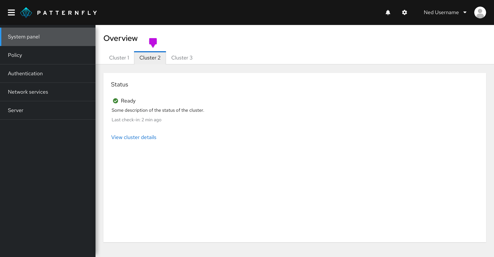

**Tabs** allow users to navigate between views within the same page or context.

## Usage

PatternFly offers a few types of tabs:

- [Default tabs](#default-tabs) (recommended)
- [Boxed tabs](#boxed-tabs)
- [Vertical tabs](#vertical-tabs)

You can use as many tabs as you want in a page, although it is recommended you keep the total number of tabs to a minimum for a better user experience. If you have more tabs than fit on the page, you may use a [default overflow](/components/tabs#default-overflow) which would allow a user to horizontal scroll through your tabs. The uses of both default and boxed stylings are flexible, so use either according to your needs and preferences. 

### Default tabs

Default tabs do not have any borders, other than the bottom line to distinguish between a selected tab, a hovered over tab, and a non-active tab. These tabs are most commonly used as top page header tabs or nested within components.

Default tabs can be formatted as standard or filled.  Filled tabs stretch to fit the width of the container that they are placed in. They can be used in screens with narrower widths, such as a drawer within a [primary detail view](/demos/primary-detail). When in doubt, stick with the standard styled tabs. 

1. Standard styled tabs
2. Filled styled tabs

### Boxed tabs

Box tabs are functionally the same as default tabs, but they are outlined by a box to emphasize the area that the tab spans. Boxed tabs can be used interchangeably with default tabs, but we recommend using the default tabs over boxed tabs. Boxed tabs can be used in combination with default tabs to create more hierarchy on the page.

### Vertical tabs

Vertical tabs are placed on the left hand side of a page or container. 

### Disabled tabs

PatternFly supports a disabled tab variation for all tab types. A disabled tab can be used to indicate that a section is unavailable to the user, usually due to a lack of permissions. Information to explain why the tab is disabled may be provided by using a tooltip on the element.

## Hierarchy

When you have more than one tab level in your UI, you can either chose to use a mixture of boxed and default tabs to create hierarchy on a page, or you can chose to use primary and secondary tabs which differ in their font size, with primary tabs using 16pt font, and secondary tabs using 14pt font.

Two tab options provide hierarchy within a page:
- [Primary tabs](#primary-tabs)
- [Secondary tabs](#secondary-tabs)

### Primary tabs

Use primary tabs only for top page header tabs and vertical tabs. Primary tabs use 16px text. 

### Secondary tabs

Use secondary tabs when, you have another set of tabs, in addition to a primary level, or when using tabs within a component, for example in a modal. Secondary tabs use 14px text.

1. Primary tabs
2. Secondary tabs

1. **Secondary tabs:** These should be used when tabs live within a component, like the modal.

