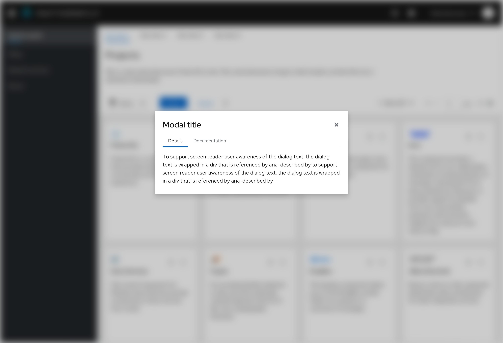

## Usage
Use tabs when you want to organize information into highly scannable display for users.

You can use as many tabs as you want in a page, although it is recommended you keep the total number of tabs to a minimum for a better user experience. If you have more tabs than fit on the page, you may use a [default overflow](/components/tabs#default-overflow) which would allow a user to horizontally scroll through your tabs. The uses of both default and boxed stylings are flexible, so use either according to your needs and preferences.

## Variations
- [Default tabs](#default-tabs) (recommended)
- [Boxed tabs](#boxed-tabs)
- [Vertical tabs](#vertical-tabs)
- [Disabled tabs](#disabled-tabs)
- [Primary tabs](#primary-tabs)
- [Secondary tabs](#secondary-tabs)
- [Horizontal overflow](#horizontal-overflow)

### Default tabs

Default tabs do not have any borders, other than the bottom line to distinguish between a selected tab, a hovered over tab, and a non-active tab. They can be formatted as standard or filled.  Filled tabs stretch to fit the width of the container that they are placed in. 

Is it recommended to use these tabs over other tab types in most cases - specifically for top page header tabs or tabs nested within components.

### Boxed tabs

Box tabs are functionally the same as default tabs, but they are outlined by a box to emphasize the area that the tab spans. Boxed tabs can be used in screens with narrower widths, such as a drawer within a primary detail view. 

### Vertical tabs

Vertical tabs are placed on the left hand side of a page or container. 

### Disabled tabs

PatternFly supports a disabled tab variation for all tab types. A disabled tab can be used to indicate that a section is unavailable to the user, usually due to a lack of permissions. Information to explain why the tab is disabled may be provided by using a tooltip on the element.

### Horizontal overflow

Horizontal overflow menus are useful when there is not enough space on a screen to display all tabs. The overflow menu contains all the remaining tabs and is always placed as the last tab on the right. Selecting options from overflow menu changes the name of the main tab to the selected one. You may show an overflowing tab count next to the overflow menu name, if needed.

### Hierarchy

When designing tab organization with two levels of tabs, it's important to create a clear hierarchy. To achieve this, the top level tabs should use the default open tabs, which feature a 16pt font. Meanwhile, the bottom level tabs should use the secondary open tabs, which feature a 14pt font.

### Primary tabs

Use primary tabs only for top page header tabs and vertical tabs. Primary tabs use 16px text. 

### Secondary tabs

Use secondary tabs to help differentiate between two levels of tabs and make it easier for users to navigate through the interface.

1. Primary tabs
2. Secondary tabs

Secondary tabs should also be used when tabs live within a component, or are in a non-full page context, like in a modal.

