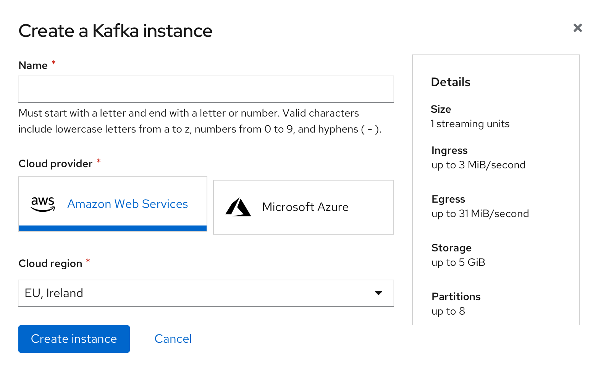
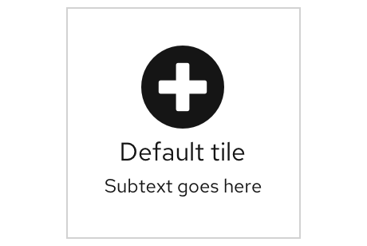

A **tile** component is a form of selection that can be used in place of a [radio button](/components/radio) and is commonly used in [forms](/components/form). A tile appears visually similar to a [selectable card](https://www.patternfly.org/v4/components/card/). However, tiles are used specifically when the user is selecting a static option, whereas a selectable card triggers an action or opens a quickstart or sidebar to provide additional information. 

## Usage

**Tiles can be used as a selection method when**:
* The selection process would benefit from having the additional visual prominence that tiles provide
* The selection includes additional information, like a brief description or an icon 
* The selection consists of brief, static content 
* There are few (typically 2-6) selections for the user to choose from

**Use card instead when**:
* The option presented to the user includes an action link, button, or overflow menu
* The option presented to the user requires more than 3 lines of content description
*  The option opens an additional resource or triggers an action

**Example**

  

## Behavior

As the user hovers over the tile component, the color will change insinuating its clickability. Once the user chooses the title, it will appear with a blue border showing it has been selected. 

  

## Variations 

1. Basic

2. Subtext

3. Icon

